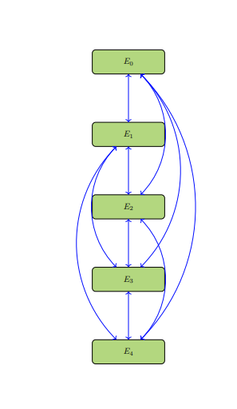

# Nu Merchant Principal
## ~ ongoing notions by me, Richard Pham. 

----------------------------------------------------------------------------------------------------------------------------------------------------------------------------------
### The Big Principle: 
### In mercantilism, that "father figure" you have that told you "it is not about the money, it is about the principle" might just rape you dead and take all of your belongings...
-----------------------------------------------------------------------------------------------------------------------------------------------------------------------------------

Business comes and goes, much more frequently than governments. 
So how can commerce thrive without the dread of disillusionment
that stems from the lackluster payoff in zero-sum dynamics? 
Zero-sum dynamics carry an extremely bipolar nature in the 
psychology of actors. And there are few paradigms of thought 
outside of this zero-sum strategic convention in politics, 
business, and war. Well, to clarify, there are few paradigms 
of thought, outside of zero-sum, that have gained enough 
mainstream adoption for the concepts to be taught in typical 
higher education settings.

Brilliance does not quite make the mark in intensely competitive 
settings. But there are some that argue that it is the misuse 
of brilliance, trained and primed towards "malfeasant" outlets,
that results in clear defeats for the owner/s of that brilliance. 
But there have been and are plenty of brilliant people that 
did not quite train and prime themselves towards "malfeasant" 
outlets. And they get paid in dirt. The dumb and perhaps 
retarded scoff at their ideas, deny their promotion, and ruin 
their composure. This is how some brilliant people get treated
like dirt. They get invited to a club or party of some high-society
members, after achieving much and expecting some festive recognition, 
and the invites are rescinded. And the club/party mentions them as if 
they are some dull one fit for exploitation. The high-society 
members already know, due to the luxury and power that they 
are able to retain, that preventative measures against 
exploitation require more than just brilliance. Brilliance 
is materially less in value than dirt. The brilliant person 
wants to get somewhere, with rejection thrown in their face 
as well as insults and knives in their back, their so-called 
"defensive posturing" against exploitation is most definitely 
born from a source, or at least an effect, of malice. 

Do you really think that fat cow that is your neighbor really 
gives a care for your interests and well-being? Laissez-faire 
feudalism predicts that they do not. While you might be digging 
trenches for "modern-day Rome", that fat cow, the one that has 
never been hurt in any way except for their feelings, looks at
you like you are some kind of slave. The fat cow is stupid.
It is stupid not because it is simple-minded. It is stupid for 
judging while sitting comfortably in its welfare zone, sponsored 
by the government in the name of ... what? Merit? Justice? That
fat cow, ultimately in the context of economic sacrifice, may 
as well be a wolf. It may as well be a wolf because it would 
prefer that you are eaten instead of it.

Suppose there is some kind of wisdom in ultra-competitive 
environments, borne out of Laissez-faire, that goes something 
similar as "one should make as much effort in befriending 
another as the effort required to defend against an enemy."
This is an "ideal" that is much easier to declare and believe in 
than to successfully accomplish. The difficulty of accomplishing
this "ideal" rests upon the nature that surrounds the center, 
for there is no mechanical principle behind it that ensures 
the equal probability of easiness in befriending and enemizing.
Who is to state, with a guarantee that rests completely on 
confidence instead of fear, that not every person becomes 
an enemy in the eyes of a "neo-mercantilist" (for lack of a 
better term)? 

The notion of the fat cow as a wolf in the context of 
economic sacrifice is a strong assumption on costs from 
loss due to some underlying fatalism. Rest assured that 
there are many in academia and government that strongly 
disagree with the concept of competition, or at least 
self-improvement, as zero-sum. These contrarian views 
harness the game theory specification of "non-zero sum 
games". The rationale is that some aspects, which can be
quantified, rest on a sort of cooperation, a mutual 
assurance, a compromise. There is much opinion and 
exemplification on non-zero sum games. These so-called 
"games" do exist in reality, but were only formalized 
into theoretical frameworks, for re-teaching, sometime 
in the last two centuries. By the standard of non-zero 
sum games, the fat cow does not have to be a wolf then! 

The mechanics of "costs", including but not limited to 
quantitative finance, are derived from the cultural 
mores and collective ambition, and also the mainstream 
economic concept of the correlation between scarcity 
and the magnitude of "cost", but the "faith" in these 
numbers does not rest on a uniform consensus of agreement. 
For instance, a sentimental person would probably prefer 
to sell something else other than the memorabilia 
that they've acquired through their years. There is 
the belief in the pricelessness of some material 
objects. Collectively, these same material objects 
could very well be circulated by the masses, according 
to some arbitrarily-set standard of valuation, if 
they are to land in their hands. There are psychological 
and collectivist elements in non-zero sum games. Suppose
that two agents are participants in such a game. Given 
the perceived costs in this game's cost table, the two 
agents "cooperate" for outcomes that grant them both 
"positive" gains, by the table's objective numbers. But
there is dissatisfaction underneath the compromise. 
Perhaps either one or both of the agents feel as though
they deserve more of the "positive" gains. What factors 
would ensure that for the next "game" these two agents 
participate in, there would be no disagreement on the
values of said game's cost table? On the matter of 
collectivist elements in non-zero sum games, suppose
that two arbitrary agents are enthusiastic participants. 
Both of them are practically in sync, with regards to 
their decisions and the corresponding payoffs from those
decisions. But regardless of what decisions they made,
there is a "super-agent" above them. This "super-agent"
is the singular representative of the collective outside
of the game's two agents. According to the facts given 
to this super-agent, both of the agents lose in the 
non-zero sum game. The deceptively "positive" gains split
between the two agents are in fact losses to them. Perhaps
the gains could have been objectively greater if the 
agents were to participate in non-zero sum games without
the overhead of the super-agent's authority. Perhaps
the gains are not objectively positive gains for the
two agents in the long term, given the super-agent's 
influence and capability of intervening between the 
two. 

Cultural, psychological, and collectivistic factors 
were especially noted in non-zero sum games, even
though their existence in zero-sum games is not 
negligible. It is obvious to state that zero-sum 
games, if based on accurate cost tables, result 
in "cleaner cuts". Every participant has very 
little motive to consider the outcome of well-being
for their "competitors". Zero-sum games rest on 
the principles of physics. Value cannot grow, but 
it can be cleanly transferred from some original 
owner, a participant in the zero-sum game, to 
another. The argument that zero-sum games are 
more objectively-based than non-zero sum games 
is more persuasive than the argument for vice-versa.

There is an absolute chance for arguments that non-zero
sum games are more amenable to participants. And the 
claim that the base of objectivity is an exclusive 
trait to zero-sum games is surely to be scrutinized. 
There is another claim that can be more fully 
agreed upon: for any prolonged sequence of 
decision-making events, the usage of both 
game categories serve unique demands. The payoffs 
to participants from non-zero sum games may amount 
to less for each, in comparison to the potential 
payoff (single participant gain) from zero-sum games.
But over time, the partial payoffs from each 
non-zero sum game produce longer lasting and more
stable benefits to the participants, by the metrics 
revolving around uniformity and the mean. Needless to 
say, these two categories of games can be expanded to
involve more than two agents in the lens of mass 
organization. Organizations do not tend to encourage
zero-sum games between its members, given the condition
that both members are of pertinence, through utility, to 
the organization (but perhaps not of the same degree). 
The compromise from non-zero sum games suits the purpose
of pacifying such biases, including jealousy and ambition, 
for integrity of the organization. However, in an 
organization's life, there occur instances where 
zero-sum games are utilized for the objective of 
slashing what is deemed to be excess or vice. 

The first paragraph of this essay posits the 
domineering influence of zero-sum, over others, such as 
the alternative of non-zero sum, as a concept taught
in the education setting. Many in university/government
settings would probably not be vocal in support of this
posit. Activities such as research&development, 
coordinated security, and journal publications do 
lean toward cost values of non-zero sum game. 
Knowledge, especially, is one of the fundamental 
possessions that do not operate on zero-sum dynamics 
on the one condition that the knowledge is fairly
distributed. One of the ideals espoused in higher 
education is something along the lines of "a more 
informed society is a superior society". But the 
value of knowledge wildly oscillates from trivia 
to critical vulnerabilities belonging to persons, 
organizations, nation-states, etc. What is a non-zero
sum game to a select group of participants may be
reflected onto another group as a zero-sum game's 
outcome that adversely affects them.

With regards to application of the concepts zero or
non-zero sum, the first is predominantly used in 
contexts such as material transfers and clear-cut
win/lose outcomes. Due to the cooperative nature 
of non-zero sum games, even with the specification 
that the participants do not know ahead of time 
what their counterparts' decisions are, there is 
a tendency for at least one of the participants 
to lose sight of the definition behind the outcome
values. The coupling (two participants) and 
entanglement (more than two participants) fuzz 
decision-making in such a way for there to be 
virtually no optimum payoff by the available 
options. Perhaps in some cases, contiguous 
non-zero sum games played by the participants 
may result for there to be a kind of "delegation"
from at least one of the players to the remainder.
The preferences of the remainder become prioritized
over the delegators, who would rather play and follow
along than to emphasize their own ideal choices 
in the "game". 

## Autonomy and Games

Autonomy is a multi-faceted question in arrangements 
that are games. Why would an agent participate in some 
arrangement called a game if there is the certainty 
that the best outcome, in the form of payoffs from 
the true cost table, cannot result in their betterment?
The agent diverges from their original circumstances
that would have granted them opportunities to pursue 
some desired sequence of outcomes, each a checkpoint of 
success or at least, gratification. Then they are 
enmeshed in circumstances that require their actions 
to be geared towards some objective directly related 
to the specific temporal demands of those circumstances.
They can mention the question of choice, a topic which 
is generally known to many members of societies that have 
had their hands forced into certain outlets (certainly by 
the mortal powers above them), but they will only receive
a response to accept the matter as another of idealism's
lost visions.

Children engage in activities that can be termed
as "games". These activities generally do no harm amongst
themselves, and give them the benefit of developing their
values and way of life to eventually play the roles of 
astute cogs in mature society. It is this premise that 
is a major moral justification for why some find themselves
in circumstances, deemed games by some, that they otherwise
would not engage in, either due to their ignorance that 
such circumstances (comprised of materials and events) exist 
or their involuntary stance towards those circumstances.
The premise as one word is education. Is this word 
simply a transmission of terminology and procedures,
as well as the auxiliary materials used to aid in 
understanding and experiencing this transmission of 
information? Could education really be as simple as two 
parallel straight paths, one the perfect transmission 
(by the educator) and the other the perfect practice or 
at least the most genuine effort in practice (by the educatee)? 

Entertain the notion that there are two tenets in education. 
For matters of fact, education transmits absolute truth. 
And for other matters, education transmits perfect knowledge 
of the methodology. This notion relies on the condition that
there is nothing to be educated on past the minds of the 
educators. The educators were selected due to their mastery 
of the matters that they are to transmit and train their 
educatees on. So the educators could not possibly steer
any of their subjects directly towards wrongful practices 
and fallacies. 

On the idea of autonomy as the choice to participate
in games that benefit and to not participate in anti-beneficial
games, education as outlined by the previous paragraph 
is beneficial. But in games that are believed not to be
beneficial, how can an agent truly know that they will 
sorely pay during or after their participation? Couple 
the particular outlining of education (in the previous 
paragraph) with active efforts to know the unknown (and 
all of the unknown's costs), from a perspective that supercedes
even the educator. And the resultant is not education by 
the definition. Instead, it is experimentation and education. 
Education systems can enable their educatees to experiment, 
outside of constraints designed by the educator.
There are certainly arguments available to defend these 
kinds of education systems, so that the educatees have 
greater awareness of what games will pay them off 
immensely, what other games are non-profit but greatly
expands the experience (if experience cannot be 
quantified), and yet still the remaining games that 
will make them sorely pay beyond their recovery back to 
growth or at least, stasis. 

The structuralization of any education system surely 
cannot accomodate the demands of the lifelong learner.
This is to assume that any education system imposes
binding demands on its participants. Without binding
demands, the freedom of participants to come and go 
by their own volition somehow dilutes the seriousness
and truthfulness of the informational material 
transmitted to them. In these circumstances, education
becomes casual recreation, and recreation is personally
experiential events; this is a Dionysian VS Apollonion 
argument. Even if one is not keen on learning any more 
past their depth, there is still the requirement 
of experience in sentient existence (if life goes on). 
And experience can be very stochastic, or even worse, 
engineered against those subject to the experience. The 
term "information-flow system" suffices as a superset 
of "education system". There are not required to be any 
binding demands from an educator that does not need to 
exist. The omnipresent requirement of processing 
information stands strong in this superset of an 
education system, even stronger than that of the 
education system since the lack of structured guidance 
is compensated by utter seriousness in certain contexts.

In many respects, the objective of education is to 
enhance and refine risk-averse mentalities and behaviors.
For example, mistakes from history should not be repeated.
Make careful calculations before embarking on dangerous
trails. Take the tragic lessons from literature to heart.
And so on. With experimentation, there is risk attached.
Experimentation is interesting with regards to 
accountability. Educators generally steer clear from 
the losses from experimentation. The simple more is that
they cannot risk their reputation to become entangled 
in what are perceived by third-party judges as fallibility 
traps. The fact that there are different natures and 
styles attached to those that experiment validates the 
anticipation that conceptualizations of fallibility, such 
as the Seven Deadly Sins, are to be mentioned by some in 
their aims to "reveal and penalize evil". 

Autonomy is intricately connected to information-flow
systems. Some important attributes of noteworthy mention
are filtration processes, recognition mechanisms, flow 
control, network administration, and ultimately, capabilities 
past the knowledge that is perfect information.

## Situational Engineering

The academic field of game theory has mass-proliferated
some important findings in the context of decision-making.
It has structured "games", decision-making junctions between 
two or more agents, into these classifications: strategic, 
extensive, and coalitional. It has also put focus on the 
nature of information available to agents during their 
activities called "games", that is, perfect and imperfect 
information. Rules for calculating the optimal decision
are defined by the Nash equilibrium and its sibling 
concepts. In cases where there is no optimum by the decisions
and costs granted to the agents, there is also the 
"ideal" (or expectation) of steady state, as illustrated
by games such as Matching Pennies. 

The mathematics applied in game theory is extensive enough 
to satisfy these two big questions: 
- best decisions or expected states,
- expected payoffs (through probabilistic functions or 
best-decision rules). 

But what about the situation? Given merely the cost tables 
(as formulated by game theory), some agents are predisposed
to having some set of moves that may or may not intersect
with the movesets of their co-participants. In other words,
there is an unspoken asymmetry or equality in capabilities
before the consideration of the game in focus. Acceptance of
these conditions relies on the acceptance of the histories
(for lack of a better term) of not only the agents belonging
to the game in focus. There is also the need to understand 
the outside factors, some of which may be responsible for 
governing past events, agents, interpretations, and orders 
into the situation that contains the participating agents. 

Consider this situation, called Game of Varying Coercion. 
There are only two players to make way for simplicity of 
illustration.

| t=1 | Play Along | Reveal |
| --- | ---------- | ------ |
| Silent Trigger | 10,1 | 10,-100 |
| Brute's Force | -1,0 | 5,-50 |

**GVC1:** Game of Varying Coercion @ timestamp 1; (2 x 2).

Agent A (row-wise) has the clear upper hand, in terms of
cost as quantified by this table. Agent B is put into a
servile position. Agent A would be wise to maintain 
preference for the dominated action of Silent Trigger.
There is no possibility for Silent Trigger to inflict 
negative gains for Agent A. Whether Agent B chooses to
obey Agent A by playing along, or revealing so as to 
catalyze revolt against Agent A, Agent A secures its 
upper hand by Silent Trigger. For Agent A to act by 
Brute's Force against an obedient Agent B speaks poorly 
for its welfare, as denoted by the negative gain of 
-1. If Brute's Force is used against Agent B in the 
case of its act of revealing, then there is a positive 
gain of half that for Silent Trigger. Suppose the 
revelation is judged to be fallacious, so much that 
Brute's Force is justified.  

Silent Trigger requires more skill by the actor. It
also requires more situational expenses so that the
silence of the Trigger is not exposed to Agent B or
third-party observers, who then have more knowledge 
and material to retaliate. The cost values of Table GVC1
denote the combative gains by the agents. However, 
there is another set of costs that are pertinent, 
by Table ST1. 

| ~~ | Effective Cooperative | Ineffective Cooperative |
| --- | ---------- | ------ |
| Bull's Eye | -3,-12 | -1000,-50 |
| Missed Mark | -30,-100 | -1200,-1000 |

**ST1:** Costs to Resources by Silent Trigger; (2 x 2).

There are two possibilities for the actor behind Silent 
Trigger, labeled by the rows. The infrastructural costs, 
comprised of sentient agents, the environment, and the 
situation that is staged by these sentient agents, are 
the two columns: effective and ineffective cooperative. 
The cooperative is designated as an alignment with the 
Silent Trigger's actor. Note that there are no positive
gains to resources. If the cooperative is ineffective, 
whether voluntarily or not, then it is critical for 
Silent Trigger's actor to move by Bull's Eye, in the 
name of costs to resources. If there is effective 
cooperative, the event of Missed Mark by Silent Trigger's 
actor results in less damage to resources. Table ST1 
illustrates the heavy costs, even without the risk of 
failure by Silent Trigger's actor and their cooperative, 
of maintaining the dominated action of Silent Trigger 
over Brute's Force. 

By Brute's Force, however, there is a risk that 
oppositional mass-organization from Agent B 
(in Table GVC1) ensues. The situation of the involved 
agents can escalate into something similar to that 
illustrated below.

| ~~ | Advance Opposition | Maintain Opposition | Withdraw Opposition |
| --- | -------------------- | ------------------- | ----------------- | 
| Escalate Brute's Force | 1000,500 | 250,250 | 2000,0 | 
| Mix Brute's Force with Silent Trigger | 2000,-50 | 1000,500 | 2000,-300
| Silent Trigger | 0,400 | 0,0 | 4000,-200

**BFAM:** Combative Gains (Opponent's Pay) in the Aftermath of Initial Brute's Force; (3 x 3).

Table BFAM gives numbers that still predominantly benefit Agent A.
But these numbers are based only the starting states of the agents, 
and shed no evidence on the constancy of costs over repeated iterations.
Brute's Force may result in the situation of Table BFAM, and the decision 
for Agent A to choose Brute's Force over Silent Trigger may be due to 
the latter's unsuccessful enactment, which in turn, is due to the 
negative gains. Silent Trigger in BFAM, due to its requirements of 
high skill and effective cooperative, becomes virtually useless 
unless Agent B chooses to withdraw opposition. 

The Game of Varying Coercion is an antagonistic game. It 
requires for there to be an aggressive antagonist and an 
incapable subordinate target, with much less the social and 
communicative resources than available to its opposer. What 
kind of game is this, for there to be irrationality on the 
part of Agent B that results in its entering this situation? 
Game theoretics do presuppose that agents act by rational 
choice, before, during, and after any arbitrary decision 
junction that is a game. As stated in the beginning of this 
section, the rationale for why situations such as Game of 
Varying Coercion occur is essentially long, nuanced, 
specific explanations based on histories. A more civilized 
version of this game can certainly exist, as Game of 
Pacified Varying Coercion. 

| t=1 | Genuinely Cooperate | Civil Re-negotiation | Fraud/Betrayal |
| --- | ------------------- | -------------------- | -------------- |
| Pacified Silent Trigger | 100,100 | 0,0 | 1000,0 |
| Pacified Brute's Force | -1000,0 | -100,500 | 1000,0 |

**GPVC1:** Game of Pacified Varying Coercion @ timestamp 1; (2 X 3).

There is the question of the degree of choice 
revolving around the hands (of the agents and third-parties) 
in the Game of Varying Coercion. Would it not be splendid if
there was only the alternative of Game of Pacified Varying 
Coercion to be played? There would be little motive for any 
rational Agent B to choose Fraud/Betrayal. The integrity of 
the feedback loops involving genuine cooperation and civil 
re-negotiations would lead to a continuous improvement 
process, without any second thoughts. But back to the matter 
of the Game of Varying Coercion, it could be argued that 
the events leading up to the asymmetric attributes of the 
involved players are essentially sibling decision junctions 
of the Game of Chicken. The key difference is that in the 
Game of Chicken, the objective is mirror-opposite decisions. 
To achieve the moveset of Agent A in Game of Varying Coercion,
as a game before this game, there is required a kind of 
relentless dedication (including the security) to acquiring 
the skills and resources that then concentrates these 
attributes into the moveset, the starting possible 
choices available to Agent A. For clarification, the 
likeness in these predecessor games to the Game of Chicken, 
with the aims of achieving the position of Agent A, rests
on the "security" in the relentless dedication. If Agents 
C and D are to compete, in forms direct or otherwise, to 
be Agent A instead of B in Game of Varying Coercion, then
they are to attempt to appear as doves in particular contexts.
Playing as the dove helps avoid direct confrontation with 
obstacles to their objective of becoming Agent A.

## Security's Price of Choice-Communication

There is a lot to be said,written, or however else 
communicated on the "power of language", specifically its 
broad role in retentive and transformative processes. 
A universal desire exists amongst sentient beings to 
privatize (form and uphold attributes of secrecy) 
communication to their personally desired degrees. 
Unwanted members, such as those that would oppose the 
communication or would be advantaged as antagonists to 
know said communication, are the subjects that privatization 
efforts seek to exclude. In this game, deemed the Game 
of Crypto or Gibberish, communication does not take 
place simply between two distinct beings. There are 
calculations and layers involved, manifesting themselves 
as functional judgments and tiered structures (geometric 
spaces,networks,et cetera). 

There are four agents in this game that consists of 
more than one cost table.
- Agent A: the interpreter of the communication.
- Agent B: the source and messenger of the communication.
- Agent C: correspondent to Agent A, otherwise known as a sub-agent of A; they provide methodologies,tips, and hints derived from their observation of Agent B. Such observation may require positioning for insider knowledge.
- Agent D: the follow-up actor to the interpretation by Agent A of Agent B's communication.

Whenever Agent A is mentioned, assume that Agent C is 
also included due to their status as a sub-agent to Agent A.

Three primary decision junctions exist in the Game of 
Crypto or Gibberish, and this section sequentially presents 
explanation on them. 

Agent B has a question Q to provide an answer to. They 
know that this answer, formatted according to some 
specification, will be received by Agent A. There are 
three possible choices for answers. 
- $I_1$: completely true in the case of Q being a fact-based query, otherwise completely genuine for Q that is a subjective-based query.
- $I_2$: trivial, sarcastic, ironic statement.
- $I_3$: completely fallacious or disingenious statement.

There are also three accomodating objective functions 
for Agent B that ranks the choices for $I_j$ by ordinality. 
- $OBJ_1: I_1 > I_2 > I_3$,
- $OBJ_2: I_2 > I_1 > I_3$,
- $OBJ_3: I_3 > I_2 > I_1$.

The first junction is one decision by Agent B to format
their message into a secure format, such as digital encryption
via some arbitrary mask procedures, denoted by $M_k$. The 
"hardness" of the particular mask is denoted by $k$, such 
that $k$ is inversely proportional to this variable:
$1 > 2 > 3$. "Hardness", in computational complexity, 
refers to the expense of resources required to accurately 
complete the calculation. So, $M_1$ is more complex than 
$M_2$ for a third-party to process. 

| $dec_t=1$ | $M_1$ | $M_2$ | $M_3$ |
| --------- | ----- | ----- | ----- |
| $I_1$ | $OBJ_i(I_1)$,3 | $OBJ_i(I_1)$,2 | $OBJ_i(I_1)$,1 |
| $I_2$ | $OBJ_i(I_2)$,3 | $OBJ_i(I_2)$,2 | $OBJ_i(I_2)$,1 |
| $I_3$ | $OBJ_i(I_3)$,3 | $OBJ_i(I_3)$,2 | $OBJ_i(I_3)$,1 |

**GCG1:** Game of Crypto or Gibberish @ decision junction 1; (3 X 3).

For each cost-value pair $(c_0,c_1)$ in the table above, 
$c_0$ denotes the expense on objective $OBJ_i$ in sending 
information $I_j$ to Agent A, and $c_1$ denotes the price of 
using mask $M_k$. 

These two tables below are exemplifications of the objective
being $OBJ_1$ and $OBJ_2$, respectively.

| $dec_t=1$ | $M_1$ | $M_2$ | $M_3$ |
| --------- | ----- | ----- | ----- |
| $I_1$ | 0,3 | 0,2 | 0,1 |
| $I_2$ | 1,3 | 1,2 | 1,1 |
| $I_3$ | 2,3 | 2,2 | 2,1 |

**GCGO1:** Table GCG1 by $OBJ_1$; (3 X 3).

| $dec_t=1$ | $M_1$ | $M_2$ | $M_3$ |
| --------- | ----- | ----- | ----- |
| $I_1$ | 1,3 | 1,2 | 1,1 |
| $I_2$ | 0,3 | 0,2 | 0,1 |
| $I_3$ | 2,3 | 2,2 | 2,1 |

**GCG02:** Table GCG1 by $OBJ_2$; (3 X 3).

Lower expenses in objectives are preferred, for costs 
incurred upon the objective promote the failure of Agent B.
The direct association, between the value $c_1$ and the 
strength of the mask, is used by Agent B to decide on 
which mask to use. $M_1$ provides the greatest security
in transmission, that is, the lowest probability that 
a third-party (those that Agent A has not shared with) 
will able to possess full knowledge of. Junction 1 is a 
min-max decision problem. The information $I_j$ with the 
lowest corresponding $c_0$ score is the dominated choice. 
Mask $M_1$ is the dominated choice of mask, with respect 
to two-agent (A and B) privatization. This decision problem 
could be further complicated by raising the question on 
the magnitude of privatization desired by Agent B. Agent 
B could very well not care about maintaining "perfect 
secrecy", and chooses one of the masks in $\{M_2,M_3\}$ 
so that some other arbitrary agent outside of $\{A,B,C,D\}$ 
can knowledgeably interfere.

Now onto the second decision junction, with specific focus 
on Agents A and C. Correspondent Agent C's responsibility 
was to "observe" Agent B for information regarding the 
important attribute of the mask $M_k$ used as well as their
objective with respect to $I_j$. While gathering information 
on the mask is an empirical task, meaning the knowledge 
gathered on its form and parameters can be judged on a 
continuum spanning from absolutely false to absolutely 
true (but the question remains on when the judgment 
can take place), prediction of Agent B's objective 
is not as clearly defined, in great part because Agent B 
could very well change their objective a split instance 
before for a future decision unanticipated by Agents A 
or C. Prediction of Agent B's objective is clearly 
a probabilistic problem, with some reasonable solution 
catered to their behaviorial leanings. Below is a possible
cost table that accomodates the second decision junction.

| $dec_t=2$ | $D_1$ | $D_2$ | $D_3$ | $D_{null}$ |
| --------- | ----- | ----- | ----- | ---------- |
| $M_?(I_j)$ | 1,3 | 1,2 | 1,1 | 1,0 | 

**GCGT2:** Decision junction 2 for Agent A with C; (1 X 4).

The table GCGT2 pre-supposes that Agent A has been 
able to ascertain the three available masks, as presented
in table GCG1. If Agent B wants Agent A to have the 
capability to decrypt the message $M_?(I_j)$, then they 
encourage conditions that grant Agent A (through themself 
or their correspondent Agent C) the knowledge of either 
the actual (inarguable) mask $M_?$ or some combination
of the masks $\{M_1,M_2,M_3\}$. The numbers in this 
cost table mean very little, in terms of deciding on the 
best out of the four choices, because the aims of Agent
A is to derive one of $\{I_1,I_2,I_3\}$ from $M_?(I_j)$.
Agent A, for their serious intents and purposes, would 
only be interested in $I_1$, possibly $I_2$ if $I_2$ 
sheds some inkling (decreases the breadth of possibilities) 
on $I_1$. If $I_j$ in table GCGT2 is one of $\{I_2,I_3\}$,
then Agent A could use a null decryptor $D_{null}$ that
produces no legible information. Assume that in this 
game, having full knowledge of a mask $M_i$ naturally 
lends way to determining the corresponding de-masker 
$D_i$. If Agent B simply wants for Agent A to receive 
$M_?(I_j)$ without providing them any direct or indirect 
knowledge on the mask used, then Agent C would have to 
put precise and greater effort in ascertaining $M_?$. 
Agent A would not know that $I_1$ is the best option 
if decision junction 1 is carefully implemented by 
Agent B in a way that uniformly splits believability 
between the members of $\{I_1,I_2,I_3\}$, as the 
answer to question Q. Then Agent A, upon their belief 
that $M_?(I_j)$ is pertinent, advances ahead to 
attempting to use the correct de-masker for the 
result $I_j$.

On the matter of capabilities, if masks $M_1,M_2$ 
and $M_3$ are somehow connected in their calculative 
procedures, then Agent A's ascertainment of $M_1$ 
naturally lends way to them also having the capability 
to ascertain $M_2$ and $M_3$.

Cost table GCGT2 could be further complicated 
if Agent B were to, instead of selecting only 
one $I_j$ by their objective $OBJ_i$, instead sends 
some combinational set of size greater than 1 from 
$\{I_1,I_2,I_3\}$ to Agent A. 

| $dec_t=2$ | $D_1$ | $D_2$ | $D_3$ | $D_{null}$ |
| --------- | ----- | ----- | ----- | ---------- |
| $M_?(I_1)$ | 1,3 | 1,2 | 1,1 | 1,0 | 
| $M_?(I_2)$ | 1,3 | 1,2 | 1,1 | 1,0 | 
| $M_?(I_3)$ | 1,3 | 1,2 | 1,1 | 1,0 | 

**GCGT22:** Decision junction 2 for Agent A with C in the event of plural information $I_j$; (3 X 4).

The extent of labor required of Agent C, as well 
as the degree of their skills in information acquisition,
in determining the credibility of $I_j$ is proportional 
to the design, objective, and performance of Agent
B's transmission.

Moving onto decision junction 3, it is now Agent D's
turn to act. Agent D is given the information 
$W=D_?(M_?(I_j))$. They must decide on how to act on 
$W$. They could just rest their decision on the judgments 
from correspondent Agent C of A, and move on ahead
to acting by their prescribed procedure.

| $dec_t=3$ | $A_{pro}$ | $A_{contra}$ | $A_{null}$ |
| --------- | --------- | ------------ | ---------- |
| $W$ | ?,? | ?,? | ?,? |

**GCGT3:** Decision junction 3 for Agent D, the follow-up actor 
to the plain information received from Agent A; (1 X 3). $A_{?}$
is a possible classification of action to take. 

The Game of Crypto or Gibberish has a few noteworthy
attributes that if, left unmentioned explicitly, 
may lead to alternative understanding. Every junction 
point is a decision to be taken by exactly one agent. 
Each decision may be comprised of more than one choice, 
a choice as an $(n,m)$'th element in the appropriate 
cost table. Given the abstract of this game, there 
cannot exist a deterministic function that predicts 
what decisions are to be taken at every one of these 
junction points. With accurate experimental data 
taken pertaining to some group of agents that 
collectively play the roles of Agents A through D, 
probabilistic methodologies can yield decision 
functions with predictive accuracy on the outcome 
of the game greater than that offered on the basis 
of "random" chance. In the Game of Crypto or 
Gibberish, the three cost tables, each one for one 
decision junction, can be amalgamated into a 
single cost table. This single cost table is 
an action-oriented cost table. The outcome of 
the action that D is to take is the primary 
consideration in cost assignment, as a direct 
determinant for decision.

Relations between Agents A through D are an 
important aspect in this reduction to a single 
cost table, that can in turn be represented 
in at least two ways.

In the first route, there are three relations, 
each with their own particular set of variables 
and operators.
- $\mathrel{R}(A,B)$: Connected to the $OBJ_i$ selected by B in its message,
  the particular message communicated by B, and the decision by $A$ at decision junction 2.
- $\mathrel{R}(A,D)$: Connected to the preference of A to want for D to 
  - follow its preference on what action D should take,
  - allow for D to take the most ideal action based on A's transmitted interpretation of B's
    message.  
- $\mathrel{R}(B,D)$: Connected to the $OBJ_i$ selected by B, the action that B desires for 
  D to take, and the action that best suits the interests of D. 

The function $\mathrel{F}(A,B,D)$ is formulated as
$\mathrel{F}(A,B,D)= \mathrel{R}(A,B) \times_0 \mathrel{R}(A,D) \times_1 \mathrel{R}(B,D) \times_2 \epsilon.$ The symbol $\times_?$ is an arbitrary 
commutative operator, and any two $\times_i,\times_j$ do not have 
to equal each other. The error term $\epsilon$ allows for 
a precise fit. 

Function $\mathrel{F}(A,B,D)$ is used to determine the specific 
two-value cost for each action $A_{pos},A_{contra},A_{null}$ 
that Agent D can take:
$\mathrel{F}(A,B,D)(A_{?}) \rightarrow (c_0,c_1).$
The values $c_0$ and $c_1$ have opposite signage to one another. 

The single cost table, by this first route of expression, is 

| ~~~~~~~~~ | $A_{pro}$ | $A_{contra}$ | $A_{null}$ |
| --------- | --------- | ------------ | ---------- |
| $\{A,B,D\}$ | $\mathrel{F}(A,B,D)(A_{pro})$ | $\mathrel{F}(A,B,D)(A_{contra})$ | $\mathrel{F}(A,B,D)(A_{null})$ |

**GCGSINGLE:** Single-table expression (route one) of the outcomes possible to the involved agents in Game of Crypto or Gibberish; (1 x 3).

And the best action to take, when the cost values $(c_0,c_1)$
are oriented for the relation of greater as better, is
the one with the maximum value $c_0+c_1$ from function 
$\mathrel{F}(A,B,D)$. 

For the second route, every agent A,B,D has a corresponding 
valuation function $V_{?}$ that produces a cost-value pair $(c_0,c_1)$ 
on the outcome from the action taken by D (after its receipt of A's 
interpretation of B's message).

| ~ | $A_{pro}$ | $A_{contra}$ | $A_{null}$ |
| - | --------- | ------------ | ---------- |
| A | $V_{A}(A_{pro})$  | $V_{A}(A_{contra})$ | $V_{A}(A_{null})$ |
| B | $V_{B}(A_{pro})$ | $V_{B}(A_{contra})$ | $V_{B}(A_{null})$ |
| D | $V_{D}(A_{pro})$ | $V_{D}(A_{contra})$ | $V_{D}(A_{null})$ | 

**GCGSINGLE2:** Single-table expression (route two) of the outcomes possible to the involved agents in Game of Crypto or Gibberish; (1 x 3).

The problem that cost table GCGSINGLE2 asks to solve 
is to determine the action $A_{?}$ that Agent D would 
take to yield the "most benefit" to itself and 
Agents A,B. There are two standard mathematical 
approaches. 
- Select $A_{?}$ based on the greatest cumulative summation 
  $c_0+c_1$ from valuation functions $V_{A}$ through 
  $V_{D}$. 
- Select $A_{?}$ based on the least variance of 
  $c_0+c_1$ between valuation functions $V_{A}$ through 
  $V_{D}$.

In the first approach, there is the belief that the
action with the greatest singular value produced from 
the cumulative attributes and decisions of Agents A 
through D is most beneficial. In the second approach, 
there is the belief that the action with the most even 
distribution of gains or losses between Agents A through 
D is superior.

The Game of Crypto or Gibberish has the distinction of 
possessing an innate and constant opaque nature to guard
against convenient understanding. Exemplifications of the 
Game of Crypto or Gibberish can be revealed towards full 
understanding, but perhaps the revelation takes place 
only after the actualization of events during timespans 
displeasing for the impatient or those that cannot afford 
the time. 

## Maintenance as Half-Measures of the Potential

Maintenance is associated with aspiring towards the
"constant", the "equilibrium", and confusingly, some 
quality/ies of the full picture belonging to a context 
that is a zero-sum dynamic. If maintenance was the 
absolute peak of potential for an entity, then there 
can be no question on what further magnitudes they can 
accomplish, relegated to the confines of their peak 
potential action of maintenance. Destruction consists
of related but not entirely connected phenomena to 
maintenance. A casual reminder on destruction is it 
is enabled by specific conditions stemming from 
over-maintenance (excess magnitude in pro-activity) and 
lack of maintenance (negligible activity). Destruction is 
not the focus of this section, although phenomena 
labeled as destructive has a contradicting relationship
with the defined ideals of maintenance.   

A construct called the Game of Tree-Trimming is used 
to aid in quantitatively abstracting maintenance. The 
Game of Tree-Trimming is one, similar to the previously 
discussed Game of Crypto or Gibberish, with multiple 
cost tables in consideration. Threshold-activation, a 
quantitative condition that places demands on an actor 
with respect to their achieving some objective for them 
to move onto a different cycle or step, is an important 
component of the Game of Tree-Trimming and accounts for
the continuum belonging to the actor's potential. 

Similar to the Game of Crypto or Gibberish, the Game of
Tree-Trimming has four primary agents. 
- Agent T: the tree, comprised of a trunk (including the root) as 
  $R$ and the connected branches $B$. Every branch $B$ 
  has some arbitrary quantity of leaves $L$ and fruit $U$. 
  While a branch $B$ connects to T's periphery of $L$ and 
  $U$, it is still a strict subset of $R$, meaning that it 
  can never be $R$. T has exactly one process, to naturally 
  grow, that is, proliferate itself to be of a greater mass 
  through extension of any one of its component classifications, 
  the root $R$, branches $B$, leaves $L$, and fruit $U$. 
  Outside of T's natural growth process, they do not have any 
  mechanism of free-will to act in any other way. 
- Agent A: in charge of modifying T via its only action
  of cutting. The magnitude of cutting power available to Agent
  A is left undefined by default.
- Agent B: by its ordainment of continually perfect information 
  on Agent T, commands to Agent A its preference on how 
  Agent A should cut. 
- Agent C: otherwise known as a third-party or unknown factor. Plays
  some role of advisor or ruler on Agent A's judgment of the appropriate
  command to Agent B. 

One important constraint is placed on the capabilities of Agents 
B,A, and C with regards to treatment of Agent T. The growth 
process of Agent T cannot be augmented by any Agents B,A, or C
outside of A's cutting actions. The Game of Tree-Trimming is 
an abstraction, and so does not include real-life considerations 
such as environmental engineering that would affect Agent T's 
growth process. Maintenance as half-measures of the potential
refers to A's cutting actions, and the maximum cutting power
(potential) of A is measured by its capability to cut the 
leaves $L$ and fruit $U$, branches $B$, and the root $R$ of 
Agent T. There is a non-zero observable probability for any 
branch $B$ to be a finitely recursive structure. A branch $B$ 
may contain some arbitrary number of sub-branches, each still
classified as a branch.

A hierarchical demand-flow is what the Game of Tree-Trimming 
relies on. Agent T's one action of its growth process is 
ascribed to the realm of "natural activity". The unidirectional 
source of influence for Agent A's cutting actions is from Agent 
B's convolutional decision-making process, that which involves 
contributions from Agent C. 

**GTTD:** Flow-diagram for Game of Tree-Trimming. 

Categories of threshold-activated functions, pertaining to 
Agent A's actions, exist to fit the attributes of Agent T. 
One category is for fruit and leaves, another for the 
branches, and the last for the root $R$.

| branch | geometric measure |
| --------- | ----- |
| $B_0$ | $m_0$ | 
| $B_1$ | $m_1$ |
| $B_2$ | $m_2$ |
| ... | ... |

**TBR:** Two-column table of branches and their corresponding non-negative geometric measures.

The threshold function for trimming branches is 
$F_{branch}$, which outputs a (minimum,maximum)
activation range, and is controlled by the 
convolutional judgment of Agents B with C. 

In terms of efficiency and uniformity, it would 
make sense for $F_{branch}$ to produce activation
ranges roughly equal to each other for each branch.
However, in terms of aesthetics, each branch surely
has a probability of being assigned an activation 
range from $F_{branch}$ distinct from that of at least 
one other branch. Recall that since a branch may 
be finitely recursive, so that some branch $B_x$ 
may be a subset of another branch $B_y$ in table TBR,
then the most efficient cutting procedure for 
Agent A to take based on $F_{branch}$ from Agent 
B is to first determine which of the branches fit
their respective ranges for cutting. For any connected
set of branches,
$B_{x_1} \subset B_{x_2} \subset \dots \subset B_{x_n}$, 
select the biggest branch $B_{x_j}$ that is judged by Agent B
to need cutting, and cut it. This approach guarantees 
the fewest number of cuts required. But there is one 
issue not yet mentioned, and that is the regenerative
potential of Agent T after these cuts are made. Suppose
for each branch $B_x$ that fits the activation range
to be cut, the cut by Agent A applied to its specific 
geometry results in an end so dead that no regenerative 
process from T can grow back $B_x$ to its former geometry
and beyond.

The threshold-activation function $F_{L,U}$ is similar
to $F_{branch}$. But since branches are recursive structures,
the methodology for selecting the fruits and leaves is 
more straightforward. And $F_{L,U}$ produces more uniform 
threshold-activation ranges than $F_{branch}$, on the 
natural basis that all fruits and leaves from Agent T 
are of a uniform nature respective to their categories.
Cutting just the fruit and leaves of Agent T bears no 
possibility for future dead ends. The fruit and leaves
regenerate based on the volition of Agent T's root $R$.

And the last threshold-activation function $F_{root}$ 
is quite complicated to generalize. For Agent A to 
cut the root $R$ of Agent T, if it really can, Agent 
B would have to deem the act vital to its interests.
Perhaps Agent B, through its convolutional thought 
processes with Agent C, thinks that Agent T has 
"outserved its purpose" to it. Its judgment may be 
derived from the temporal accounting of poor yield
belonging to Agent T, through the branches, fruits, 
and leaves cut. Perhaps Agent B has determined that 
there is a better alternative to Agent T, such as 
another replacement tree or no tree whatsoever.
The function $F_{root}$ outputs a value of 1 (cut 
it) or 0 (do not cut it). $F_{root}$ is to answer 
the question of preferring source elimination
over source control. 

These three threshold-activation functions suffer 
from the probable problem of piecewise contradiction
between their outputs. For Agent B to judge, based on 
its function $F_{L,U}$ to not cut a particular 
leaf or fruit $f$, but for its function $F_{branch}$
to label a branch $B$, holding $f$, to be cut 
is an example of this contradiction. Similar 
forms of contradiction exist with relations 
involving $F_{root}$.

As mentioned in the initial introduction of the 
four agents in the Game of Tree-Trimming, Agent
A's cutting power is undefined by default, but 
a sane presupposition can be made that this 
power it has is finite and non-static. An 
opportune time for Agent A to cut some part of 
Agent T may not come again.

## Wasting the Drive in Gridlock 

Gridlock describes a condition with particular
traits in a group of entities (two or more), 
with at least one entity thinking and acting for an 
interest that does not align with at least one co-entity 
in this group. The perception of gridlock has a level
of difficulty in detection, whether by members of 
the involved group or a third-party, proportional
to the cumulative difficulty in accurately measuring 
each member's advances (improvements, actualization, 
et cetera) in their interest over a selected period 
in time. In gridlock, membership of an entity in a 
group does not require their voluntary consent. 
Enactment of connective principles such as contractual 
agreements, socio-economic magnetism, and co-dependencies 
are some of the preventative measures against an entity's
attempt to separate themselves, by their own perogative
from a group. 

Suppose a group D has five entities in it:
$D= \{E_0,E_1,E_2,E_3,E_4\}.$

**NOTE**
The integer five is a common number, alongside two and 
three, in the context of division or at least difference. 
Five is the value from halving in base-10 numerical 
systems. It was chosen as the number of entities in 
this example based on this premise. 

Each of the entities $E_i$ is associated with an 
interest $I_i$. In group D, there exists at least one
pair of entities $(E_i,E_j)$ with relations, based on 
their interests, that do not align. In formulaic notation,
that is 
$R_{align}(I_i,I_j) = false.$
The objective of each entity's interest is to yield some
outcome: $OBJ(I_i) \rightarrow O_i$. 
The outcome, for practical intents and purposes, is typically
a set of variable values. Each variable value of an outcome $O_i$
falls on a continuum or a discrete space $S_i$, such as boolean, of 
their respective attribute. Additionally, every variable value
is supposed to satisfy only a portion $P_i$ of the space of 
possibilities. In other words, the satisfying condition for 
objective $OBJ(I_i)$, based on the associated possible outcomes, 
is $P_i \subseteq S_i$. Based on the nullifying initiator, 
the lack of alignment $R_{align}(I_i,I_j)$, the outcomes for 
the entities of D are the following. 

| Interest | Wanted Outcome | Actual Outcome |
| -------- | -------------- | -------------- |
| $I_0$ | $P_0$ | $P^{?}_0$ |
| $I_1$ | $P_1$ | $P^{?}_1$ |
| $I_2$ | $P_2$ | $P^{?}_2$ |
| $I_3$ | $P_3$ | $P^{?}_3$ |
| $I_4$ | $P_4$ | $P^{?}_4$ |

**GRLK:** Table showing the wanted and actual outcomes for 
each entity of group D. None of the actual outcomes in the 
table above equal their corresponding wanted outcome, due 
to gridlock.

To conclude on this section's generalization of gridlock, 
gridlock places demands on each entity in the group 
in such a way that no entity's state can improve via 
efforts for their interest. The lack of alignment, which 
could also include malignment, between the interests of 
at least two entities fuels a nullification process 
that breaks the wanted outcomes of all involved entities 
in the gridlocked group. The Game of Breaking Gridlock 
helps to illustrate some of the activity, efforts by 
members to break free  of the gridlock and perhaps even 
separate from the group, that may occur in gridlocked 
groups. 

In this game, a group G of entities are in a gridlock, 
a condition that has been generally defined in the 
beginning of this section. In this gridlock arrangement, 
none of the entities can "outperform" any other 
co-entity. The term "outperform" is a strict classifying 
term on an entity's success in achieving its interests, 
by <ins>relying on its own autonomy of resources and 
capabilities</ins> at the initializing instance of the Game 
of Breaking Gridlock (gridlock has already been set). 
Entities can attempt to "outperform" another by increasing 
the magnitude of their resources' and/or capabilities' 
utility, but gridlock will prevent their outperforming 
by this game's starting state. There can be intersection 
(sharing) of control (autonomy) between members of a 
group with respect to resources or capabilities, 
at the expense of administrative simplicity. The objective 
of at least one of the entities in a gridlock is 
"subversion" of the gridlock arrangement. Generally, 
"subversion" can be achieved by an entity outperforming 
or, antithetically, undermining another to such an extent 
that the other's performance falls short by some 
measures that would have ensured the preservation of 
the gridlock arrangement. The full achievement of subversion 
disintegrates the conservative force behind gridlock, 
thereby enabling at least one of the entities in the group 
to achieve their original interest. 

The below diagram illustrates the connective arrangement 
in a gridlock of the five entities of group D, from this 
section's beginning. Each two-headed arrow is a relation 
between two entities. The lack of labeling and functions 
for each of these two-headed arrows is intentional, leaving
the nature, biases, and leanings of each relation open 
to the specificities involved in practical affairs.

**GBGD1:** Graphical illustration of group D's connectivity. In mathematical lexicon, this 
group is a complete graph. There is no correlation between node positioning and entity 
rank in the group. 

If the five entities of D exist in a closed world, and they 
conserve their activity for their constant interests, then
gridlock is expected to last for an indeterminate amount of
time. In cases in which D does not exist in a closed world
(perhaps a world is better understood as constructed and 
defined rather than the inherited constant), then entities 
in the Game of Breaking Gridlock will attempt to break 
gridlock (that is the objective of the game) by 
<ins>underminement</ins>. In an open world, members of 
group D will seek to undermine one another by 
possession and possibly utility of specific gains, reaped 
from a "middle ground" through a feedback loop. The 
"middle ground" is a composite prediction by group D on 
what would enable at least one entity to "outperform" others. 
Outperformance would finally and directly enable the advancement 
or fulfillment of at least one entity's interests for a broken 
gridlock. 

**GBGD2:** Graphical illustration of a functional feedback loop between
group D and a "middle ground", a composition of each entity's 
predicted source for their underminement activity. 

Diagram GBGD2 is not foolproof as an illustration for 
underminement by members of group D. If perhaps only one
entity does not conserve their activity for their constant
interests, the losses from their failure to conserve would
transfer over to another entity in group D. The gravity of 
change from such zero-sum transfer increases the likelihood
of a broken gridlock due to the reason of <ins>failed 
conservation</ins>. By complication through diversification
of semantics, the definition of an entity's "performance" 
is extended to explicitly include its conservative (retentive)
power in its autonomy (resources and capabilities). 
In diagram GCGD2, the arrow from group D to "middle ground" 
G is a query (request) by some arbitrary set of D's 
entities for resources, physical or otherwise, to aid 
in the entities' ulterior objective of underminement. 
And the "middle ground" G responds by a function that 
outputs a product (physical or otherwise) back to members 
of D selected by G as the receiver of the product.

Diagram GCGD3 shows the process of underminement from 
start to potential "finish". The blue nodes are labeled 
$P_i \rightarrow I_i$. The possible achievement of 
outcome $P_i$ (fulfillment of entity $E_i$'s interest)
is through the gains, made through underminement feedback
loops with the unrepresented "middle ground", that lends
to the entity's outperformance (by gridlock arrangement norms). 
And outperformance makes barriers against the achievement 
of the interest $I_i$ naturally cede.

**GCGD3:** Prospects of underminement by members of gridlocked group D.

There are a few questions for the thinker to ponder on 
in this Game of Breaking Gridlock. How and why would 
there be encouragement for entity activity to be 
redirected towards a middle ground? To answer that 
the encouragement was instantiated due to the drive 
of at least one member of a gridlocked group G to 
break gridlock is a roundabout answer. How would the 
gains reaped from the "middle ground" and transferred
to selected members of group G be utilized for partial 
advantage, on the condition that gridlocking conditions
prohibit the utility of advantage, that is, resources 
and qualities not present in the initial autonomous 
conditions of the group's members? As for the possible
future, abstraction by the Game of Breaking Gridlock 
opens the doors to the undefined. 

## How Obtuse Judgments Can Count

What does the word "judgment" mean when there are
no consequences from the occurrence of it in the 
sentient mind? The concept of "judgment" is 
associated with a decisive tone, maybe consequence
or consequences, maybe a conclusion to merely 
believe in if not to uphold and advance. The 
explicit mention of associated  terms, such 
as consequences and conclusions, belonging 
to judgments is necessary to discuss the topic 
in this outline of cognitive processes.

A sentient being can "perceive" something. 
And then that same being forms a judgment of it. 
This sequence follows the logic of forming 
conclusions, or at least informed hypotheses, 
derived from experience formatted as the 
"perception". Note the usage of the additional 
word "informed" as a descriptor for these 
hypotheses, since a "hypothesis" is very frequently
defined simply as an "educated guess". As 
funny as an "educated hypothesis" sounds, 
the phrase would go against teachings of its 
definition as an "educated guess" on the 
premise of redundancy. To add on more to these 
elaborations in a way that is besides the point, 
this statement makes no implicative jab on any 
education system.
 
The simple logic that judgmental processes 
are borne from perceptual ones falls very 
short of capturing the full extent of complex 
cognitive phenomena. <ins>Information-flow engineering</ins>,
basically data engineering that is directed 
(maybe by force) into a sentient being's cognition, 
results in the frequent state that is the sentient 
being forming judgmental functionaries to streamline
the innumerable cases of information into categories 
much fewer than the original number of cases, 
granted that the being has learning capabilities 
in the realm of informatic-efficiency. With learning 
capabilities, the easiness in mentally computing 
or concocting certain tasks, over the frequency 
of practice through exposure, results in generalizations 
(classifications) that have an acceptable rate of error,
acceptance due to the gains in efficiency, with respect 
to the possible information cases to be received. In 
machine-learning theory, this dynamic is termed 
<ins>bias-complexity tradeoff</ins>. 

There is some perspective to be written on 
bias-complexity tradeoffs. Definitions provided by 
orthodox machine-learning experts define the bias as 
something inclusive of the error term (typically 
a decimal in standard algebraic equations). The 
complexity of the solution, meaning the amount 
of effort required to obtain the solution and 
its final form, removes the bias. The complexity 
of the solution may also lead to over-fitting, 
a technical term used to describe solutions 
that are virtually perfect (no error in 
performative tasks such as classification and 
regression) for subsets of the entire space of 
information cases and also, meanwhile, would 
or did perform poorly for different subsets 
of the same space of information cases.
The orthodox definition of bias-complexity 
tradeoff sets the bias' identity as akin to the 
error-term. However, outside of the orthodox 
definition provided by machine-learning experts, 
bias could be regarded as an "open-ended" 
component for a solution, synonymously a "freedom" 
for an agent to make selections, in the remaining but 
diversified options, for their own "full solution". 
And the possibly high complexity of a solution, 
minimizing the error by the tradeoff dynamic, produces 
practical biases, those that produce a high rate 
of error on some subsets of the entire possible
information space. This commentary on the 
perspective of the concept of bias-complexity 
tradeoff swaps the roles of bias and complexity,
from formulation towards the solution (meditation,
introspection) to actualizing (non-rehearsing utility) 
on the solution.

One broad area of complication in fully describing
judgmental processes is its influence on 
perception. One thing that can be stated for certain 
is: the extent in existence and use of judgmental 
functionaries regarding cognition has a correlative 
influence on perceptual tasks that take place after 
said functionaries have taken root. This statement 
can be used to buttress idioms such as a sentient 
being "sees what they want to see and hears what 
they want to hear". Judgmental functionaries seem to 
manifest themselves in symptomatic effects such as
the primary symptom of filtration processes against
the intake from information flow.

There are two over-arching classifications of 
cognitive processes revolving around judgments and 
perceptions, based on the relative ordering 
of their occurrence. There is the judgment-first
and the perception-first model. Before moving on 
to notions on these two models, mentions on 
personality tests such as the famous Myer-Briggs 
test are a helpful visitation. The Myer-Briggs 
test is used as a criteria for classifying 
personalities by thought processes. There are 
exactly sixteen personalities, due to four categories 
such that each category has two variants. This 
section is only interested in the last of the 
four categories, with two variants of perceiving 
and judging types. This specific test assigns 
a personality as either perceptive or judgmental
by the predominance (of frequency) of one of 
the two traits over the other. And the frequencies 
collected are through questions asked that are 
supposed to yield "genuine" answers. 

Shifting focus back to the two models for cognitive 
processes that is judgment or perception first,
there are unique advantages possessed by each 
model. The judgment-first model is a more defensive
model against arbitrary information flow, in which 
the labeling of "more defensive" is derived from 
the greater magnitude in filtration process 
utility over that of the perception-first model.
There is still the unanswerable question (in the 
general realm) of the effectiveness in the higher 
defensive posturing encouraged by this model.
This model is also ironically more action-oriented 
than its counterpart. To form a conclusion or at 
least a decision quicker than by the counterpart 
model that emphasizes perception (indiscriminate 
intake from information flow) could very well be 
an advantage in cases where threats or flaws are 
well-recognized and thus anticipated ahead of 
time. Judgment-first models intend to bar
advantages by threats that would have been given
wider and deeper opportunities, due to the 
sentient being's openness, for inflicting fault.

The exclusive gains from perception-first models 
are judgmental processes that are fuller in breadth 
and scope because of the typically higher intake from 
information-flow, given the patience that is 
extra time required. Not all tasks (mental or otherwise)
demand an immediate consequential action afterwards. 
But perception-first models may not yield effective 
solutions in a timely manner based on the nature 
of their specific information-flow intake. For example, 
if the same errors in the form of patterns similar to 
one another are present in the intake, perception-first 
models must know to "cut the losses" of additional 
experience. To further exemplify, perhaps it is not 
the value derived from more open information-flow
intake that is gainfully important, but that of 
proceeding to action.

An obvious thought on these two models is that 
there can be a "balancing act" between them. 
There is no physical law on cognition, based on 
prior evidence yielded through empirical 
studies, that states that exactly one model is 
to be used for the duration of a sentient being's 
existence. On the premise of design behind the 
Myer-Briggs test, it is conjectured that preferring 
one cognitive model over the other at some critical 
spans in time (such as the beginning) may skew overall
cognitive processes through the span of a 
sentient being's time in ways that contradict the 
"balancing act" it desires, goals for a middle 
ground of impartiality. The corrective cycles
involved in judgment-first models may yield more 
pronounced changes in acquired solutions, due to 
the obvious possibility of drastic differences in
the samples from arbitrary information-flow intake. 

Obtuse judgments can count in cases in which there 
is the lack of immediate consequences against the sentient 
being, the practitioner of the obtuse judgment, if they 
are to acquire dominion over their "immediate vicinity". 
The acquisition of dominion gives credence to the practitioner 
of the obtuse judgment. And maybe in contentious affairs, 
those that have already established dominion through 
their obtuse judgments will find their foe weak and 
beneath them. The foe may have relied on a perception-first 
model in their daily practices, only to discover that their 
information-flow intake was not substantial enough to 
adversely compare with those holding obtuse judgments against 
them.

Here is a musing on what superiorities of two 
classifications in thought processes, with no definitive 
answer for that would require specific examples. 

## To Be Revered by What

The word "reverence" carries attitudes and beliefs
of genuine respect for a noun, typically a sentient
being. An attempt is made in this section to detail
what reverence means in practice, and its alternative
analogues, intended to appear as the authentic, to shift
well-meaning focus towards them. 

There is a similar word to reverence that may act as 
a starting step towards the belief in it. The word is 
"reference". In a world of utmost connectivity, 
strong connectivities between polarities (maybe
the only way the polarity preserves its full identity)
and between variants (higher orders of difference), 
a reference can be a or the source from which the 
connectivity stems from. A reference could 
also be a derivation of a source. The connectivity, 
once put in existence, can be shared in some variable 
manner outside of the full control of the reference as 
the possible source. The choice to acknowledge connectivity 
between two seemingly different objects matters in 
the context of identification by cognitive functions. 

Here are a few broad classifications of attributes for 
references:
- duplicate (indistinguishable to its "source"), 
- complement (requires the "source" to be perceived as incomplete in the sense that the 
  reference can aid as an additive towards its fullness),
- variant (distinguishable from the "source", but related 
  to it in ways perceivable by select observers).

In input-output computational network models, with the 
inputs given the freedom of arbitrary definition 
(although the networks may immediately reject the 
inputs if they are to violate network input conditions), 
cognitive tasks take place by way of information 
transmitting from element to element of the network. 
An element of a typical network may be a node 
(station,endpoint,unit) or an edge (connective piece 
between any two nodes). Each element is attached to
some function that serves as a condition for how 
the information being transmitted is utilized. 
Common utility purposes include transforming the 
specific information into another form (of a 
different data space) or a variant in the same 
space, as well as routing the information to 
another node or along another edge.

Some common roles for sources of references, using the 
data format of networks, are  <ins>centers</ins>, 
<ins>sinks</ins>, and <ins>deflectors</ins>. Each of these
roles are illustrated in the proceeding diagrams.

**REFSTAR:** A <ins>star</ins> graph, with the source (red) in the "center".

**REFPER:** A <ins>line</ins> graph, with the source (red) at the extreme peripheral, the 
"sink".

**REFALT:** An <ins>arbitrary</ins> graph, with a reference (red) acting as a "deflector"
against the source (labeled S).

In diagram REFALT, reference $R_4$ is able to deflect information 
flow from nodes $R_0$ and $R_1$ that would have gone to source 
$S$ if there was no connection (edge) shared by both $R_0$ 
and $R_1$ with $R_4$.

Some formulaic notation is called for in discussing the 
classifications for references based on their attributes. 
Suppose an element $E$ has these arbitrarily defined attributes: 
$[A_0,A_1,A_2,A_3]$. Any of these attributes can be 
"transformed" into another by the use of any of these 
categories of functions: $C^{(?)}$ (complementary), $D^{(?)}$ 
(duplicative), and $V^{(?)}$ (variant). These transformative 
functions are denoted by "power of question mark" since there 
is no consideration for the control of the material and effort 
required in their functions to achieve their wanted 
metrics.

The table below shows an element $E$ 
as the source, its two references, and pertinent 
attributes for each. 

| Element | Attributes |
| ------- | ---------- |
| $E$ | $A_0,A_1,A_2,A_3$ |
| $R_0$ | $C^{(0)}(A_1),D^{(0)}(A_2),A_4$ |
| $R_1$ | $C^{(1)}(A_3),A_5,A_6$ |

**ATTRT:** Attributes for element $E$ and two references to it.

The task of distinguishing an element from another
by mathematical approaches is frequently based on 
on functions similar to the arithmetic operation of
subtraction. For any two elements, the qualities that 
distinguish them are  

$\triangle(E_0,E_1) = E_1 - (E_0 \bigcap E_1)$,   
$\triangle(E_1,E_0) = E_0 - (E_0 \bigcap E_1)$.  

These two formulae oversimplify the computation 
of distinguishing two elements based on their 
specific attributes, but they do serve as a 
typical template for further specification.
Specific differentiation between two attributes such 
as $A_0$ and $D^{(?)}(A_0)$ are left up to design
alongside verification for their methodological 
correctness. The first formula distinguishes $E_1$ 
from $E_0$ by the attributes exclusive to $E_1$, 
and the second vice-versa.

Qualities of information-flow activity are a 
central topic for observation in <ins>computational 
reference networks</ins>, a category of reference 
networks. Flow of information requires direction
along edges if the information is to not be jammed 
in transmission. Direction of flow can change in 
these networks, and the mechanisms for these are 
later specified in more constrained terms. Edges 
are typically left open to be bidirectional (in 
other words, undirected) so that there is possibility 
for change of flow in spans of activity deemed 
necessary, such as cycling of information back to 
nodes and edges already traveled for corrective 
or reflective purposes. There is **exactly one 
of two responsibilities for a <ins>node recognized 
as the source</ins>**. These two responsibilities 
are <ins>material</ins> and <ins>functional</ins> 
utility. The terms "role" and "responsibility", 
as categorical terms in this section used to describe 
how sources and references work, are not synonymous 
with each other, although there is a lot of overlap 
in interpretation between these two terms in plainspeak. 
Before defining these two responsibilities by way of 
written language, these next diagrams below on common 
information-flow patterns allow room for familiarity. 

**INFOREF1:** Diagram shows a computational reference 
network. The source node $S$ has the responsibility of 
being a <ins>functional utility</ins> to the other nodes (references)
that have passed it information. Source $S$ also acts the
role of a <ins>deflector</ins> of information against 
node $R_4$, symbolized by the strikethrough of connections 
$(R_0,R_4)$ and $(R_4,R_5)$. Source $S$ is also a <ins>sink</ins> for 
functional utility by all involved references,
$\{R_0,R_1,R_2,R_3,R_5,R_6\}$, in the transmission of 
information to it. Last but not least, source $S$ acts 
as an <ins>anti-center</ins> for the origins of information
flow, since it is to function according to some way by 
information it did not have prior to the information's 
receipt by the references. 

Computational reference networks complicate the categorization 
of nodes by their roles. In diagrams REFSTAR,REFPER, and REFALT,
the undirected connections between nodes allow for easier 
recognition of their most probable role, based on metrics 
concerning node-to-node distance and centrality. The additional 
feature of adding directions to these edges (connections) for 
information flow, without consideration for more network 
features, allows the possibility for any node connected to the 
network to appear and act as any role.

**INFOREF2:** Computational reference network with source S having 
a <ins>material responsibility</ins> of transmitting information to
all connected references.

Diagrams INFOREF1 and INFOREF2 provide visual basis on the 
two responsibilities of a node in computational reference 
networks. The responsibilities of material and functional 
utility are reduced to the relative direction of flow from 
a node acting as a source in these networks. Material utility 
consists of negative flows of information from the node acting 
as a source, and functional utility consists of the opposite 
that is positive flows. No specific conditions are set in 
computational reference networks for the endpoint receivers 
of the information from these positive and negative flows. 
There are innumerable ways in which computational reference 
networks can be used. Networks, especially in computing, 
operate by arbitrarily-defined rules. Many in operation 
today are used in tasks such as communication in social 
circles or supercomputing. These tasks will not be explored
by way of computational reference networks since they may 
require a lot of  proprietary real-life information, and 
must require technical details too minute for the wanted 
broadness in this section. 

One way is through the Game of Reference Identification (GRI). 
Specific calculations in this game can be extensive enough 
to be very difficult to comprehend in a short amount of time.
The Game of Reference Identification bases itself on a 
computational reference network. There is exactly one source 
and at least one reference that is not the source. All nodes 
in the computational reference network are connected to each 
other, although there may not be an edge shared between every 
pair. Every node has some set of attributes and also a function 
that acts on information it receives. Every edge also has a 
function that acts on information it receives. 

A third-party agent $D$ has a criteria $C$, also the 
starting information for the flow process in a computational
reference network. Agent $D$ first gains entry into the 
computational reference network at an arbitrary node. 
The agent is to identify the source in the network. From 
a probabilistic perspective, any node has an equal probability
of being the source. With the criteria $C$ by the agent, there
is the potential for the agent to narrow down the possibilities
for the source. The agent can travel to each node in the network
by way of edges. For each piece of the network (either a node or edge),
its associated function uses comparative measures between element (node) 
attributes to process information that is originally criteria $C$ 
by third-party agent $D$. If the information satisfies some 
condition, not yet specified, by the comparative measures, then an 
action is taken with regards to the node or edge. If action 
is to be taken on a node, then one of two events may occur:
- the node is accepted by agent $D$ as the source, 
- the node routes the information passed to it along an edge. 
  
And for action to be taken on an edge, there is the primary 
one of routing the information along it to the node at the 
end of it (represented as nodes touching arrows in diagrams 
INFOREF1 and INFOREF2).

On the format for any criteria by any third-party agent $D$, the 
criteria is information on the source that may be entirely 
incorrect. The criteria consists of 
- a sequence $\overrightarrow{A} = \{A^{(D)}_0,\dots,A^{(D)}_l\}$, 
  values of the attributes hypothesized by $C$ to be the correct
  answer, 
-  a non-negative integer that serves as the number of unknown 
  attributes, 
- a pairwise attribute-distinguisher function that compares two 
  values of an attribute $A_i$,
  $F_{-}(A^{(?)}_i,A_i) = q.$  
  The value q is typically a real number, due to the space of 
  real numbers serving as a continuous spectrum for magnitudes 
  in differences, such that if $q=0$, then there is no difference 
  between the two attribute values.

Each member of this list can be modified by agent $D$ to suit 
the information it has received on what it thinks the source is. 
An example is called for to depict how agent $D$ may operate in 
the Game of Reference Identification. Consider this criteria. 

| Attribute Hypothesis | No. of Unknown | Distinguisher Function |
| -------------------- | -------------- | ----------- |
| $C^{(q)}(A_0),V^{(q)}(A_1),A_2$ | 3 | $F_{-}$ |

**CRI1:** Criteria $C$ for a third-party agent D; (2 x 3). 

| Element | Attributes |
| ------- | ---------- |
| $E$ | $A_0,V^{(E)}(A_1),C^{(E)}(A_1),D^{(E)}(A_2)$ |
| $R_0$ | $C^{(R_0)}(A_0),A_1,A_2,A_3,A_4,A_5$ |
| $R_1$ | $C^{(1)}(A_3),A_5,A_6$ |

**ATTRT2:** Table of elements and their attributes, such that $E$ 
is the source and $R_0,R_1$ are references.  

**CRN1:** A computational reference network of elements in table ATTRT2.
Note the function sets $F_{?}$,associated with nodes, and $G_{?}$ associated 
with edges. 

Every associated function of a network's piece takes
as input the running criteria of a third-party agent. 
The term "running" is a descriptor for a variable 
that undergoes changes applied by one or more outside 
factors in a duration of activity. 

The functions in the network of diagram CRN1 could go
as such. 

| Function | Formula | Activation | 
| ------- | ----------- | ---------- | 
| $G_{S,R_1}$ | $\emptyset$ | pass to end |
| $G_{R_1,S}$ | $\emptyset$ | pass to end |
| $G_{S,R_0}$ | $\emptyset$ | pass to end |
| $G_{R_0,S}$ | $\emptyset$ | pass to end |

**FEDGEG:** Table for edge functions, their formula and activation; (5 x 3).  
The null formulae for these functions denote any information 
transmitting along them freely transmits to the corresponding 
endpoints of the edges. 

For each of the node functions, 

$$\begin{equation}
F_{S}(\overrightarrow{A}) = 
     \begin{cases}
      \text{transmit to $R_1$} & \text{if $\overrightarrow{A}$ equals S,} \\ 
      \text{transmit to $R_0$} & \text{otherwise.} \\ 
     \end{cases}
\end{equation}$$

$$\begin{equation}
F_{R_0}(\overrightarrow{A}) = 
     \begin{cases}
      \text{transmit to $S$} & \text{if coin toss is heads,} \\ 
      \text{terminate flow} & \text{otherwise.} \\ 
     \end{cases}
\end{equation}$$

$$\begin{equation}
F_{R_1}(\overrightarrow{A}) = 
     \begin{cases}
      \text{transmit to $S$} & \text{if coin toss is tails,} \\ 
      \text{switch flow of edge $(S,R_1)$, and transmit on it} & \text{otherwise.} \\ 
     \end{cases}
\end{equation}$$

Functions $F_{R_1},F_{R_0},F_{S}$ are simple, in the sense that 
they merely make decisions of routing information that their 
respective elements receive based on either an attribute-equality 
operator, in $F_{S}$, and for the others, a "coin toss"-like 
function determining the next node destination for the 
information. In the cases of $F_{R_0}$ and $F_{R_1}$, there is 
also the node functionalities of switching flow direction 
belonging to an edge or terminating flow. In termination of 
flow, the third-party agent must make a decision on what 
element it has computed to be the source, for information 
flow has terminated. 

In more complex cases, node or edge functions can act as 
modifiers onto the distinguisher function in use by the 
third-party agent. This stipulation assumes said 
third-party agent does not have full control over its 
criteria that it uses in search for the source. These 
kinds of functions are something that can be termed 
<ins>degenerative coupling functions</ins>, functions 
that influence the behavioral variables of another 
function in such a way that that function outputs values 
different from before the modification. 

Activity on the computational reference network in 
diagram CRN1 could go something like that found in 
this table.

| Timestamp | Node Location | Action | 
| --------- | ------------- | ------ | 
| 0 | $R_0$ | pass to $S$ |
| 1 | $S$ | pass to $R_1$ |
| 2 | $R_1$ | switch flow of edge $(S,R_1)$,take edge |
| 3 | $S$ | cannot pass to $R_1$,terminate flow |

**ACTLOG1:** Four transmissions of information $C$, the criteria used 
by third-party agent $D$. $D$ must decide which is the source element
after this termination. 

An arbitrary feature that can be added to computational 
reference networks for any third-party agent is cease
information flow after a specific number of edges 
the agent has traveled. For instance, if threshold for 
cessation is exactly 1 edge, then the third-party 
agent has exactly two node options, based on information 
flow, to choose as the source. But it could still 
guess, with no knowledge acquired through the information 
flow, that one of the remaining nodes is the source. 

Next, here is one possibility for agent $D$'s 
distinguisher function, $F_{-}$, and its attribute 
hypothesis $\{C^{(q)}(A_0),V^{(q)}(A_1),A_2\}$.

$$\begin{equation}
F_{-}(\overrightarrow{A}) = 
     \begin{cases}
      \text{accept as source} & \text{if 6 attributes} \\ 
      \text{reject as source} & \text{otherwise.} \\ 
     \end{cases}
\end{equation}$$

Using $F_{-}$, agent $D$ recognizes $R_0$ as the source 
when, much to its chagrin by facts, the source is $S$. 
More advanced cases of distinguisher functions 
by a third-party involve the concept of learnability
through trial-and-error, that is, improving the 
accuracy in distinguishing a source from the reference
based on modifying the running distinguisher function 
(mutable, in this case) to fit for an output that 
recognizes $S$ as the source. Generalized description 
for the Game of Reference Identification is concluded 
with this example of a computational reference network 
in diagram CRN1. 

On the idea of reverence briefly mentioned at the 
beginning of this section, some notions on the idea 
of reverence not yet discussed can be put forth after 
elaboration on computational reference networks. 
Reverence can be further described as a devotion by 
one, a devotion that is more selfless for the revered 
than not, and is also psychological phenomena 
by one that holds the revered in higher esteem 
and light than even themself.

A computational reference network can, by way of 
numerical spaces such as the real numbers (where 
greater numbers represent greater influence), 
quantitatively model reverence. A typical network
formation is based on a star graph. For every 
reference node connected to the source by way of 
some edge, the associated node and edge functions
are based on pairwise-comparator functions between
some wanted (ideal,desired) attributes, such that 
those attributes may not actually be possessed 
by the references, and the attributes belonging 
to the source. Information-flow patterns, in the 
context of responsibility, tend to oscillate 
between material and functional utility. The 
material utility, negative flow of information 
away from the source, is used by references to
possibly proliferate (promote and duplicate by 
transmission) to other elements. Then these other 
elements may hold functions that are similar to 
the initial references of the source. And the 
cycle of proliferation may continue until there 
are conditions that constrain the process to 
a stall in growth of number of references, and 
perhaps the number of references shrink by way 
of severing or altering connections for 
information flow in matters of material and 
functional utility with respect to the source.

**CRN2:** A computational reference network, with $S$ as the 
source. Functions $M_{?}$ are for material utility to 
the references, and functions $F_{?}$ are for functional utility.
The green node represents the function that $S$ acts on 
in information flow that is functional utility. Source $S$
is, in synonymous terms, a <ins>reverence node</ins>. 

The Game of Reference Identification is not that similar to a 
needle-in-the-haystack problem. The task of identifying
the source and finding the needle appear to be similar 
in the sense that some unique object must be found. 
But for the latter objective, the haystack problem typically 
requires large scales of information to become difficult 
enough for third parties to identify the needle. The third 
parties in needle-in-the-haystack problems have to resort 
to tactics such as brute force, and these tactics require 
a scale of resources that correlates by some proportion 
to the size of the haystack. 

## Curse by Pre-emptive Doxing 

The newspeak involved in political warfare continues 
its evolution to this day. The word "doxing", having made 
its way into the English dictionary, means to distribute 
information that was intended by certain interests to be 
completely privatized, supposed to be known only by those
interests that prohibit such distribution of said 
information. 

In the Game of Reference Identification, the act of 
"doxing" could entail giving a third-party agent the 
correct criteria for identifying the source, via communicating 
the source's precise attributes. In the Game of Breaking 
Gridlock, the doxxer (they that act by doxing) provides
supplementary material, containing knowledge advantageous
to the recipient, to specific entities as partisan
support for their interests. In the Game of Tree-Trimming,
the doxxer could provide information that leads to the
most "ideal" decisions made by the cutting agent. In the 
Game of Crypto or Gibberish, the doxxer could provide 
the correct contextual or literal information on the message 
to the correspondent (Agent C) and interpreter (Agent A). 
In the Game of Varying Coercion, the doxxer could help
agents of Silent Trigger. These are some very well-known 
aims of doxxers. This statement can very much go without
any citations of real-life cases. 

The idiom of the needle-in-the-haystack, analogized in 
the end of the last section (To Be Revered by What), 
makes for a safe and conservative starting step for 
discussing the topic of doxing. What if, in adaptive 
systems, the structure nicknamed the "haystack" grows 
to be insurmountably large in the sense that the doxed 
information poses no advantage whatsoever? Doxing 
does not necessarily lead to a certainty in increasing 
the probability of accomplishing some objective in 
these games mentioned. Doxing can serve as an aggravating 
force. The attempt to disseminate information, without knowing
the certainty of its correctness or the consequences of
its use, can lead to dismal answers given to those questions.
Alas, the intentions and actualization of achieving some
aims, via knowledge thought to be advantageous by one or 
both the recipient and sender in doxing, are essentially 
specific semantics under the Game of Crypto or Gibberish.

The superstitious notion of a curse, phenomena perceived to 
be some nature that bears some effect, all this without 
empirical reasoning and additionally power ascribed
to a foreign/alien/deitified force, could very well be the 
result of recipes heavily reliant on doxing. Suppose these 
patterns perceived to be malicious by some, those that hold 
the patterns to be curses, fall under games akin to those
already mentioned in this section. 

Interpret events one step past the five senses in cases such 
as disintegration of the state, feudal republics, "staged 
accidents", ultimate mysteries, and other dysfunctions of 
madness down the darkened list, and to call these kinds of 
events curses falls under the conclusion that is an 
opinionated acceptance without rediscovery, bound to the 
lack of light.

## A Simple Template For Expectations of Cost 

The value of every cost (typically a number in the space of 
real numbers), when presented to some audience, is expected 
by one or both the presenter and the audience to be of an 
authentic measure, according to metrological processes 
recognized as objective. There is a difference between 
the value of a cost and the value of a fact, typically 
presenting themselves in material forms that are agreed
upon by conventional and well-known methodologies to 
zero down room for possible advocacy for conflicting 
valuation. If material forms cannot be acquired on 
certain facts, then there are alternatives such as 
replication, retelling, and group consensus as proofs 
by argument. Cost can be as scant to the solidity of 
facts as speculation without any mechanism geared 
towards correctness. Cost is a judgment of some body 
of facts, and these bodies of facts can be collections 
of bodies of opinions converted into numerical frequencies. 
Costs can then be understood as condensation of 
subjective interpretation of some body of facts 
into singular values, in the image of fact. 

Some inklings on expectations are first put forth. And 
these inklings are used to describe a simple template 
for expectations of cost. A foremost pillar to rely on
for expectations is the past, given the condition that 
there was proper accounting on pertinent events and 
objects of said past and this proper accounting has 
survived to the present time. With this condition 
satisfied, the past is a conservative source to refer
to. The conservative source, even in cases where there
are falls and faults, serve as templates for understanding
in manners such as present-time predictive and referential 
tasks. A second opinion of the past could directly open 
the possibility to entertain it as something to be 
revised based on additional information received, or 
something that certainly can be interpreted differently 
using the information already possessed. Setting the 
past as the conservative source (the "axis") for 
relativistic understanding of present-time costs is
not as grounded in certainty as those appreciative of 
the past may hope to be. 

What is the future in terms of cost? With no regards 
for fictional depictions of utopia necessary, the 
future is thought of by some to be an ideal to be 
worked for through risk-averse practices. Or is the 
future an open-ended question, filled with great 
possibilities for advances through stochastic 
experimentation? 

In the paradigm of machine-learning, as sophisticated 
as the most state-of-the-art algorithms the field 
has produced, there is one of a few important subproblems. 
The subproblem is <ins>supervised learning</ins>. 
It is conducted by computational processes, 
using data already annotated using descriptors agreed 
upon by the supervisor to be correct, to "learn" 
solutions for the data (tagged by descriptors) in 
a possible space of solutions. Supervised learning 
is a concept that can certainly accomodate the 
divide between expectations of cost with the 
"actualities" of cost. To maintain generality of 
discussion, needless for the nuances of mathematics, 
the values of cost can be dichotomized into paired 
values: (the expected, the actual). This constitutes 
a constant calibrative process to maintain the 
"factuality" of cost. Table EAST1 shows a modified 
version of the cost to resources by Silent Trigger, 
in the Game of Varying Coercion. The cooperative and the 
actor behind Silent Trigger do not know the value of 
costs associated with their two respective possibilities. 

| ~~ | Effective Cooperative | Ineffective Cooperative |
| --- | ---------- | ------ |
| Bull's Eye | (-3,-4),(-12,-15) | (-1000,-2000),(-50,-30) |
| Missed Mark | (-30,-29),(-100,-100) | (-1200,-800),(-1000,-300) |

**EAST1:** The table ST1 of section Situational Engineering, each pair of 
values dichotomized into (expected,actual) format; (2 x 2).

One major goal of this template, already quite well-known 
and taught in educational settings on applied mathematics, 
is to reduce the disorientation from judgments, thought to 
rest soundly on condensation of quantitative information, 
that would lead to negatively consequential decisions on 
a ghastly magnitude. 

Learnability of any problem can pose a security issue to 
the conservative source, mentioned earlier in this section. 
If disorientation of a judgment, quantified as big differences
in values between the expected and actual, does not lead to 
adverse effects for those that depend on the judgment 
in some relevant span of time, then the disorientation 
could become a permanent substitute for the orientation 
(also referred to in this section as the conservative 
source, the "axis"). The security issue is the removal 
of the conservative source that some if not many at the 
"beginning" strongly upheld as the standard. 

## The Effectiveness of Imagined Fallibilities 

What is left to the imagination may stay in the 
immediate and constrained realm of the imagining.
The extrema, holding the range for this thing 
called imagination, is so wild and varied, and 
typically discussed openly (but how honestly is 
another question) only by drunkards and deceivers.
Imagination is one of those things that require
a source for the thinking behind it, and behind 
said source, a dampening agent who may be called 
a pessimist by those that do not share their 
views. The pathologically optimistic do have 
imaginations that mostly stay unrealized in 
a structured society. But this section does not
delve into the societal and neuroscientific 
aspects of imagination.  

Imagination as a quantitative factor, a factor 
that lends influence into an actual for an 
effect predictable by the nature of the <ins>automaton</ins>
it is connected to, is not as open-ended as 
unquantified half-formulated thoughts (the other 
half is what is not yet defined), multiple 
interpretations, and rudimentary principles that 
result in conflicting or specialized designs. 
Automata can be materializations of automata 
theoretics. And automata theoretics is the applied 
practice of automata theory. Automata theory, a 
subfield of computer science, provides the lexicon 
and methodology to model processes by way of a 
<ins>directed graph</ins>, similar to the 
computational reference graph defined and elaborated 
upon in the section To Be Revered by What. The
automata in this section are illustrations of 
selected circumstances possibly borne from 
the acceptance of imagined values. 

One use of imagined values is as a priming 
factor to activate an effect of an object or catalyze 
a sequence of events. The activated effect or event/s
is the actual that emerges from an imagined value. 
From a cognitive standpoint, an imagined value could 
take the form of a speculation or conjecture, possibly 
difficult to numerically represent, that transmits 
itself to agents capable of actions represented by 
the output of quantitative forms. The agents, upon 
their reception of the imagined value, validate 
the value through their group consensus, then takes 
some grouped sequence of actions based on the 
validation. In another case of use, imagined values 
provide "temporary immunity" to an acting agent 
in violating non-physical laws, rules that can be 
broken due to the physical potential but mostly 
remain abided by for some prescribed decorum 
such as social propriety. The "temporary immunity" 
dissipates after the acting agent has acted in some 
way resulting in the breaking of certain non-physical 
laws, and the agent is left to answer to the prescribed 
consequences of violating these non-physical laws. 

**IM1:** Wanted objective in automaton is activation of black box. 
Only agent $B$ can activate blackbox through intermediary $C$.
Imaginary value $I$ is used to bypass security measures, denoted 
by edges striked through, by passing the mocked value of $B$ to
$C$. 

Diagram IM1 starts off at imaginary value $I$. If $I$ were to 
attempt to communicate with agent $B$, $B$ sends back a destroyer
function that deletes $I$. Agents $A$ and $B$ are in a coupling 
situation, such that each reflects their own value to the other
in a constant security loop. When $I$ sends a request to $A$ to
send back an "imaginary" reflection of $B$ to it, $A$ complies.
Then $I$ sends this "imaginary" value to the mocking agent $M$. 
$M$ mocks the reflection of agent $B$, sends the mocking to $C$, 
and $C$ activates the black box. The black box, in this automaton,
could have only been activated by $B$'s authorization through 
the intermediary $C$. Although $B$ cut connection to the 
intermediary, with the goal of eliminating any chance of activating
the black box, the black box was nevertheless activated. 

**IM2:** Trap arrangement between Agent $C$ and imaginary 
value $I$ against agent $A_i$. Agent $C$ has the responsibility 
of sending the destroyer function $f_d$ to agent $A_i$ if 
it accepts communication from imaginary value $I$. 

If $I$ relays to agent $C$ non-null communication it 
received from $A_i$, agent $C$ proceeds to sending 
$f_d$ to $A_i$. In the connection between agent $A_i$
and imaginary value $I$, $A_i$'s continual rejection
of communication from $I$ means that value $v(A)$ 
sent to $C$ stays null, so that $C$ does not send 
the destroyer function after $A_i$. 

**IM3:** Closed five-star network has two vulnerable 
ports, with agents $b_0$ and $b_1$ in charge of guarding
entry against outsider agents listed as threats. Using 
imaginary value $I$, outsiders $d_0$ and $d_1$ were able
to obscure their identities and bypassed the guardian 
agents, thereby infiltrating the five-star network. 

**IM4:** Adversarial agents $A_0,A_1,$ and $A_2$ are 
in a connected subnetwork to charge their power by 
function $f_t$. They use their combined energies to
channel it outwards against agent $D$. However, the 
imaginary value $I$ acts as an absorption buffer 
against the impacts of the loaded fire $F_l(i)$
from the $A_{i}$ agents. Targeted agent $D$ receives 
half of the loaded fire through buffer $I$. It 
redirects this neutralized value back to agent $A_2$,
in order to provide the adversarial agents with 
false positive feedback on their loaded fire. The
other half of the fire is directed from the imaginary 
buffer to the reactive site $R$. When reactive 
site $R$ acquires enough energy, it sends 
concentrated energy to the black box function. 
The black box function sends destroyer functions 
to each of the agents $A_0,A_1,$ and $A_2$ to 
neutralize them. 

**IM5:** Imaginary value $I$ serves as a deludant to 
agent $A$'s goal of achieving destination $T$. Agent 
$A$ is deluded into reaching the failpoint $F$. 

Another area of noteworthy interest in which 
imaginary values produce effects is <ins>reproductive 
numerical structures</ins>. Two classifications of 
structures capable of "reproduction" are vectors, 
sequences of numbers, and matrices, sequences of 
numbers structured into a dimensional format greater 
than single dimension. The utility of imaginary 
values could behave differently from the standard 
imaginary number "i". As a reminder, the imaginary 
number "i" follows this multiplicative pattern:  
$[i,-1,-i,1].$  

In this section's definition of reproductive 
numerical structures, every index of the structure
is associated with a process function. Each process 
function has two components:   
1. a conditional function
2. a reproductive function that is applied to some 
   arbitrary indices of the numerical structure if 
   the conditional function is satisfied. 

This definition is rather scant and allows for 
practices open-ended in effects. The conditional 
function, for example, could involve more values 
outside of the number at the arbitrary index 
of focus. The reproductive function could add 
more numbers to the numerical structure, and 
in turn, modifies the size and possibly 
dimensionality of the numerical structure. The
reproductive function also does not have to take
effect on the same index/indices as those of the
conditional function activating it. The "imaginary 
values" are the conditional functions. Activation 
of the conditional function requires the pertaining 
"real" value/s of the numerical structure to 
satisfy its condition. Upon satisfaction, the 
effect of the "imaginary value" is application of 
the reproductive function.

## Shifty and Shifting Alliances

Connection as a continuity does not have a 
particularly wide opening for opportunity in a 
zero-sum world. The connection does or does
not exist. There is no task of making connections, 
competing for connections, and reaping of the 
ruins after breaking connections. Any ideal 
recognized in totally static connections would 
remain that way. Any questioning or dissidence
against the existence of these certain connections 
alongside predictable assertion (typically 
with an aggressive tone) for alternative 
connections that would split the two ends of 
said connections into their own non-intersectional
paths is viewed as fools' follies. A disregarding 
and cold response would be in order. What defiance 
can outmatch the truthfulness of something very much 
like physical law? There is no will that has not been 
grounded by hubris, and what ways stay contained by 
the powers that be.  

The consideration of fluidity in connective 
systems, which does not have to be mechanical 
or procedural, that are susceptible to fluid 
tendencies do behave in at least somewhat 
mechanical and procedural ways, even if the 
outcomes of participants may fare quite poorly 
with great variance against their wants and 
forecasts. Standard definitions of the word 
"alliance" will be explored, via network-like 
illustrations, of the broad branches by which 
fluid connections can express effect. Alliances 
are bodies of agreements between at least two 
entities. These agreements are evidenced and 
rationalized as granting benefits (positive or 
at least non-negative gains) in events that would 
produce disastrous outcomes if the agreements 
were not set in place to be executed for said 
events. First, some written mention of subjective 
but important questions is put forth. 

What is the cost of making and breaking alliances?
What premises, including non-physical properties, 
do alliances rest on? Are the premises that alliances
rest on mutable not only in minor exemplification 
but also in stark differences of principle? When 
do the potential effects of some alliances catalyze 
to fullness in outward projection, and what are the 
default states and activities of these alliances? What 
is the reliability of an alliance under the hierarchy 
or overarching objective of an outside force? These 
questions are difficult to comprehend in the sense 
that potent (condensed) answers can be fallaciously 
originated for fullness in explanation. Competent 
attempts have been made, and continue to be made. 
Instead of relying on the broadness of philosophical 
abstraction, or the efficiency of mathematical formulae, 
these attempts take the form of fictional/fictionalized 
works exploring character/organizational dynamics, 
events and feelings that convolute social divides 
established in the "beginning", unexpected gains 
made by those less fortunate by birth but somehow 
gained the "throne" and legitimacy through acting 
off of their personal desires against hierarchical 
imposition, and direct acknowledgment of the fragility 
of the social order upon one person's violation of 
their people's socioeconomic code. Recurring themes 
such as the acceptance of unavoidable tragedies 
(coming up past the horizon) just to live and pursue 
the desires of the soul and mind for the moment, the 
breaking of state or tribal bonds in the name of a 
greater ends with promises outweighing what monstrous 
means are necessary or even enjoyable to pursue, due 
to some growing distaste for a crumbling society 
led by those still stubborn enough to acknowledge 
the decadence of conserving the original paradigm, 
are also well-represented in works of foreign lands 
that went through their own reformation processes. 
As brilliant and illuminating as some of these works 
are, there are underlying attitudes in the more 
anarchist varieties expressing scorn for some laws 
(predominantly social/legal laws), no need for any 
serious one to acknowledge them or their regulators 
in charge of them, and what acknowledgment is given 
to these laws is relegated to contrarian hooligans 
and anti-establishment charlatans, a fitting and unserious 
resistance. These works tend to also draw their 
primary source of narration from the temporal perspective: 
an attitude of "there is really no past or present, 
but things just are so let things be, let us be...".
Lastly, sensuality and emotionalism taint the clarity
of understanding the principles (a lack of principle 
is a principle in these works) that drive characters 
and events to narrative climax and conclusions. 

To state that shifty and shifting alliances can be 
easily re-enacted through computational modeling 
will be expectedly challenged. Computational modeling 
does strip away a lot of convolution that is both 
"enjoyable" for readers of works, concerning shifty 
and shifting alliances, and horrendous for those that 
have experienced real-life events predominated by these 
types of alliances. Computational modeling does provide
bases easily comprehendable, although there is the 
lack of "completeness" (closure) that is found in 
specification and illumination, and just as importantly, 
the egregious faults that can come with mishandling by 
misconstruction through the usage of these bases.

These two diagrams show two graph units that can be 
used to represent one entity. 

**SA1:** Uniform graph unit, depicting an entity.

**SA2:** Hierarchical graph unit, depicting an entity.

The first diagram is a single node, a visualization of 
the wholeness of an entity under uniformity (attributes 
and values evenly dispersed). The second diagram consists 
of three nodes, with the blue node being the lead and 
the other two as sub-ordinate equals. These units for 
representing entities operate by "smart" network
functionalities, exhibited by autonomous actions taken 
after appropriate objectives and corresponding training 
have taken place with the aims of reliably deciding on  
maximally-gainful choices.

Hierarchical graph units are predominantly used 
in conceptualization and calculations, concerning alliances, 
in the remaining of this section. There is preference 
for this variant of unit, used in this discussion, 
since it allows for more sophistication through its 
three-ness of an entity, and calculations involving
three-node entities would also apply to one-node 
entities. Additional sophistication from three-node 
entities enacts effect from the structure's hierarchy 
(lead,sub-ordinates) and greater default connectivity 
(three-node VS. one-node) which, in turn, could lead 
to a scale of decisions multiple of those in 
one-node structures. There can, of course, be 
one-node entities with features (functions, 
programmatic rules) that enact hierarchical 
relations outside of the three-node model, but 
the vast diversification in this option oversteps 
the wanted base brevity in depicting alliances 
as changing networks. Innumerable network designs, 
for use in modeling automata of the variety that 
is connected systems (synonymously in this section, 
alliances), exist out of thin air. In order to contain 
the discussion in this section, there is no further 
mention of alternative models for graphical units, 
used as building blocks in complex connectivity. 

Entities, by the hierarchical graph unit, can be 
structured as a "mesh", the connectivity signifying 
an "alliance" between entities. To clarify for this 
section's design, though, an "alliance" does not 
have to necessarily have to exist as a mesh. For 
there to be an alliance between two entities, at 
least one of two conditions have to be satisfied:
- there is an edge connecting one node of one entity
  to another node of the other entity,
- there is a node shared by the two entities. 

**MESH1:** A mesh structure connecting 8 entities together. 
These 8 entities are "allied" with each other. The graph 
is entirely connected; there are no two nodes without a 
sequence of edges between them. Note the ambiguity in entities 
with more than one blue (lead) node. In these entities, there 
are "toss-up" procedures to yield the "lead" node. These procedures 
can produce different nodes for leads at different instances in time. 

Suppose there is a central factor $C$ of interest in an 
alliance of entities; $C$ is also deemed an "alliance" 
factor. Each entity is hierarchically organized as 
such in diagram SA2. When the central factor $C$ 
makes a connection to one of $E_0$ or $E_1$ via an 
edge, there are a few possibilities that can occur.
The category of open knowledge is quite relevant in 
interactions between entities. If there is open (instead 
of closed) knowledge between entities, then each entity 
knows every other entity's constituent nodes, and 
additionally knows what new connections, in the form 
of edges to nodes external to the entity, are 
established. Without open knowledge, a new connection 
to a network, which may be disconnected, is known
only to entities with an affected node. 

**MESH2:** The same mesh network from diagram MESH1, with 
an "alliance" factor $F$ connected to node $B$. 

The entities $\{B,a_0,b_0\}$, $\{B,a_0,a_1\}$, 
and $\{B,C,a_1\}$ are affected. Consider the case of 
closed knowledge, with respect to new connections, 
with these three entities. The other five do not know.
The lead node for the first two entities is $B$, but for 
the last, there are the candidates $B$ and $C$ as the 
lead. A safe assumption can be made that for any entity 
with a node size greater than one, a new connection to 
the entity will trigger calculations between the other 
nodes of said entity without the new connection. These 
calculations result in some broad categories of possibilities
with regards to node decisions. 

One category is change of rank. A new connection to a 
node of an entity can increase or decrease its rank with 
respect to the entity's remaining nodes. A lead node could
become a subordinate equal to another, and vice-versa. 
Another category is change of alliance. Recall this section's
formal definition of an alliance, with regards to graphs. 
A new connection from an "alliance" factor could severe 
existing alliances between entities. If there is a node 
shared between two entities, the entities may engage in a
toss-up to determine sole ownership of the shared node. 
The defeated entity, now consisting of only two nodes, 
is a broken one that no longer fits the three-node 
definition of a hierarchical unit. But if there is only 
an edge shared between two entities, then only the edge 
is shattered, separating them two into their own "domains". 
A new connection to an "alliance" factor could also form 
an "alliance" between two entities previously not allied. 
The naming of these two categories of change is somewhat
of misnomer. A change in rank within an entity could, in 
real-world applications, cause irreconciliable differences 
between the constituents of the entity that would impend 
on the entity's maintenance of unity. 

Another important aspect to consider is the design, 
intentional or not, of the "ripple" effect from the 
new connection to the "alliance" factor. With open 
knowledge, all involved entities are aware of the 
"alliance" factor's activity. The "alliance" factor 
produces changes onto the other entities not directly
connected to it, and these changes fall under the 
categories mentioned in the previous paragraph, change
of rank and change of alliance. Probability curves 
alongside pre-programmed rules and algebraic equations 
are standard mathematical tools in use to predict and 
replicate this kind of "ripple" effect onto networks. 
In diagram MESH2, entities $\{A,a_0,a_1\}$ and $\{A,D,a_1\}$
could attempt a negative change of alliance from some 
subset of the three involved entities connected to $F$, 
the "alliance" factor, due to what they judge as changes 
disadvantageous to their positioning to those entities. 

Open and closed knowledge are labels with quite complicated 
solutions for perfect-information objectives, usually specialized 
and cross-referenced in real-world practices. There is, however, 
a concise principle on how entities may operate in open versus 
closed knowledge environments. In open knowledge environments, 
the entities would know what new connections to "alliance" factors 
occur. In closed knowledge environments, each entity would have 
to deduce if there are new connections to other entities 
based on its independent observation of the other entities' 
operational changes. To elaborate, does the other entity 
output higher or lower quality values? Does the other 
entity "behave differently" to its peers? If either one of
these two questions produce YES as answers, then there is 
a non-zero chance that the other entity may have established 
a connection to an "alliance" factor.  

**MESH3:** A result from the changes produced from a new 
connection to "alliance" factor $F$; see reference MESH2. 
Node $B$ is demoted to a clear sub-ordinate, with node 
$b_0$ assuming the lead. Dash lines signify previous 
connections now shattered. 

**MESH4:** "Alliance" factor $F$ connected to node $B$ results
in a new alliance with entity $\{B,b_0,b_1\}$, denoted by the dashed 
line. The green node $a_1$ is to assume the lead of the entity 
$\{A,a_0,a_1\}$ due to the entity's new alliance.

Some rules for "alliances" (for a jolly time, till kingdom 
come) are in order. This table below maps the action that a 
node takes alongside actions that other nodes take if $F$ 
connects to it. 

**ALLT:** Mapping for the behaviorial effects of nodes, in alliance 
MESH1, from connecting to "alliance" factor F. These are the 
pre-programmed (premeditated, planned, declared,et cetera) rules 
that every constituent of the alliance agreed upon if "alliance" 
factor $F$ were to establish a connection with one of them. 
Positive signs denote "promotion" of the node, meaning that
the node receives a higher standing in some metric. And negative signs
denote "demotion". 

Table ALLT shows the pre-programmed rules, in the form of 
planned actions taken by nodes, in the advent of "alliance" 
factor $F$ connecting to some node in the alliance. If knowledge 
is open, then each constituent knows $F$'s connection with 
certainty. Otherwise, as stated previously with closed knowledge,
each node except for the one that $F$ connects to has to deduce 
the connection, deduction being a probabilistic process with 
a minimal chance of accuracy with constituents that have 
well-guarded informational defense.

There are less than ten nodes in this situation, and even with 
these simple rules, for there are no hard numbers or formulae 
telling how to proceed with "promotion" and "demotion", these 
calculations are not so simple as solving standard algebraic 
systems of equations. In this conceptualization, the base 
assumption is that if there was no "alliance" factor to begin 
with, then the constituents of an alliance would go about 
their procedures as put forth beforehand in their agreements
constituting the alliance. The "alliance" factor serves as 
a body of sorts for the causality behind why and how an 
alliance can transform itself over time. There is no mention 
of what specific real-life nouns and verbs would act as an
"alliance" factor. The subjectivity could really go on for 
a while from there.

A prime aspect to consider for constituents of alliances, 
in spans of existence where an "alliance" factor plays 
an existing role, is the dichotomy of expected VS actual. 
The expected would be the body of agreements put forth by 
the constituents as a collective, for the alliance. And 
the actual is how those constituents act on their 
pre-programmed courses of actions. A little cliche mention 
on the application of free will in these constituents' 
actualization: for an entity, does their taking a 
different course of action from that prescribed in 
the formation of the alliance demonstrate it to be 
"more free than not"?

So far, this section has focused primarily on the effects of 
some arbitrary force called an "alliance" factor onto an 
alliance, consisting of connected entities. Focus is shifted 
from the perspective/s of the "alliance" to that of the 
"alliance" factor. There is a game in play here. It is called 
the Game of Sliding Alliances, to be elaborated on after 
some mention on pertinent variables. The "alliance" factor 
does not have to stay connected to one single node during 
a duration. There are a few big tenets in the decision for 
one to accept the inviting connection from another. These 
tenets do rest in the realm of pragmatism; as an aside, the 
heart and soul really know no bound in expression from 
a statistical observation. The tenets are 
- initial,median,potential gains as measurements of the 
  prospective connection's functionality, 
- initial,median,potential losses from establishing and 
  maintaining the connection, 
- risk assessment of the prospective connection, based on their 
  - historical records,
  - reception from peers. 

In the Game of Sliding Alliances, the objective of the 
"alliance" factor is to establish connection with each 
constituent of an alliance. The "one" mentioned in relation 
to the tenets previously listed is the current constituent 
of connection to the "alliance" factor. And the "alliance" 
factor can only be connected to one constituent, a node in 
the representational schema of graphs, at any single 
instance. Furthermore, for each constituent, the "alliance" 
factor is to accomplish some objective such as recreational 
experience (to set the start for long-lasting relations), 
gather information on the constituent (relations), and 
conduct exchanges (material/immaterial goods). Potential 
problems emerge for the "alliance" factor when they 
break connection to one constituent that goes against 
the constituent's expectations or interests, usually 
communicated to the "alliance" factor in some form,
with the goal of transparency for their defined commitment 
to the connection. Equivalently, the same problems may 
arise when the "alliance" factor establishes a connection 
to a different constituent that results in a previous 
constituent's judgment of being disadvantaged in some 
form. A sub-challenge for the "alliance" factor would 
be for them to justify their decisions, that which may 
violate terms set by each of the constituents they 
proceed to connect to in this game. These justifications 
could rest on areas such as the "alliance" factor's 
default state of lacklusterness, a state understandable 
from a mainstream-rational perspective to be impossibly 
conducive to fulfilling set terms of agreement, as well 
as deficits in prior constituent connections. And if 
these justifications appear plausible to a constituent, 
this constituent feeling violated of the terms it set 
with the "alliance" factor, then the constituent may 
fold (yield way) to the decision/s. 

Quantification is best implemented and continually revised 
for this Game of Sliding Alliances, after pertinent 
variables and their arbitrary orders of derivatives 
are accurately laid out. Vast subjectivity in real-life 
practices, including but not limited to stylistic 
preferences and stochastic decision-making principles, 
fall out of the bounds of rudimentary quantification. 

Below is the Game of Sliding Alliances on six constituents
with two entities. 

**GSA:** A Game of Sliding Alliances. The "alliance" factor 
has already established connection and conducted activity 
with the first constituent of its interest, node $B$. The 
black box is the justification that $F$ will use, as a 
resource, for its justification functions $f_j^{B}$ (justification 
to node $B$ for shattering connection), $f_j^{J}$ (information/resources 
to build up the justification in a situational way), and 
$f_j^{F}$ (transfer of material to $F$ for it to execute functions 
that rely on $J$, $f_j^{B}$ and $f_a^{(2)}$. Functions $f_a^{(1)}$
and $f_a^{(2)}$ are functions used to establish connections to 
constituents of the "alliance" (all nodes except for $F$ and 
black box $J$). The self-loop from $F$ to itself is a meditative
function, allowing it to continually revise and review its strategy
and exhibited tactics with new information/resources. 
The strategy of $F$ (not displayed in diagram) is to establish 
meaningful connections with the lead nodes of the two entities,
resulting in positive outcomes for them two. Then, by the 
desired well-meaning history of the two lead nodes with respect
to $F$, the other nodes will be more receptive and condoning 
to $F$'s activity. 

This section relies on the conceptualization of automata
as Conway's Game of Life, invented by British mathematician 
John Horton Conway, to aid with describing possible 
deltas in "alliances", as depicted by graphs. 

## Denying Sophistication 

An almost universal envy is aimed towards those that have 
become sophisticated (many would say this trait is nurtured 
rather than inherited) and competent. These sophisticated 
and competent are complex to understand, their methodologies 
difficult for their friends and foes alike to understand, 
and their places in society probably unattainable by others 
through merit, since their existences supercede any rank 
declared in the formal hierarchy. Irreplaceable, brilliant, 
understanding, ambitious, admirable, honorable, a step below 
godliness these sophisticated and competent are. Some of 
their "friends" and "foes" whisper, amongst themselves, 
how dangerous these competent and sophisticated folks are. 
The ones with more animalistic views nickname them "snakes", 
"eagles", amongst other high-ranking predatory creatures. 
Their bloodthirsty competitors think of them as a constant 
threat to their own well-being, even if they have never posed 
any physical harm to them. But as to their prestige and ranking 
in the eyes of societies' members that these bloodthirsty 
competitors lust praise from, said competitors probably feel 
they have big problems to solve. And these big problems revolve 
around these competent and sophisticated folks. The word 
"anti-elitism" is inaccurate to describe these competitors; 
there is no mention or explicit rule forbidding a bloodthirsty 
competitor from being, for example, an aristocrat or feudal 
head of a vassal army. 

Sophistication is a process, and the products yielded from 
this process are not necessarily in line with the descriptor
"elaborate". The word "elaborate", from a perspective, holds 
the meaning of something too broad and diverse for condensation 
that would preserve the identity of that something. For example, 
a person that conducts elaborate activity to woo another person 
of their romantic wants may, in actuality, not be very well-versed 
(the experienced as the sophisticated) in acts of wooing and seduction. 
The sophisticated are recognized as this label relative to their 
peers, peers that may fluctuate in identity over the course of different 
contexts. A person, recognized as sophisticated because they hold 
some unique ability to engineer proteins or to replicate DNA for 
cloning, may appear so to many people with other unique skills and 
talents, but amongst this person's peers such as their educators 
and workplace colleagues, they are quite unremarkable. In this 
case, it is the practice and products that this particular person 
engages in that is what is "actually sophisticated" from some 
people's recognition, not the actor that is the person. 

The term "sophisticated" is somewhat intertwined, by mainstream 
interpretation, with elitism or to be in possession as a trait 
amongst elites. Replication, ever since human beings have learned 
to industrialize, plagues the uniqueness that many aspirants hold 
as a second objective during their stages of sophistication. 
Scarcity, as a simple economic concept, becomes a critical factor 
in valuation of sophisticated practices or products, even if 
public market pricing is not to occur from the start. These 
practices and products no longer produce the same kind of aura 
after undergoing distributive processes, such as democratization 
(no additional comment on this term), that produce replicants 
of that which was originally labeled "sophisticated". 

Sophistication does raise alarms from a defense perspective. 
This mentioned defense is not for those practices and products 
borne from sophistication. Rather, this defense takes an 
antithetical stance towards sophistication, with great 
condemnation of its possible fruits that is the sophisticated.
Popular questions include:
- "What is the need for this sophisticated product? How would I, 
  from this background X with skillset Y, make use of this 
  sophisticated product?"
- "What would happen to my welfare if this sophisticated 
  product were to intrude into my domain of work/life balance?"
- "How should I go about accepting or rejecting this sophisticated 
  product, since it clearly solves problems through its novelties, 
  yet the public perception of it is clouded by controversy?"
- "What are my long-term gains and losses by accepting this 
  sophisticated product into my daily life, in relation to 
  my peers that may or may not accept this product?" 
Sophistication, as a concept synonymous with diversification 
and the decomposition of present-day mores and values, spurs 
changes in the form of "ripple"-like effects on activities 
and constructs spanning from the closely related (at the
start of the ripple) to relations far removed by initial 
estimators. The source that is the sophisticated, through 
this distributive process of "ripple"-like effects, 
is then held, in some regards, as the "ideal", the "origin"
of all the changes attributed to this source. Security would
have to anticipate how "ideals" such as these are somewhat 
direct causes of the bending and supplanting of existing 
rules/attitudes belonging to greater society. From a 
conservation perspective, with related concepts such as 
legacy, promotion of alien competition, and invitation 
for hypocrisy, these nu ideals can pave the way for 
destabilization if not wholly adopted. 

Simple mechanisms for preserving the uniqueness of 
practices and products borne from sophistication processes 
include the well-known (maybe under different phrasing)
"hole for the sophisticated". This "hole for the sophisticated"
is a prime objective of strategies to contain the uniqueness
of the sophisticated from public knowledge that can be 
used to replicate the sophisticated. And the replication 
would definitely be a force of competition through 
ironically supplanting the sophisticated, in a cyclical 
turn-based adaptation pattern. The sophisticated are to 
remain in this hole due to greater society's poor knowledge
of the sophistication process and as importantly, the 
utility of the sophisticated. In contexts of scarcity, 
mass desires to utilize the sophisticated may backfire 
on the mass as a collective as each have to outcompete
their fellow contenders on the path to utilization. 