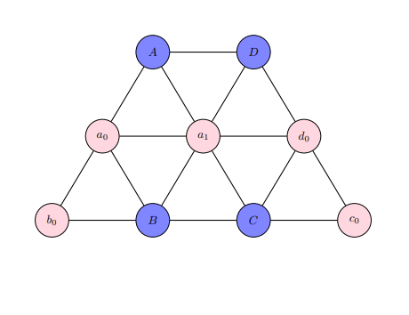
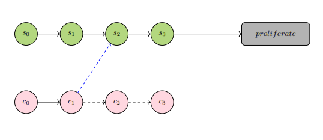
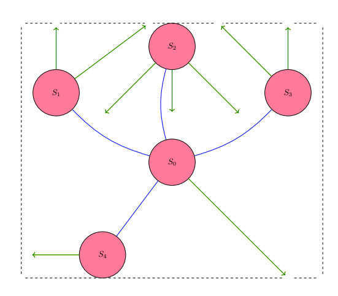
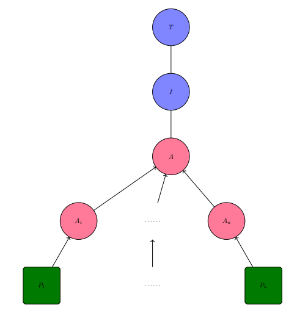
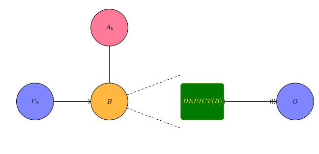

# Nu Merchant Principal
## ~ ongoing notions by me, Richard Pham. 

----------------------------------------------------------------------------------------------------------------------------------------------------------------------------------
### The Big Principle: 
### In mercantilism, that "father figure" you have that told you "it is not about the money, it is about the principle" might just rape you dead and take all of your belongings...
-----------------------------------------------------------------------------------------------------------------------------------------------------------------------------------

# Table of Contents
1. [Autonomy and Games](#p1)
2. [Situational Engineering](#p2)
3. [Security's Price of Choice-Communication](#p3)
4. [Maintenance as Half-Measures of the Potential](#p4)
5. [Wasting the Drive in Gridlock](#p5)
6. [How Obtuse Judgments Can Count](#p6)
7. [To Be Revered by What](#p7)
8. [Curse by Pre-emptive Doxing](#p8)
9. [A Simple Template For Expectations of Cost](#p9)
10. [The Effectiveness of Imagined Fallibilities](#p10)
11. [Shifty and Shifting Alliances](#p11)
12. [Denying Sophistication](#p12)
13. [The Sophisticated as Behavior After Appearance](#p13)
14. [Shifty and Shifting Alliances Pt. II](#p14)
15. [The Great-Wind's Restriction](#p15)
16. [The Idiom and the Idiot](#p16)
17. [Half-Efforts, Full Takes](#p17)
18. [Arguments in Image-Projectable Contexts](#p18)

Business comes and goes, much more frequently than governments. 
So how can commerce thrive without the dread of disillusionment
that stems from the lackluster payoff in zero-sum dynamics? 
Zero-sum dynamics carry an extremely bipolar nature in the 
psychology of actors. And there are few paradigms of thought 
outside of this zero-sum strategic convention in politics, 
business, and war. Well, to clarify, there are few paradigms 
of thought, outside of zero-sum, that have gained enough 
mainstream adoption for the concepts to be taught in typical 
higher education settings.

Brilliance does not quite make the mark in intensely competitive 
settings. But there are some that argue that it is the misuse 
of brilliance, trained and primed towards "malfeasant" outlets,
that results in clear defeats for the owner/s of that brilliance. 
But there have been and are plenty of brilliant people that 
did not quite train and prime themselves towards "malfeasant" 
outlets. And they get paid in dirt. The dumb and perhaps 
retarded scoff at their ideas, deny their promotion, and ruin 
their composure. This is how some brilliant people get treated
like dirt. They get invited to a club or party of some high-society
members, after achieving much and expecting some festive recognition, 
and the invites are rescinded. And the club/party mentions them as if 
they are some dull one fit for exploitation. The high-society 
members already know, due to the luxury and power that they 
are able to retain, that preventative measures against 
exploitation require more than just brilliance. Brilliance 
is materially less in value than dirt. The brilliant person 
wants to get somewhere, with rejection thrown in their face 
as well as insults and knives in their back, their so-called 
"defensive posturing" against exploitation is most definitely 
borne from a source, or at least an effect, of malice. 

Do you really think that fat cow that is your neighbor really 
gives a care for your interests and well-being? Laissez-faire 
feudalism predicts that they do not. While you might be digging 
trenches for "modern-day Rome", that fat cow, the one that has 
never been hurt in any way except for their feelings, looks at
you like you are some kind of slave. The fat cow is stupid.
It is stupid not because it is simple-minded. It is stupid for 
judging while sitting comfortably in its welfare zone, sponsored 
by the government in the name of ... what? Merit? Justice? That
fat cow, ultimately in the context of economic sacrifice, may 
as well be a wolf. It may as well be a wolf because it would 
prefer that you are eaten instead of it.

Suppose there is some kind of wisdom in ultra-competitive 
environments, borne out of Laissez-faire, that goes something 
similar as "one should make as much effort in befriending 
another as the effort required to defend against an enemy."
This is an "ideal" that is much easier to declare and believe in 
than to successfully accomplish. The difficulty of accomplishing
this "ideal" rests upon the nature that surrounds the center, 
for there is no mechanical principle behind it that ensures 
the equal probability of easiness in befriending and enemizing.
Who is to state, with a guarantee that rests completely on 
confidence instead of fear, that not every person becomes 
an enemy in the eyes of a "neo-mercantilist" (for lack of a 
better term)? 

The notion of the fat cow as a wolf in the context of 
economic sacrifice is a strong assumption on costs from 
loss due to some underlying fatalism. Rest assured that 
there are many in academia and government that strongly 
disagree with the concept of competition, or at least 
self-improvement, as zero-sum. These contrarian views 
harness the game theory specification of "non-zero sum 
games". The rationale is that some aspects, which can be
quantified, rest on a sort of cooperation, a mutual 
assurance, a compromise. There is much opinion and 
exemplification on non-zero sum games. These so-called 
"games" do exist in reality, but were only formalized 
into theoretical frameworks, for re-teaching, sometime 
in the last two centuries. By the standard of non-zero 
sum games, the fat cow does not have to be a wolf then! 

The mechanics of "costs", including but not limited to 
quantitative finance, are derived from the cultural 
mores and collective ambition, and also the mainstream 
economic concept of the correlation between scarcity 
and the magnitude of "cost", but the "faith" in these 
numbers does not rest on a uniform consensus of agreement. 
For instance, a sentimental person would probably prefer 
to sell something else other than the memorabilia 
that they've acquired through their years. There is 
the belief in the pricelessness of some material 
objects. Collectively, these same material objects 
could very well be circulated by the masses, according 
to some arbitrarily-set standard of valuation, if 
they are to land in their hands. There are psychological 
and collectivist elements in non-zero sum games. Suppose
that two agents are participants in such a game. Given 
the perceived costs in this game's cost table, the two 
agents "cooperate" for outcomes that grant them both 
"positive" gains, by the table's objective numbers. But
there is dissatisfaction underneath the compromise. 
Perhaps either one or both of the agents feel as though
they deserve more of the "positive" gains. What factors 
would ensure that for the next "game" these two agents 
participate in, there would be no disagreement on the
values of said game's cost table? On the matter of 
collectivist elements in non-zero sum games, suppose
that two arbitrary agents are enthusiastic participants. 
Both of them are practically in sync, with regards to 
their decisions and the corresponding payoffs from those
decisions. But regardless of what decisions they made,
there is a "super-agent" above them. This "super-agent"
is the singular representative of the collective outside
of the game's two agents. According to the facts given 
to this super-agent, both of the agents lose in the 
non-zero sum game. The deceptively "positive" gains split
between the two agents are in fact losses to them. Perhaps
the gains could have been objectively greater if the 
agents were to participate in non-zero sum games without
the overhead of the super-agent's authority. Perhaps
the gains are not objectively positive gains for the
two agents in the long term, given the super-agent's 
influence and capability of intervening between the 
two. 

Cultural, psychological, and collectivistic factors 
were especially noted in non-zero sum games, even
though their existence in zero-sum games is not 
negligible. It is obvious to state that zero-sum 
games, if based on accurate cost tables, result 
in "cleaner cuts". Every participant has very 
little motive to consider the outcome of well-being
for their "competitors". Zero-sum games rest on 
the principles of physics. Value cannot grow, but 
it can be cleanly transferred from some original 
owner, a participant in the zero-sum game, to 
another. The argument that zero-sum games are 
more objectively-based than non-zero sum games 
is more persuasive than the argument for vice-versa.

There is an absolute chance for arguments that non-zero
sum games are more amenable to participants. And the 
claim that the base of objectivity is an exclusive 
trait to zero-sum games is surely to be scrutinized. 
There is another claim that can be more fully 
agreed upon: for any prolonged sequence of 
decision-making events, the usage of both 
game categories serve unique demands. The payoffs 
to participants from non-zero sum games may amount 
to less for each, in comparison to the potential 
payoff (single participant gain) from zero-sum games.
But over time, the partial payoffs from each 
non-zero sum game produce longer lasting and more
stable benefits to the participants, by the metrics 
revolving around uniformity and the mean. Needless to 
say, these two categories of games can be expanded to
involve more than two agents in the lens of mass 
organization. Organizations do not tend to encourage
zero-sum games between its members, given the condition
that both members are of pertinence, through utility, to 
the organization (but perhaps not of the same degree). 
The compromise from non-zero sum games suits the purpose
of pacifying such biases, including jealousy and ambition, 
for integrity of the organization. However, in an 
organization's life, there occur instances where 
zero-sum games are utilized for the objective of 
slashing what is deemed to be excess or vice. 

The first paragraph of this essay posits the 
domineering influence of zero-sum, over others, such as 
the alternative of non-zero sum, as a concept taught
in the education setting. Many in university/government
settings would probably not be vocal in support of this
posit. Activities such as research&development, 
coordinated security, and journal publications do 
lean toward cost values of non-zero sum game. 
Knowledge, especially, is one of the fundamental 
possessions that do not operate on zero-sum dynamics 
on the one condition that the knowledge is fairly
distributed. One of the ideals espoused in higher 
education is something along the lines of "a more 
informed society is a superior society". But the 
value of knowledge wildly oscillates from trivia 
to critical vulnerabilities belonging to persons, 
organizations, nation-states, etc. What is a non-zero
sum game to a select group of participants may be
reflected onto another group as a zero-sum game's 
outcome that adversely affects them.

With regards to application of the concepts zero or
non-zero sum, the first is predominantly used in 
contexts such as material transfers and clear-cut
win/lose outcomes. Due to the cooperative nature 
of non-zero sum games, even with the specification 
that the participants do not know ahead of time 
what their counterparts' decisions are, there is 
a tendency for at least one of the participants 
to lose sight of the definition behind the outcome
values. The coupling (two participants) and 
entanglement (more than two participants) fuzz 
decision-making in such a way for there to be 
virtually no optimum payoff by the available 
options. Perhaps in some cases, contiguous 
non-zero sum games played by the participants 
may result for there to be a kind of "delegation"
from at least one of the players to the remainder.
The preferences of the remainder become prioritized
over the delegators, who would rather play and follow
along than to emphasize their own ideal choices 
in the "game". 

## Autonomy and Games 

Autonomy is a multi-faceted question in arrangements 
that are games. Why would an agent participate in some 
arrangement called a game if there is the certainty 
that the best outcome, in the form of payoffs from 
the true cost table, cannot result in their betterment?
The agent diverges from their original circumstances
that would have granted them opportunities to pursue 
some desired sequence of outcomes, each a checkpoint of 
success or at least, gratification. Then they are 
enmeshed in circumstances that require their actions 
to be geared towards some objective directly related 
to the specific temporal demands of those circumstances.
They can mention the question of choice, a topic which 
is generally known to many members of societies that have 
had their hands forced into certain outlets (certainly by 
the mortal powers above them), but they will only receive
a response to accept the matter as another of idealism's
lost visions.

Children engage in activities that can be termed
as "games". These activities generally do no harm amongst
themselves, and give them the benefit of developing their
values and way of life to eventually play the roles of 
astute cogs in mature society. It is this premise that 
is a major moral justification for why some find themselves
in circumstances, deemed games by some, that they otherwise
would not engage in, either due to their ignorance that 
such circumstances (comprised of materials and events) exist 
or their involuntary stance towards those circumstances.
The premise as one word is education. Is this word 
simply a transmission of terminology and procedures,
as well as the auxiliary materials used to aid in 
understanding and experiencing this transmission of 
information? Could education really be as simple as two 
parallel straight paths, one the perfect transmission 
(by the educator) and the other the perfect practice or 
at least the most genuine effort in practice (by the educatee)? 

Entertain the notion that there are two tenets in education. 
For matters of fact, education transmits absolute truth. 
And for other matters, education transmits perfect knowledge 
of the methodology. This notion relies on the condition that
there is nothing to be educated on past the minds of the 
educators. The educators were selected due to their mastery 
of the matters that they are to transmit and train their 
educatees on. So the educators could not possibly steer
any of their subjects directly towards wrongful practices 
and fallacies. 

On the idea of autonomy as the choice to participate
in games that benefit and to not participate in anti-beneficial
games, education as outlined by the previous paragraph 
is beneficial. But in games that are believed not to be
beneficial, how can an agent truly know that they will 
sorely pay during or after their participation? Couple 
the particular outlining of education (in the previous 
paragraph) with active efforts to know the unknown (and 
all of the unknown's costs), from a perspective that supercedes
even the educator. And the resultant is not education by 
the definition. Instead, it is experimentation and education. 
Education systems can enable their educatees to experiment, 
outside of constraints designed by the educator.
There are certainly arguments available to defend these 
kinds of education systems, so that the educatees have 
greater awareness of what games will pay them off 
immensely, what other games are non-profit but greatly
expands the experience (if experience cannot be 
quantified), and yet still the remaining games that 
will make them sorely pay beyond their recovery back to 
growth or at least, stasis. 

The structuralization of any education system surely 
cannot accomodate the demands of the lifelong learner.
This is to assume that any education system imposes
binding demands on its participants. Without binding
demands, the freedom of participants to come and go 
by their own volition somehow dilutes the seriousness
and truthfulness of the informational material 
transmitted to them. In these circumstances, education
becomes casual recreation, and recreation is personally
experiential events; this is a Dionysian VS Apollonion 
argument. Even if one is not keen on learning any more 
past their depth, there is still the requirement 
of experience in sentient existence (if life goes on). 
And experience can be very stochastic, or even worse, 
engineered against those subject to the experience. The 
term "information-flow system" suffices as a superset 
of "education system". There are not required to be any 
binding demands from an educator that does not need to 
exist. The omnipresent requirement of processing 
information stands strong in this superset of an 
education system, even stronger than that of the 
education system since the lack of structured guidance 
is compensated by utter seriousness in certain contexts.

In many respects, the objective of education is to 
enhance and refine risk-averse mentalities and behaviors.
For example, mistakes from history should not be repeated.
Make careful calculations before embarking on dangerous
trails. Take the tragic lessons from literature to heart.
And so on. With experimentation, there is risk attached.
Experimentation is interesting with regards to 
accountability. Educators generally steer clear from 
the losses from experimentation. The simple more is that
they cannot risk their reputation to become entangled 
in what are perceived by third-party judges as fallibility 
traps. The fact that there are different natures and 
styles attached to those that experiment validates the 
anticipation that conceptualizations of fallibility, such 
as the Seven Deadly Sins, are to be mentioned by some in 
their aims to "reveal and penalize evil". 

Autonomy is intricately connected to information-flow
systems. Some important attributes of noteworthy mention
are filtration processes, recognition mechanisms, flow 
control, network administration, and ultimately, capabilities 
past the knowledge that is perfect information.

## Situational Engineering 

The academic field of game theory has mass-proliferated
some important findings in the context of decision-making.
It has structured "games", decision-making junctions between 
two or more agents, into these classifications: strategic, 
extensive, and coalitional. It has also put focus on the 
nature of information available to agents during their 
activities called "games", that is, perfect and imperfect 
information. Rules for calculating the optimal decision
are defined by the Nash equilibrium and its sibling 
concepts. In cases where there is no optimum by the decisions
and costs granted to the agents, there is also the 
"ideal" (or expectation) of steady state, as illustrated
by games such as Matching Pennies. 

The mathematics applied in game theory is extensive enough 
to satisfy these two big questions: 
- best decisions or expected states,
- expected payoffs (through probabilistic functions or 
best-decision rules). 

But what about the situation? Given merely the cost tables 
(as formulated by game theory), some agents are predisposed
to having some set of moves that may or may not intersect
with the movesets of their co-participants. In other words,
there is an unspoken asymmetry or equality in capabilities
before the consideration of the game in focus. Acceptance of
these conditions relies on the acceptance of the histories
(for lack of a better term) of not only the agents belonging
to the game in focus. There is also the need to understand 
the outside factors, some of which may be responsible for 
governing past events, agents, interpretations, and orders 
into the situation that contains the participating agents. 

Consider this situation, called Game of Varying Coercion. 
There are only two players to make way for simplicity of 
illustration.

| t=1 | Play Along | Reveal |
| --- | ---------- | ------ |
| Silent Trigger | 10,1 | 10,-100 |
| Brute's Force | -1,0 | 5,-50 |

**GVC1:** Game of Varying Coercion @ timestamp 1; (2 x 2).

Agent A (row-wise) has the clear upper hand, in terms of
cost as quantified by this table. Agent B is put into a
servile position. Agent A would be wise to maintain 
preference for the dominated action of Silent Trigger.
There is no possibility for Silent Trigger to inflict 
negative gains for Agent A. Whether Agent B chooses to
obey Agent A by playing along, or revealing so as to 
catalyze revolt against Agent A, Agent A secures its 
upper hand by Silent Trigger. For Agent A to act by 
Brute's Force against an obedient Agent B speaks poorly 
for its welfare, as denoted by the negative gain of 
-1. If Brute's Force is used against Agent B in the 
case of its act of revealing, then there is a positive 
gain of half that for Silent Trigger. Suppose the 
revelation is judged to be fallacious, so much that 
Brute's Force is justified.  

Silent Trigger requires more skill by the actor. It
also requires more situational expenses so that the
silence of the Trigger is not exposed to Agent B or
third-party observers, who then have more knowledge 
and material to retaliate. The cost values of Table GVC1
denote the combative gains by the agents. However, 
there is another set of costs that are pertinent, 
by Table ST1. 

| ~~ | Effective Cooperative | Ineffective Cooperative |
| --- | ---------- | ------ |
| Bull's Eye | -3,-12 | -1000,-50 |
| Missed Mark | -30,-100 | -1200,-1000 |

**ST1:** Costs to Resources by Silent Trigger; (2 x 2).

There are two possibilities for the actor behind Silent 
Trigger, labeled by the rows. The infrastructural costs, 
comprised of sentient agents, the environment, and the 
situation that is staged by these sentient agents, are 
the two columns: effective and ineffective cooperative. 
The cooperative is designated as an alignment with the 
Silent Trigger's actor. Note that there are no positive
gains to resources. If the cooperative is ineffective, 
whether voluntarily or not, then it is critical for 
Silent Trigger's actor to move by Bull's Eye, in the 
name of costs to resources. If there is effective 
cooperative, the event of Missed Mark by Silent Trigger's 
actor results in less damage to resources. Table ST1 
illustrates the heavy costs, even without the risk of 
failure by Silent Trigger's actor and their cooperative, 
of maintaining the dominated action of Silent Trigger 
over Brute's Force. 

By Brute's Force, however, there is a risk that 
oppositional mass-organization from Agent B 
(in Table GVC1) ensues. The situation of the involved 
agents can escalate into something similar to that 
illustrated below.

| ~~ | Advance Opposition | Maintain Opposition | Withdraw Opposition |
| --- | -------------------- | ------------------- | ----------------- | 
| Escalate Brute's Force | 1000,500 | 250,250 | 2000,0 | 
| Mix Brute's Force with Silent Trigger | 2000,-50 | 1000,500 | 2000,-300
| Silent Trigger | 0,400 | 0,0 | 4000,-200

**BFAM:** Combative Gains (Opponent's Pay) in the Aftermath of Initial Brute's Force; (3 x 3).

Table BFAM gives numbers that still predominantly benefit Agent A.
But these numbers are based only the starting states of the agents, 
and shed no evidence on the constancy of costs over repeated iterations.
Brute's Force may result in the situation of Table BFAM, and the decision 
for Agent A to choose Brute's Force over Silent Trigger may be due to 
the latter's unsuccessful enactment, which in turn, is due to the 
negative gains. Silent Trigger in BFAM, due to its requirements of 
high skill and effective cooperative, becomes virtually useless 
unless Agent B chooses to withdraw opposition. 

The Game of Varying Coercion is an antagonistic game. It 
requires for there to be an aggressive antagonist and an 
incapable subordinate target, with much less the social and 
communicative resources than available to its opposer. What 
kind of game is this, for there to be irrationality on the 
part of Agent B that results in its entering this situation? 
Game theoretics do presuppose that agents act by rational 
choice, before, during, and after any arbitrary decision 
junction that is a game. As stated in the beginning of this 
section, the rationale for why situations such as Game of 
Varying Coercion occur is essentially long, nuanced, 
specific explanations based on histories. A more civilized 
version of this game can certainly exist, as Game of 
Pacified Varying Coercion. 

| t=1 | Genuinely Cooperate | Civil Re-negotiation | Fraud/Betrayal |
| --- | ------------------- | -------------------- | -------------- |
| Pacified Silent Trigger | 100,100 | 0,0 | 1000,0 |
| Pacified Brute's Force | -1000,0 | -100,500 | 1000,0 |

**GPVC1:** Game of Pacified Varying Coercion @ timestamp 1; (2 X 3).

There is the question of the degree of choice 
revolving around the hands (of the agents and third-parties) 
in the Game of Varying Coercion. Would it not be splendid if
there was only the alternative of Game of Pacified Varying 
Coercion to be played? There would be little motive for any 
rational Agent B to choose Fraud/Betrayal. The integrity of 
the feedback loops involving genuine cooperation and civil 
re-negotiations would lead to a continuous improvement 
process, without any second thoughts. But back to the matter 
of the Game of Varying Coercion, it could be argued that 
the events leading up to the asymmetric attributes of the 
involved players are essentially sibling decision junctions 
of the Game of Chicken. The key difference is that in the 
Game of Chicken, the objective is mirror-opposite decisions. 
To achieve the moveset of Agent A in Game of Varying Coercion,
as a game before this game, there is required a kind of 
relentless dedication (including the security) to acquiring 
the skills and resources that then concentrates these 
attributes into the moveset, the starting possible 
choices available to Agent A. For clarification, the 
likeness in these predecessor games to the Game of Chicken, 
with the aims of achieving the position of Agent A, rests
on the "security" in the relentless dedication. If Agents 
C and D are to compete, in forms direct or otherwise, to 
be Agent A instead of B in Game of Varying Coercion, then
they are to attempt to appear as doves in particular contexts.
Playing as the dove helps avoid direct confrontation with 
obstacles to their objective of becoming Agent A.

## Security's Price of Choice-Communication 

There is a lot to be said,written, or however else 
communicated on the "power of language", specifically its 
broad role in retentive and transformative processes. 
A universal desire exists amongst sentient beings to 
privatize (form and uphold attributes of secrecy) 
communication to their personally desired degrees. 
Unwanted members, such as those that would oppose the 
communication or would be advantaged as antagonists to 
know said communication, are the subjects that privatization 
efforts seek to exclude. In this game, deemed the Game 
of Crypto or Gibberish, communication does not take 
place simply between two distinct beings. There are 
calculations and layers involved, manifesting themselves 
as functional judgments and tiered structures (geometric 
spaces,networks,et cetera). 

There are four agents in this game that consists of 
more than one cost table.
- Agent A: the interpreter of the communication.
- Agent B: the source and messenger of the communication.
- Agent C: correspondent to Agent A, otherwise known as a sub-agent of A; they provide methodologies,tips, and hints derived from their observation of Agent B. Such observation may require positioning for insider knowledge.
- Agent D: the follow-up actor to the interpretation by Agent A of Agent B's communication.

Whenever Agent A is mentioned, assume that Agent C is 
also included due to their status as a sub-agent to Agent A.

Three primary decision junctions exist in the Game of 
Crypto or Gibberish, and this section sequentially presents 
explanation on them. 

Agent B has a question Q to provide an answer to. They 
know that this answer, formatted according to some 
specification, will be received by Agent A. There are 
three possible choices for answers. 
- $I_1$: completely true in the case of Q being a fact-based query, otherwise completely genuine for Q that is a subjective-based query.
- $I_2$: trivial, sarcastic, ironic statement.
- $I_3$: completely fallacious or disingenious statement.

There are also three accomodating objective functions 
for Agent B that ranks the choices for $I_j$ by ordinality. 
- $OBJ_1: I_1 > I_2 > I_3$,
- $OBJ_2: I_2 > I_1 > I_3$,
- $OBJ_3: I_3 > I_2 > I_1$.

The first junction is one decision by Agent B to format
their message into a secure format, such as digital encryption
via some arbitrary mask procedures, denoted by $M_k$. The 
"hardness" of the particular mask is denoted by $k$, such 
that $k$ is inversely proportional to this variable:
$1 > 2 > 3$. "Hardness", in computational complexity, 
refers to the expense of resources required to accurately 
complete the calculation. So, $M_1$ is more complex than 
$M_2$ for a third-party to process. 

| $dec_t=1$ | $M_1$ | $M_2$ | $M_3$ |
| --------- | ----- | ----- | ----- |
| $I_1$ | $OBJ_i(I_1)$,3 | $OBJ_i(I_1)$,2 | $OBJ_i(I_1)$,1 |
| $I_2$ | $OBJ_i(I_2)$,3 | $OBJ_i(I_2)$,2 | $OBJ_i(I_2)$,1 |
| $I_3$ | $OBJ_i(I_3)$,3 | $OBJ_i(I_3)$,2 | $OBJ_i(I_3)$,1 |

**GCG1:** Game of Crypto or Gibberish @ decision junction 1; (3 X 3).

For each cost-value pair $(c_0,c_1)$ in the table above, 
$c_0$ denotes the expense on objective $OBJ_i$ in sending 
information $I_j$ to Agent A, and $c_1$ denotes the price of 
using mask $M_k$. 

These two tables below are exemplifications of the objective
being $OBJ_1$ and $OBJ_2$, respectively.

| $dec_t=1$ | $M_1$ | $M_2$ | $M_3$ |
| --------- | ----- | ----- | ----- |
| $I_1$ | 0,3 | 0,2 | 0,1 |
| $I_2$ | 1,3 | 1,2 | 1,1 |
| $I_3$ | 2,3 | 2,2 | 2,1 |

**GCGO1:** Table GCG1 by $OBJ_1$; (3 X 3).

| $dec_t=1$ | $M_1$ | $M_2$ | $M_3$ |
| --------- | ----- | ----- | ----- |
| $I_1$ | 1,3 | 1,2 | 1,1 |
| $I_2$ | 0,3 | 0,2 | 0,1 |
| $I_3$ | 2,3 | 2,2 | 2,1 |

**GCG02:** Table GCG1 by $OBJ_2$; (3 X 3).

Lower expenses in objectives are preferred, for costs 
incurred upon the objective promote the failure of Agent B.
The direct association, between the value $c_1$ and the 
strength of the mask, is used by Agent B to decide on 
which mask to use. $M_1$ provides the greatest security
in transmission, that is, the lowest probability that 
a third-party (those that Agent A has not shared with) 
will able to possess full knowledge of. Junction 1 is a 
min-max decision problem. The information $I_j$ with the 
lowest corresponding $c_0$ score is the dominated choice. 
Mask $M_1$ is the dominated choice of mask, with respect 
to two-agent (A and B) privatization. This decision problem 
could be further complicated by raising the question on 
the magnitude of privatization desired by Agent B. Agent 
B could very well not care about maintaining "perfect 
secrecy", and chooses one of the masks in $\{M_2,M_3\}$ 
so that some other arbitrary agent outside of $\{A,B,C,D\}$ 
can knowledgeably interfere.

Now onto the second decision junction, with specific focus 
on Agents A and C. Correspondent Agent C's responsibility 
was to "observe" Agent B for information regarding the 
important attribute of the mask $M_k$ used as well as their
objective with respect to $I_j$. While gathering information 
on the mask is an empirical task, meaning the knowledge 
gathered on its form and parameters can be judged on a 
continuum spanning from absolutely false to absolutely 
true (but the question remains on when the judgment 
can take place), prediction of Agent B's objective 
is not as clearly defined, in great part because Agent B 
could very well change their objective a split instance 
before for a future decision unanticipated by Agents A 
or C. Prediction of Agent B's objective is clearly 
a probabilistic problem, with some reasonable solution 
catered to their behaviorial leanings. Below is a possible
cost table that accomodates the second decision junction.

| $dec_t=2$ | $D_1$ | $D_2$ | $D_3$ | $D_{null}$ |
| --------- | ----- | ----- | ----- | ---------- |
| $M_?(I_j)$ | 1,3 | 1,2 | 1,1 | 1,0 | 

**GCGT2:** Decision junction 2 for Agent A with C; (1 X 4).

The table GCGT2 pre-supposes that Agent A has been 
able to ascertain the three available masks, as presented
in table GCG1. If Agent B wants Agent A to have the 
capability to decrypt the message $M_?(I_j)$, then they 
encourage conditions that grant Agent A (through themself 
or their correspondent Agent C) the knowledge of either 
the actual (inarguable) mask $M_?$ or some combination
of the masks $\{M_1,M_2,M_3\}$. The numbers in this 
cost table mean very little, in terms of deciding on the 
best out of the four choices, because the aims of Agent
A is to derive one of $\{I_1,I_2,I_3\}$ from $M_?(I_j)$.
Agent A, for their serious intents and purposes, would 
only be interested in $I_1$, possibly $I_2$ if $I_2$ 
sheds some inkling (decreases the breadth of possibilities) 
on $I_1$. If $I_j$ in table GCGT2 is one of $\{I_2,I_3\}$,
then Agent A could use a null decryptor $D_{null}$ that
produces no legible information. Assume that in this 
game, having full knowledge of a mask $M_i$ naturally 
lends way to determining the corresponding de-masker 
$D_i$. If Agent B simply wants for Agent A to receive 
$M_?(I_j)$ without providing them any direct or indirect 
knowledge on the mask used, then Agent C would have to 
put precise and greater effort in ascertaining $M_?$. 
Agent A would not know that $I_1$ is the best option 
if decision junction 1 is carefully implemented by 
Agent B in a way that uniformly splits believability 
between the members of $\{I_1,I_2,I_3\}$, as the 
answer to question Q. Then Agent A, upon their belief 
that $M_?(I_j)$ is pertinent, advances ahead to 
attempting to use the correct de-masker for the 
result $I_j$.

On the matter of capabilities, if masks $M_1,M_2$ 
and $M_3$ are somehow connected in their calculative 
procedures, then Agent A's ascertainment of $M_1$ 
naturally lends way to them also having the capability 
to ascertain $M_2$ and $M_3$.

Cost table GCGT2 could be further complicated 
if Agent B were to, instead of selecting only 
one $I_j$ by their objective $OBJ_i$, instead sends 
some combinational set of size greater than 1 from 
$\{I_1,I_2,I_3\}$ to Agent A. 

| $dec_t=2$ | $D_1$ | $D_2$ | $D_3$ | $D_{null}$ |
| --------- | ----- | ----- | ----- | ---------- |
| $M_?(I_1)$ | 1,3 | 1,2 | 1,1 | 1,0 | 
| $M_?(I_2)$ | 1,3 | 1,2 | 1,1 | 1,0 | 
| $M_?(I_3)$ | 1,3 | 1,2 | 1,1 | 1,0 | 

**GCGT22:** Decision junction 2 for Agent A with C in the event of plural information $I_j$; (3 X 4).

The extent of labor required of Agent C, as well 
as the degree of their skills in information acquisition,
in determining the credibility of $I_j$ is proportional 
to the design, objective, and performance of Agent
B's transmission.

Moving onto decision junction 3, it is now Agent D's
turn to act. Agent D is given the information 
$W=D_?(M_?(I_j))$. They must decide on how to act on 
$W$. They could just rest their decision on the judgments 
from correspondent Agent C of A, and move on ahead
to acting by their prescribed procedure.

| $dec_t=3$ | $A_{pro}$ | $A_{contra}$ | $A_{null}$ |
| --------- | --------- | ------------ | ---------- |
| $W$ | ?,? | ?,? | ?,? |

**GCGT3:** Decision junction 3 for Agent D, the follow-up actor 
to the plain information received from Agent A; (1 X 3). $A_{?}$
is a possible classification of action to take. 

The Game of Crypto or Gibberish has a few noteworthy
attributes that if, left unmentioned explicitly, 
may lead to alternative understanding. Every junction 
point is a decision to be taken by exactly one agent. 
Each decision may be comprised of more than one choice, 
a choice as an $(n,m)$'th element in the appropriate 
cost table. Given the abstract of this game, there 
cannot exist a deterministic function that predicts 
what decisions are to be taken at every one of these 
junction points. With accurate experimental data 
taken pertaining to some group of agents that 
collectively play the roles of Agents A through D, 
probabilistic methodologies can yield decision 
functions with predictive accuracy on the outcome 
of the game greater than that offered on the basis 
of "random" chance. In the Game of Crypto or 
Gibberish, the three cost tables, each one for one 
decision junction, can be amalgamated into a 
single cost table. This single cost table is 
an action-oriented cost table. The outcome of 
the action that D is to take is the primary 
consideration in cost assignment, as a direct 
determinant for decision.

Relations between Agents A through D are an 
important aspect in this reduction to a single 
cost table, that can in turn be represented 
in at least two ways.

In the first route, there are three relations, 
each with their own particular set of variables 
and operators.
- $\mathrel{R}(A,B)$: Connected to the $OBJ_i$ selected by B in its message,
  the particular message communicated by B, and the decision by $A$ at decision junction 2.
- $\mathrel{R}(A,D)$: Connected to the preference of A to want for D to 
  - follow its preference on what action D should take,
  - allow for D to take the most ideal action based on A's transmitted interpretation of B's
    message.  
- $\mathrel{R}(B,D)$: Connected to the $OBJ_i$ selected by B, the action that B desires for 
  D to take, and the action that best suits the interests of D. 

The function $\mathrel{F}(A,B,D)$ is formulated as
$\mathrel{F}(A,B,D)= \mathrel{R}(A,B) \times_0 \mathrel{R}(A,D) \times_1 \mathrel{R}(B,D) \times_2 \epsilon.$ The symbol $\times_?$ is an arbitrary 
commutative operator, and any two $\times_i,\times_j$ do not have 
to equal each other. The error term $\epsilon$ allows for 
a precise fit. 

Function $\mathrel{F}(A,B,D)$ is used to determine the specific 
two-value cost for each action $A_{pos},A_{contra},A_{null}$ 
that Agent D can take:
$\mathrel{F}(A,B,D)(A_{?}) \rightarrow (c_0,c_1).$
The values $c_0$ and $c_1$ have opposite signage to one another. 

The single cost table, by this first route of expression, is 

| ~~~~~~~~~ | $A_{pro}$ | $A_{contra}$ | $A_{null}$ |
| --------- | --------- | ------------ | ---------- |
| $\{A,B,D\}$ | $\mathrel{F}(A,B,D)(A_{pro})$ | $\mathrel{F}(A,B,D)(A_{contra})$ | $\mathrel{F}(A,B,D)(A_{null})$ |

**GCGSINGLE:** Single-table expression (route one) of the outcomes possible to the involved agents in Game of Crypto or Gibberish; (1 x 3).

And the best action to take, when the cost values $(c_0,c_1)$
are oriented for the relation of greater as better, is
the one with the maximum value $c_0+c_1$ from function 
$\mathrel{F}(A,B,D)$. 

For the second route, every agent A,B,D has a corresponding 
valuation function $V_{?}$ that produces a cost-value pair $(c_0,c_1)$ 
on the outcome from the action taken by D (after its receipt of A's 
interpretation of B's message).

| ~ | $A_{pro}$ | $A_{contra}$ | $A_{null}$ |
| - | --------- | ------------ | ---------- |
| A | $V_{A}(A_{pro})$  | $V_{A}(A_{contra})$ | $V_{A}(A_{null})$ |
| B | $V_{B}(A_{pro})$ | $V_{B}(A_{contra})$ | $V_{B}(A_{null})$ |
| D | $V_{D}(A_{pro})$ | $V_{D}(A_{contra})$ | $V_{D}(A_{null})$ | 

**GCGSINGLE2:** Single-table expression (route two) of the outcomes possible to the involved agents in Game of Crypto or Gibberish; (1 x 3).

The problem that cost table GCGSINGLE2 asks to solve 
is to determine the action $A_{?}$ that Agent D would 
take to yield the "most benefit" to itself and 
Agents A,B. There are two standard mathematical 
approaches. 
- Select $A_{?}$ based on the greatest cumulative summation 
  $c_0+c_1$ from valuation functions $V_{A}$ through 
  $V_{D}$. 
- Select $A_{?}$ based on the least variance of 
  $c_0+c_1$ between valuation functions $V_{A}$ through 
  $V_{D}$.

In the first approach, there is the belief that the
action with the greatest singular value produced from 
the cumulative attributes and decisions of Agents A 
through D is most beneficial. In the second approach, 
there is the belief that the action with the most even 
distribution of gains or losses between Agents A through 
D is superior.

The Game of Crypto or Gibberish has the distinction of 
possessing an innate and constant opaque nature to guard
against convenient understanding. Exemplifications of the 
Game of Crypto or Gibberish can be revealed towards full 
understanding, but perhaps the revelation takes place 
only after the actualization of events during timespans 
displeasing for the impatient or those that cannot afford 
the time. 

## Maintenance as Half-Measures of the Potential 

Maintenance is associated with aspiring towards the
"constant", the "equilibrium", and confusingly, some 
quality/ies of the full picture belonging to a context 
that is a zero-sum dynamic. If maintenance was the 
absolute peak of potential for an entity, then there 
can be no question on what further magnitudes they can 
accomplish, relegated to the confines of their peak 
potential action of maintenance. Destruction consists
of related but not entirely connected phenomena to 
maintenance. A casual reminder on destruction is it 
is enabled by specific conditions stemming from 
over-maintenance (excess magnitude in pro-activity) and 
lack of maintenance (negligible activity). Destruction is 
not the focus of this section, although phenomena 
labeled as destructive has a contradicting relationship
with the defined ideals of maintenance.   

A construct called the Game of Tree-Trimming is used 
to aid in quantitatively abstracting maintenance. The 
Game of Tree-Trimming is one, similar to the previously 
discussed Game of Crypto or Gibberish, with multiple 
cost tables in consideration. Threshold-activation, a 
quantitative condition that places demands on an actor 
with respect to their achieving some objective for them 
to move onto a different cycle or step, is an important 
component of the Game of Tree-Trimming and accounts for
the continuum belonging to the actor's potential. 

Similar to the Game of Crypto or Gibberish, the Game of
Tree-Trimming has four primary agents. 
- Agent T: the tree, comprised of a trunk (including the root) as 
  $R$ and the connected branches $B$. Every branch $B$ 
  has some arbitrary quantity of leaves $L$ and fruit $U$. 
  While a branch $B$ connects to T's periphery of $L$ and 
  $U$, it is still a strict subset of $R$, meaning that it 
  can never be $R$. T has exactly one process, to naturally 
  grow, that is, proliferate itself to be of a greater mass 
  through extension of any one of its component classifications, 
  the root $R$, branches $B$, leaves $L$, and fruit $U$. 
  Outside of T's natural growth process, they do not have any 
  mechanism of free-will to act in any other way. 
- Agent A: in charge of modifying T via its only action
  of cutting. The magnitude of cutting power available to Agent
  A is left undefined by default.
- Agent B: by its ordainment of continually perfect information 
  on Agent T, commands to Agent A its preference on how 
  Agent A should cut. 
- Agent C: otherwise known as a third-party or unknown factor. Plays
  some role of advisor or ruler on Agent A's judgment of the appropriate
  command to Agent B. 

One important constraint is placed on the capabilities of Agents 
B,A, and C with regards to treatment of Agent T. The growth 
process of Agent T cannot be augmented by any Agents B,A, or C
outside of A's cutting actions. The Game of Tree-Trimming is 
an abstraction, and so does not include real-life considerations 
such as environmental engineering that would affect Agent T's 
growth process. Maintenance as half-measures of the potential
refers to A's cutting actions, and the maximum cutting power
(potential) of A is measured by its capability to cut the 
leaves $L$ and fruit $U$, branches $B$, and the root $R$ of 
Agent T. There is a non-zero observable probability for any 
branch $B$ to be a finitely recursive structure. A branch $B$ 
may contain some arbitrary number of sub-branches, each still
classified as a branch.

A hierarchical demand-flow is what the Game of Tree-Trimming 
relies on. Agent T's one action of its growth process is 
ascribed to the realm of "natural activity". The unidirectional 
source of influence for Agent A's cutting actions is from Agent 
B's convolutional decision-making process, that which involves 
contributions from Agent C. 

**GTTD:** Flow-diagram for Game of Tree-Trimming. 

Categories of threshold-activated functions, pertaining to 
Agent A's actions, exist to fit the attributes of Agent T. 
One category is for fruit and leaves, another for the 
branches, and the last for the root $R$.

| branch | geometric measure |
| --------- | ----- |
| $B_0$ | $m_0$ | 
| $B_1$ | $m_1$ |
| $B_2$ | $m_2$ |
| ... | ... |

**TBR:** Two-column table of branches and their corresponding non-negative geometric measures.

The threshold function for trimming branches is 
$F_{branch}$, which outputs a (minimum,maximum)
activation range, and is controlled by the 
convolutional judgment of Agents B with C. 

In terms of efficiency and uniformity, it would 
make sense for $F_{branch}$ to produce activation
ranges roughly equal to each other for each branch.
However, in terms of aesthetics, each branch surely
has a probability of being assigned an activation 
range from $F_{branch}$ distinct from that of at least 
one other branch. Recall that since a branch may 
be finitely recursive, so that some branch $B_x$ 
may be a subset of another branch $B_y$ in table TBR,
then the most efficient cutting procedure for 
Agent A to take based on $F_{branch}$ from Agent 
B is to first determine which of the branches fit
their respective ranges for cutting. For any connected
set of branches,
$B_{x_1} \subset B_{x_2} \subset \dots \subset B_{x_n}$, 
select the biggest branch $B_{x_j}$ that is judged by Agent B
to need cutting, and cut it. This approach guarantees 
the fewest number of cuts required. But there is one 
issue not yet mentioned, and that is the <ins>regenerative
potential</ins> of Agent T after these cuts are made. Suppose
for each branch $B_x$ that fits the activation range
to be cut, the cut by Agent A applied to its specific 
geometry results in an end so dead that no regenerative 
process from T can grow back $B_x$ to its former geometry
and beyond.

The threshold-activation function $F_{L,U}$ is similar
to $F_{branch}$. But since branches are recursive structures,
the methodology for selecting the fruits and leaves is 
more straightforward. And $F_{L,U}$ produces more uniform 
threshold-activation ranges than $F_{branch}$, on the 
natural basis that all fruits and leaves from Agent T 
are of a uniform nature respective to their categories.
Cutting just the fruit and leaves of Agent T bears no 
possibility for future dead ends. The fruit and leaves
regenerate based on the volition of Agent T's root $R$.

And the last threshold-activation function $F_{root}$ 
is quite complicated to generalize. For Agent A to 
cut the root $R$ of Agent T, if it really can, Agent 
B would have to deem the act vital to its interests.
Perhaps Agent B, through its convolutional thought 
processes with Agent C, thinks that Agent T has 
"outserved its purpose" to it. Its judgment may be 
derived from the temporal accounting of poor yield
belonging to Agent T, through the branches, fruits, 
and leaves cut. Perhaps Agent B has determined that 
there is a better alternative to Agent T, such as 
another replacement tree or no tree whatsoever.
The function $F_{root}$ outputs a value of 1 (cut 
it) or 0 (do not cut it). $F_{root}$ is to answer 
the question of preferring source elimination
over source control. 

These three threshold-activation functions suffer 
from the probable problem of <ins>piecewise contradiction</ins>
between their outputs. For Agent B to judge, based on 
its function $F_{L,U}$ to not cut a particular 
leaf or fruit $f$, but for its function $F_{branch}$
to label a branch $B$, holding $f$, to be cut 
is an example of this contradiction. Similar 
forms of contradiction exist with relations 
involving $F_{root}$.

As mentioned in the initial introduction of the 
four agents in the Game of Tree-Trimming, Agent
A's cutting power is undefined by default, but 
a sane presupposition can be made that this 
power it has is finite and non-static. An 
opportune time for Agent A to cut some part of 
Agent T may not come again.

## Wasting the Drive in Gridlock 

Gridlock describes a condition with particular
traits in a group of entities (two or more), 
with at least one entity thinking and acting for an 
interest that does not align with at least one co-entity 
in this group. The perception of gridlock has a level
of difficulty in detection, whether by members of 
the involved group or a third-party, proportional
to the cumulative difficulty in accurately measuring 
each member's advances (improvements, actualization, 
et cetera) in their interest over a selected period 
in time. In gridlock, membership of an entity in a 
group does not require their voluntary consent. 
Enactment of connective principles such as contractual 
agreements, socio-economic magnetism, and co-dependencies 
are some of the preventative measures against an entity's
attempt to separate themselves, by their own perogative
from a group. 

Suppose a group D has five entities in it:
$D= \{E_0,E_1,E_2,E_3,E_4\}.$

**NOTE**
The integer five is a common number, alongside two and 
three, in the context of division or at least difference. 
Five is the value from halving in base-10 numerical 
systems. It was chosen as the number of entities in 
this example based on this premise. 

Each of the entities $E_i$ is associated with an 
interest $I_i$. In group D, there exists at least one
pair of entities $(E_i,E_j)$ with relations, based on 
their interests, that do not align. In formulaic notation,
that is 
$R_{align}(I_i,I_j) = false.$
The objective of each entity's interest is to yield some
outcome: $OBJ(I_i) \rightarrow O_i$. 
The outcome, for practical intents and purposes, is typically
a set of variable values. Each variable value of an outcome $O_i$
falls on a continuum or a discrete space $S_i$, such as boolean, of 
their respective attribute. Additionally, every variable value
is supposed to satisfy only a portion $P_i$ of the space of 
possibilities. In other words, the satisfying condition for 
objective $OBJ(I_i)$, based on the associated possible outcomes, 
is $P_i \subseteq S_i$. Based on the nullifying initiator, 
the lack of alignment $R_{align}(I_i,I_j)$, the outcomes for 
the entities of D are the following. 

| Interest | Wanted Outcome | Actual Outcome |
| -------- | -------------- | -------------- |
| $I_0$ | $P_0$ | $P^{?}_0$ |
| $I_1$ | $P_1$ | $P^{?}_1$ |
| $I_2$ | $P_2$ | $P^{?}_2$ |
| $I_3$ | $P_3$ | $P^{?}_3$ |
| $I_4$ | $P_4$ | $P^{?}_4$ |

**GRLK:** Table showing the wanted and actual outcomes for 
each entity of group D. None of the actual outcomes in the 
table above equal their corresponding wanted outcome, due 
to gridlock.

To conclude on this section's generalization of gridlock, 
gridlock places demands on each entity in the group 
in such a way that no entity's state can improve via 
efforts for their interest. The lack of alignment, which 
could also include malignment, between the interests of 
at least two entities fuels a nullification process 
that breaks the wanted outcomes of all involved entities 
in the gridlocked group. The Game of Breaking Gridlock 
helps to illustrate some of the activity, efforts by 
members to break free  of the gridlock and perhaps even 
separate from the group, that may occur in gridlocked 
groups. 

In this game, a group G of entities are in a gridlock, 
a condition that has been generally defined in the 
beginning of this section. In this gridlock arrangement, 
none of the entities can "outperform" any other 
co-entity. The term "outperform" is a strict classifying 
term on an entity's success in achieving its interests, 
by <ins>relying on its own autonomy of resources and 
capabilities</ins> at the initializing instance of the Game 
of Breaking Gridlock (gridlock has already been set). 
Entities can attempt to "outperform" another by increasing 
the magnitude of their resources' and/or capabilities' 
utility, but gridlock will prevent their outperforming 
by this game's starting state. There can be intersection 
(sharing) of control (autonomy) between members of a 
group with respect to resources or capabilities, 
at the expense of administrative simplicity. The objective 
of at least one of the entities in a gridlock is 
"subversion" of the gridlock arrangement. Generally, 
"subversion" can be achieved by an entity outperforming 
or, antithetically, undermining another to such an extent 
that the other's performance falls short by some 
measures that would have ensured the preservation of 
the gridlock arrangement. The full achievement of subversion 
disintegrates the conservative force behind gridlock, 
thereby enabling at least one of the entities in the group 
to achieve their original interest. 

The below diagram illustrates the connective arrangement 
in a gridlock of the five entities of group D, from this 
section's beginning. Each two-headed arrow is a relation 
between two entities. The lack of labeling and functions 
for each of these two-headed arrows is intentional, leaving
the nature, biases, and leanings of each relation open 
to the specificities involved in practical affairs.

**GBGD1:** Graphical illustration of group D's connectivity. In mathematical lexicon, this 
group is a complete graph. There is no correlation between node positioning and entity 
rank in the group. 

If the five entities of D exist in a closed world, and they 
conserve their activity for their constant interests, then
gridlock is expected to last for an indeterminate amount of
time. In cases in which D does not exist in a closed world
(perhaps a world is better understood as constructed and 
defined rather than the inherited constant), then entities 
in the Game of Breaking Gridlock will attempt to break 
gridlock (that is the objective of the game) by 
<ins>underminement</ins>. In an open world, members of 
group D will seek to undermine one another by 
possession and possibly utility of specific gains, reaped 
from a "middle ground" through a feedback loop. The 
"middle ground" is a composite prediction by group D on 
what would enable at least one entity to "outperform" others. 
Outperformance would finally and directly enable the advancement 
or fulfillment of at least one entity's interests for a broken 
gridlock. 

**GBGD2:** Graphical illustration of a functional feedback loop between
group D and a "middle ground", a composition of each entity's 
predicted source for their underminement activity. 

Diagram GBGD2 is not foolproof as an illustration for 
underminement by members of group D. If perhaps only one
entity does not conserve their activity for their constant
interests, the losses from their failure to conserve would
transfer over to another entity in group D. The gravity of 
change from such zero-sum transfer increases the likelihood
of a broken gridlock due to the reason of <ins>failed 
conservation</ins>. By complication through diversification
of semantics, the definition of an entity's "performance" 
is extended to explicitly include its conservative (retentive)
power in its autonomy (resources and capabilities). 
In diagram GCGD2, the arrow from group D to "middle ground" 
G is a query (request) by some arbitrary set of D's 
entities for resources, physical or otherwise, to aid 
in the entities' ulterior objective of underminement. 
And the "middle ground" G responds by a function that 
outputs a product (physical or otherwise) back to members 
of D selected by G as the receiver of the product.

Diagram GCGD3 shows the process of underminement from 
start to potential "finish". The blue nodes are labeled 
$P_i \rightarrow I_i$. The possible achievement of 
outcome $P_i$ (fulfillment of entity $E_i$'s interest)
is through the gains, made through underminement feedback
loops with the unrepresented "middle ground", that lends
to the entity's outperformance (by gridlock arrangement norms). 
And outperformance makes barriers against the achievement 
of the interest $I_i$ naturally cede.

**GCGD3:** Prospects of underminement by members of gridlocked group D.

There are a few questions for the thinker to ponder on 
in this Game of Breaking Gridlock. How and why would 
there be encouragement for entity activity to be 
redirected towards a middle ground? To answer that 
the encouragement was instantiated due to the drive 
of at least one member of a gridlocked group G to 
break gridlock is a roundabout answer. How would the 
gains reaped from the "middle ground" and transferred
to selected members of group G be utilized for partial 
advantage, on the condition that gridlocking conditions
prohibit the utility of advantage, that is, resources 
and qualities not present in the initial autonomous 
conditions of the group's members? As for the possible
future, abstraction by the Game of Breaking Gridlock 
opens the doors to the undefined. 

## How Obtuse Judgments Can Count 

What does the word "judgment" mean when there are
no consequences from the occurrence of it in the 
sentient mind? The concept of "judgment" is 
associated with a decisive tone, maybe consequence
or consequences, maybe a conclusion to merely 
believe in if not to uphold and advance. The 
explicit mention of associated  terms, such 
as consequences and conclusions, belonging 
to judgments is necessary to discuss the topic 
in this outline of cognitive processes.

A sentient being can "perceive" something. 
And then that same being forms a judgment of it. 
This sequence follows the logic of forming 
conclusions, or at least informed hypotheses, 
derived from experience formatted as the 
"perception". Note the usage of the additional 
word "informed" as a descriptor for these 
hypotheses, since a "hypothesis" is very frequently
defined simply as an "educated guess". As 
funny as an "educated hypothesis" sounds, 
the phrase would go against teachings of its 
definition as an "educated guess" on the 
premise of redundancy. To add on more to these 
elaborations in a way that is besides the point, 
this statement makes no implicative jab on any 
education system.
 
The simple logic that judgmental processes 
are borne from perceptual ones falls very 
short of capturing the full extent of complex 
cognitive phenomena. <ins>Information-flow engineering</ins>,
basically data engineering that is directed 
(maybe by force) into a sentient being's cognition, 
results in the frequent state that is the sentient 
being forming judgmental functionaries to streamline
the innumerable cases of information into categories 
much fewer than the original number of cases, 
granted that the being has learning capabilities 
in the realm of informatic-efficiency. With learning 
capabilities, the easiness in mentally computing 
or concocting certain tasks, over the frequency 
of practice through exposure, results in generalizations 
(classifications) that have an acceptable rate of error,
acceptance due to the gains in efficiency, with respect 
to the possible information cases to be received. In 
machine-learning theory, this dynamic is termed 
<ins>bias-complexity tradeoff</ins>. 

There is some perspective to be written on 
bias-complexity tradeoffs. Definitions provided by 
orthodox machine-learning experts define the bias as 
something inclusive of the error term (typically 
a decimal in standard algebraic equations). The 
complexity of the solution, meaning the amount 
of effort required to obtain the solution and 
its final form, removes the bias. The complexity 
of the solution may also lead to over-fitting, 
a technical term used to describe solutions 
that are virtually perfect (no error in 
performative tasks such as classification and 
regression) for subsets of the entire space of 
information cases and also, meanwhile, would 
or did perform poorly for different subsets 
of the same space of information cases.
The orthodox definition of bias-complexity 
tradeoff sets the bias' identity as akin to the 
error-term. However, outside of the orthodox 
definition provided by machine-learning experts, 
bias could be regarded as an "open-ended" 
component for a solution, synonymously a "freedom" 
for an agent to make selections, in the remaining but 
diversified options, for their own "full solution". 
And the possibly high complexity of a solution, 
minimizing the error by the tradeoff dynamic, produces 
practical biases, those that produce a high rate 
of error on some subsets of the entire possible
information space. This commentary on the 
perspective of the concept of bias-complexity 
tradeoff swaps the roles of bias and complexity,
from formulation towards the solution (meditation,
introspection) to actualizing (non-rehearsing utility) 
on the solution.

One broad area of complication in fully describing
judgmental processes is its influence on 
perception. One thing that can be stated for certain 
is: the extent in existence and use of judgmental 
functionaries regarding cognition has a correlative 
influence on perceptual tasks that take place after 
said functionaries have taken root. This statement 
can be used to buttress idioms such as a sentient 
being "sees what they want to see and hears what 
they want to hear". Judgmental functionaries seem to 
manifest themselves in symptomatic effects such as
the primary symptom of filtration processes against
the intake from information flow.

There are two over-arching classifications of 
cognitive processes revolving around judgments and 
perceptions, based on the relative ordering 
of their occurrence. There is the judgment-first
and the perception-first model. Before moving on 
to notions on these two models, mentions on 
personality tests such as the famous Myer-Briggs 
test are a helpful visitation. The Myer-Briggs 
test is used as a criteria for classifying 
personalities by thought processes. There are 
exactly sixteen personalities, due to four categories 
such that each category has two variants. This 
section is only interested in the last of the 
four categories, with two variants of perceiving 
and judging types. This specific test assigns 
a personality as either perceptive or judgmental
by the predominance (of frequency) of one of 
the two traits over the other. And the frequencies 
collected are through questions asked that are 
supposed to yield "genuine" answers. 

Shifting focus back to the two models for cognitive 
processes that is judgment or perception first,
there are unique advantages possessed by each 
model. The judgment-first model is a more defensive
model against arbitrary information flow, in which 
the labeling of "more defensive" is derived from 
the greater magnitude in filtration process 
utility over that of the perception-first model.
There is still the unanswerable question (in the 
general realm) of the effectiveness in the higher 
defensive posturing encouraged by this model.
This model is also ironically more action-oriented 
than its counterpart. To form a conclusion or at 
least a decision quicker than by the counterpart 
model that emphasizes perception (indiscriminate 
intake from information flow) could very well be 
an advantage in cases where threats or flaws are 
well-recognized and thus anticipated ahead of 
time. Judgment-first models intend to bar
advantages by threats that would have been given
wider and deeper opportunities, due to the 
sentient being's openness, for inflicting fault.

The exclusive gains from perception-first models 
are judgmental processes that are fuller in breadth 
and scope because of the typically higher intake from 
information-flow, given the patience that is 
extra time required. Not all tasks (mental or otherwise)
demand an immediate consequential action afterwards. 
But perception-first models may not yield effective 
solutions in a timely manner based on the nature 
of their specific information-flow intake. For example, 
if the same errors in the form of patterns similar to 
one another are present in the intake, perception-first 
models must know to "cut the losses" of additional 
experience. To further exemplify, perhaps it is not 
the value derived from more open information-flow
intake that is gainfully important, but that of 
proceeding to action.

An obvious thought on these two models is that 
there can be a "balancing act" between them. 
There is no physical law on cognition, based on 
prior evidence yielded through empirical 
studies, that states that exactly one model is 
to be used for the duration of a sentient being's 
existence. On the premise of design behind the 
Myer-Briggs test, it is conjectured that preferring 
one cognitive model over the other at some critical 
spans in time (such as the beginning) may skew overall
cognitive processes through the span of a 
sentient being's time in ways that contradict the 
"balancing act" it desires, goals for a middle 
ground of impartiality. The corrective cycles
involved in judgment-first models may yield more 
pronounced changes in acquired solutions, due to 
the obvious possibility of drastic differences in
the samples from arbitrary information-flow intake. 

Obtuse judgments can count in cases in which there 
is the lack of immediate consequences against the sentient 
being, the practitioner of the obtuse judgment, if they 
are to acquire dominion over their "immediate vicinity". 
The acquisition of dominion gives credence to the practitioner 
of the obtuse judgment. And maybe in contentious affairs, 
those that have already established dominion through 
their obtuse judgments will find their foe weak and 
beneath them. The foe may have relied on a perception-first 
model in their daily practices, only to discover that their 
information-flow intake was not substantial enough to 
adversely compare with those holding obtuse judgments against 
them.

Here is a musing on what superiorities of two 
classifications in thought processes, with no definitive 
answer for that would require specific examples. 

## To Be Revered by What 

The word "reverence" carries attitudes and beliefs
of genuine respect for a noun, typically a sentient
being. An attempt is made in this section to detail
what reverence means in practice, and its alternative
analogues, intended to appear as the authentic, to shift
well-meaning focus towards them. 

There is a similar word to reverence that may act as 
a starting step towards the belief in it. The word is 
"reference". In a world of utmost connectivity, 
strong connectivities between polarities (maybe
the only way the polarity preserves its full identity)
and between variants (higher orders of difference), 
a reference can be a or the source from which the 
connectivity stems from. A reference could 
also be a derivation of a source. The connectivity, 
once put in existence, can be shared in some variable 
manner outside of the full control of the reference as 
the possible source. The choice to acknowledge connectivity 
between two seemingly different objects matters in 
the context of identification by cognitive functions. 

Here are a few broad classifications of attributes for 
references:
- duplicate (indistinguishable to its "source"), 
- complement (requires the "source" to be perceived as incomplete in the sense that the 
  reference can aid as an additive towards its fullness),
- variant (distinguishable from the "source", but related 
  to it in ways perceivable by select observers).

In input-output computational network models, with the 
inputs given the freedom of arbitrary definition 
(although the networks may immediately reject the 
inputs if they are to violate network input conditions), 
cognitive tasks take place by way of information 
transmitting from element to element of the network. 
An element of a typical network may be a node 
(station,endpoint,unit) or an edge (connective piece 
between any two nodes). Each element is attached to
some function that serves as a condition for how 
the information being transmitted is utilized. 
Common utility purposes include transforming the 
specific information into another form (of a 
different data space) or a variant in the same 
space, as well as routing the information to 
another node or along another edge.

Some common roles for sources of references, using the 
data format of networks, are  <ins>centers</ins>, 
<ins>sinks</ins>, and <ins>deflectors</ins>. Each of these
roles are illustrated in the proceeding diagrams.

**REFSTAR:** A <ins>star</ins> graph, with the source (red) in the "center".

**REFPER:** A <ins>line</ins> graph, with the source (red) at the extreme peripheral, the 
"sink".

**REFALT:** An <ins>arbitrary</ins> graph, with a reference (red) acting as a "deflector"
against the source (labeled S).

In diagram REFALT, reference $R_4$ is able to deflect information 
flow from nodes $R_0$ and $R_1$ that would have gone to source 
$S$ if there was no connection (edge) shared by both $R_0$ 
and $R_1$ with $R_4$.

Some formulaic notation is called for in discussing the 
classifications for references based on their attributes. 
Suppose an element $E$ has these arbitrarily defined attributes: 
$[A_0,A_1,A_2,A_3]$. Any of these attributes can be 
"transformed" into another by the use of any of these 
categories of functions: $C^{(?)}$ (complementary), $D^{(?)}$ 
(duplicative), and $V^{(?)}$ (variant). These transformative 
functions are denoted by "power of question mark" since there 
is no consideration for the control of the material and effort 
required in their functions to achieve their wanted 
metrics.

The table below shows an element $E$ 
as the source, its two references, and pertinent 
attributes for each. 

| Element | Attributes |
| ------- | ---------- |
| $E$ | $A_0,A_1,A_2,A_3$ |
| $R_0$ | $C^{(0)}(A_1),D^{(0)}(A_2),A_4$ |
| $R_1$ | $C^{(1)}(A_3),A_5,A_6$ |

**ATTRT:** Attributes for element $E$ and two references to it.

The task of distinguishing an element from another
by mathematical approaches is frequently based on 
on functions similar to the arithmetic operation of
subtraction. For any two elements, the qualities that 
distinguish them are  

$\triangle(E_0,E_1) = E_1 - (E_0 \bigcap E_1)$,   
$\triangle(E_1,E_0) = E_0 - (E_0 \bigcap E_1)$.  

These two formulae oversimplify the computation 
of distinguishing two elements based on their 
specific attributes, but they do serve as a 
typical template for further specification.
Specific differentiation between two attributes such 
as $A_0$ and $D^{(?)}(A_0)$ are left up to design
alongside verification for their methodological 
correctness. The first formula distinguishes $E_1$ 
from $E_0$ by the attributes exclusive to $E_1$, 
and the second vice-versa.

Qualities of information-flow activity are a 
central topic for observation in <ins>computational 
reference networks</ins>, a category of reference 
networks. Flow of information requires direction
along edges if the information is to not be jammed 
in transmission. Direction of flow can change in 
these networks, and the mechanisms for these are 
later specified in more constrained terms. Edges 
are typically left open to be bidirectional (in 
other words, undirected) so that there is possibility 
for change of flow in spans of activity deemed 
necessary, such as cycling of information back to 
nodes and edges already traveled for corrective 
or reflective purposes. There is **exactly one 
of two responsibilities for a <ins>node recognized 
as the source</ins>**. These two responsibilities 
are <ins>material</ins> and <ins>functional</ins> 
utility. The terms "role" and "responsibility", 
as categorical terms in this section used to describe 
how sources and references work, are not synonymous 
with each other, although there is a lot of overlap 
in interpretation between these two terms in plainspeak. 
Before defining these two responsibilities by way of 
written language, these next diagrams below on common 
information-flow patterns allow room for familiarity. 

**INFOREF1:** Diagram shows a computational reference 
network. The source node $S$ has the responsibility of 
being a <ins>functional utility</ins> to the other nodes (references)
that have passed it information. Source $S$ also acts the
role of a <ins>deflector</ins> of information against 
node $R_4$, symbolized by the strikethrough of connections 
$(R_0,R_4)$ and $(R_4,R_5)$. Source $S$ is also a <ins>sink</ins> for 
functional utility by all involved references,
$\{R_0,R_1,R_2,R_3,R_5,R_6\}$, in the transmission of 
information to it. Last but not least, source $S$ acts 
as an <ins>anti-center</ins> for the origins of information
flow, since it is to function according to some way by 
information it did not have prior to the information's 
receipt by the references. 

Computational reference networks complicate the categorization 
of nodes by their roles. In diagrams REFSTAR,REFPER, and REFALT,
the undirected connections between nodes allow for easier 
recognition of their most probable role, based on metrics 
concerning node-to-node distance and centrality. The additional 
feature of adding directions to these edges (connections) for 
information flow, without consideration for more network 
features, allows the possibility for any node connected to the 
network to appear and act as any role.

**INFOREF2:** Computational reference network with source S having 
a <ins>material responsibility</ins> of transmitting information to
all connected references.

Diagrams INFOREF1 and INFOREF2 provide visual basis on the 
two responsibilities of a node in computational reference 
networks. The responsibilities of material and functional 
utility are reduced to the relative direction of flow from 
a node acting as a source in these networks. Material utility 
consists of negative flows of information from the node acting 
as a source, and functional utility consists of the opposite 
that is positive flows. No specific conditions are set in 
computational reference networks for the endpoint receivers 
of the information from these positive and negative flows. 
There are innumerable ways in which computational reference 
networks can be used. Networks, especially in computing, 
operate by arbitrarily-defined rules. Many in operation 
today are used in tasks such as communication in social 
circles or supercomputing. These tasks will not be explored
by way of computational reference networks since they may 
require a lot of  proprietary real-life information, and 
must require technical details too minute for the wanted 
broadness in this section. 

One way is through the Game of Reference Identification (GRI). 
Specific calculations in this game can be extensive enough 
to be very difficult to comprehend in a short amount of time.
The Game of Reference Identification bases itself on a 
computational reference network. There is exactly one source 
and at least one reference that is not the source. All nodes 
in the computational reference network are connected to each 
other, although there may not be an edge shared between every 
pair. Every node has some set of attributes and also a function 
that acts on information it receives. Every edge also has a 
function that acts on information it receives. 

A third-party agent $D$ has a criteria $C$, also the 
starting information for the flow process in a computational
reference network. Agent $D$ first gains entry into the 
computational reference network at an arbitrary node. 
The agent is to identify the source in the network. From 
a probabilistic perspective, any node has an equal probability
of being the source. With the criteria $C$ by the agent, there
is the potential for the agent to narrow down the possibilities
for the source. The agent can travel to each node in the network
by way of edges. For each piece of the network (either a node or edge),
its associated function uses comparative measures between element (node) 
attributes to process information that is originally criteria $C$ 
by third-party agent $D$. If the information satisfies some 
condition, not yet specified, by the comparative measures, then an 
action is taken with regards to the node or edge. If action 
is to be taken on a node, then one of two events may occur:
- the node is accepted by agent $D$ as the source, 
- the node routes the information passed to it along an edge. 
  
And for action to be taken on an edge, there is the primary 
one of routing the information along it to the node at the 
end of it (represented as nodes touching arrows in diagrams 
INFOREF1 and INFOREF2).

On the format for any criteria by any third-party agent $D$, the 
criteria is information on the source that may be entirely 
incorrect. The criteria consists of 
- a sequence $\overrightarrow{A} = \{A^{(D)}_0,\dots,A^{(D)}_l\}$, 
  values of the attributes hypothesized by $C$ to be the correct
  answer, 
-  a non-negative integer that serves as the number of unknown 
  attributes, 
- a pairwise attribute-distinguisher function that compares two 
  values of an attribute $A_i$,
  $F_{-}(A^{(?)}_i,A_i) = q.$  
  The value q is typically a real number, due to the space of 
  real numbers serving as a continuous spectrum for magnitudes 
  in differences, such that if $q=0$, then there is no difference 
  between the two attribute values.

Each member of this list can be modified by agent $D$ to suit 
the information it has received on what it thinks the source is. 
An example is called for to depict how agent $D$ may operate in 
the Game of Reference Identification. Consider this criteria. 

| Attribute Hypothesis | No. of Unknown | Distinguisher Function |
| -------------------- | -------------- | ----------- |
| $C^{(q)}(A_0),V^{(q)}(A_1),A_2$ | 3 | $F_{-}$ |

**CRI1:** Criteria $C$ for a third-party agent D; (2 x 3). 

| Element | Attributes |
| ------- | ---------- |
| $E$ | $A_0,V^{(E)}(A_1),C^{(E)}(A_1),D^{(E)}(A_2)$ |
| $R_0$ | $C^{(R_0)}(A_0),A_1,A_2,A_3,A_4,A_5$ |
| $R_1$ | $C^{(R_1)}(A_3),A_5,A_6$ |

**ATTRT2:** Table of elements and their attributes, such that $E$ 
is the source and $R_0,R_1$ are references.  

**CRN1:** A computational reference network of elements in table ATTRT2.
Note the function sets $F_{?}$,associated with nodes, and $G_{?}$ associated 
with edges. 

Every associated function of a network's piece takes
as input the running criteria of a third-party agent. 
The term "running" is a descriptor for a variable 
that undergoes changes applied by one or more outside 
factors in a duration of activity. 

The functions in the network of diagram CRN1 could go
as such. 

| Function | Formula | Activation | 
| ------- | ----------- | ---------- | 
| $G_{S,R_1}$ | $\emptyset$ | pass to end |
| $G_{R_1,S}$ | $\emptyset$ | pass to end |
| $G_{S,R_0}$ | $\emptyset$ | pass to end |
| $G_{R_0,S}$ | $\emptyset$ | pass to end |

**FEDGEG:** Table for edge functions, their formula and activation; (5 x 3).  

The null formulae for these functions denote any information 
transmitting along them freely transmits to the corresponding 
endpoints of the edges. For each of the node functions, 

$$\begin{equation}
F_{S}(\overrightarrow{A}) = 
     \begin{cases}
      \text{transmit to $R_1$} & \text{if $\overrightarrow{A}$ equals S,} \\ 
      \text{transmit to $R_0$} & \text{otherwise.} \\ 
     \end{cases}
\end{equation}$$

$$\begin{equation}
F_{R_0}(\overrightarrow{A}) = 
     \begin{cases}
      \text{transmit to $S$} & \text{if coin toss is heads,} \\ 
      \text{terminate flow} & \text{otherwise.} \\ 
     \end{cases}
\end{equation}$$

$$\begin{equation}
F_{R_1}(\overrightarrow{A}) = 
     \begin{cases}
      \text{transmit to $S$} & \text{if coin toss is tails,} \\ 
      \text{switch flow of edge $(S,R_1)$, and transmit on it} & \text{otherwise.} \\ 
     \end{cases}
\end{equation}$$

Functions $F_{R_1},F_{R_0},F_{S}$ are simple, in the sense that 
they merely make decisions of routing information that their 
respective elements receive based on either an attribute-equality 
operator, in $F_{S}$, and for the others, a "coin toss"-like 
function determining the next node destination for the 
information. In the cases of $F_{R_0}$ and $F_{R_1}$, there is 
also the node functionalities of switching flow direction 
belonging to an edge or terminating flow. In termination of 
flow, the third-party agent must make a decision on what 
element it has computed to be the source, for information 
flow has terminated. 

In more complex cases, node or edge functions can act as 
modifiers onto the distinguisher function in use by the 
third-party agent. This stipulation assumes said 
third-party agent does not have full control over its 
criteria that it uses in search for the source. These 
kinds of functions are something that can be termed 
<ins>degenerative coupling functions</ins>, functions 
that influence the behavioral variables of another 
function in such a way that that function outputs values 
different from before the modification. 

Activity on the computational reference network in 
diagram CRN1 could go something like that found in 
this table.

| Timestamp | Node Location | Action | 
| --------- | ------------- | ------ | 
| 0 | $R_0$ | pass to $S$ |
| 1 | $S$ | pass to $R_1$ |
| 2 | $R_1$ | switch flow of edge $(S,R_1)$,take edge |
| 3 | $S$ | cannot pass to $R_1$,terminate flow |

**ACTLOG1:** Four transmissions of information $C$, the criteria used 
by third-party agent $D$. $D$ must decide which is the source element
after this termination. 

An arbitrary feature that can be added to computational 
reference networks for any third-party agent is cease
information flow after a specific number of edges 
the agent has traveled. For instance, if threshold for 
cessation is exactly 1 edge, then the third-party 
agent has exactly two node options, based on information 
flow, to choose as the source. But it could still 
guess, with no knowledge acquired through the information 
flow, that one of the remaining nodes is the source. 

Next, here is one possibility for agent $D$'s 
distinguisher function, $F_{-}$, and its attribute 
hypothesis $\{C^{(q)}(A_0),V^{(q)}(A_1),A_2\}$.

$$\begin{equation}
F_{-}(\overrightarrow{A}) = 
     \begin{cases}
      \text{accept as source} & \text{if 6 attributes} \\ 
      \text{reject as source} & \text{otherwise.} \\ 
     \end{cases}
\end{equation}$$

Using $F_{-}$, agent $D$ recognizes $R_0$ as the source 
when, much to its chagrin by facts, the source is $S$. 
More advanced cases of distinguisher functions 
by a third-party involve the concept of learnability
through trial-and-error, that is, improving the 
accuracy in distinguishing a source from the reference
based on modifying the running distinguisher function 
(mutable, in this case) to fit for an output that 
recognizes $S$ as the source. Generalized description 
for the Game of Reference Identification is concluded 
with this example of a computational reference network 
in diagram CRN1. 

On the idea of reverence briefly mentioned at the 
beginning of this section, some notions on the idea 
of reverence not yet discussed can be put forth after 
elaboration on computational reference networks. 
Reverence can be further described as a devotion by 
one, a devotion that is more selfless for the revered 
than not, and is also psychological phenomena 
by one that holds the revered in higher esteem 
and light than even themself.

A computational reference network can, by way of 
numerical spaces such as the real numbers (where 
greater numbers represent greater influence), 
quantitatively model reverence. A typical network
formation is based on a star graph. For every 
reference node connected to the source by way of 
some edge, the associated node and edge functions
are based on pairwise-comparator functions between
some wanted (ideal,desired) attributes, such that 
those attributes may not actually be possessed 
by the references, and the attributes belonging 
to the source. Information-flow patterns, in the 
context of responsibility, tend to oscillate 
between material and functional utility. The 
material utility, negative flow of information 
away from the source, is used by references to
possibly proliferate (promote and duplicate by 
transmission) to other elements. Then these other 
elements may hold functions that are similar to 
the initial references of the source. And the 
cycle of proliferation may continue until there 
are conditions that constrain the process to 
a stall in growth of number of references, and 
perhaps the number of references shrink by way 
of severing or altering connections for 
information flow in matters of material and 
functional utility with respect to the source.

**CRN2:** A computational reference network, with $S$ as the 
source. Functions $M_{?}$ are for material utility to 
the references, and functions $F_{?}$ are for functional utility.
The green node represents the function that $S$ acts on 
in information flow that is functional utility. Source $S$
is, in synonymous terms, a <ins>reverence node</ins>. 

The Game of Reference Identification is not that similar to a 
needle-in-the-haystack problem. The task of identifying
the source and finding the needle appear to be similar 
in the sense that some unique object must be found. 
But for the latter objective, the haystack problem typically 
requires large scales of information to become difficult 
enough for third parties to identify the needle. The third 
parties in needle-in-the-haystack problems have to resort 
to tactics such as brute force, and these tactics require 
a scale of resources that correlates by some proportion 
to the size of the haystack. 

## Curse by Pre-emptive Doxing 

The newspeak involved in political warfare continues 
its evolution to this day. The word "doxing", having made 
its way into the English dictionary, means to distribute 
information that was intended by certain interests to be 
completely privatized, supposed to be known only by those
interests that prohibit such distribution of said 
information. 

In the Game of Reference Identification, the act of 
"doxing" could entail giving a third-party agent the 
correct criteria for identifying the source, via communicating 
the source's precise attributes. In the Game of Breaking 
Gridlock, the doxxer (they that act by doxing) provides
supplementary material, containing knowledge advantageous
to the recipient, to specific entities as partisan
support for their interests. In the Game of Tree-Trimming,
the doxxer could provide information that leads to the
most "ideal" decisions made by the cutting agent. In the 
Game of Crypto or Gibberish, the doxxer could provide 
the correct contextual or literal information on the message 
to the correspondent (Agent C) and interpreter (Agent A). 
In the Game of Varying Coercion, the doxxer could help
agents of Silent Trigger. These are some very well-known 
aims of doxxers. This statement can very much go without
any citations of real-life cases. 

The idiom of the needle-in-the-haystack, analogized in 
the end of the last section (To Be Revered by What), 
makes for a safe and conservative starting step for 
discussing the topic of doxing. What if, in adaptive 
systems, the structure nicknamed the "haystack" grows 
to be insurmountably large in the sense that the doxed 
information poses no advantage whatsoever? Doxing 
does not necessarily lead to a certainty in increasing 
the probability of accomplishing some objective in 
these games mentioned. Doxing can serve as an aggravating 
force. The attempt to disseminate information, without knowing
the certainty of its correctness or the consequences of
its use, can lead to dismal answers given to those questions.
Alas, the intentions and actualization of achieving some
aims, via knowledge thought to be advantageous by one or 
both the recipient and sender in doxing, are essentially 
specific semantics under the Game of Crypto or Gibberish.

The superstitious notion of a curse, phenomena perceived to 
be some nature that bears some effect, all this without 
empirical reasoning and additionally power ascribed
to a foreign/alien/deitified force, could very well be the 
result of recipes heavily reliant on doxing. Suppose these 
patterns perceived to be malicious by some, those that hold 
the patterns to be curses, fall under games akin to those
already mentioned in this section. 

Interpret events one step past the five senses in cases such 
as disintegration of the state, feudal republics, "staged 
accidents", ultimate mysteries, and other dysfunctions of 
madness down the darkened list, and to call these kinds of 
events curses falls under the conclusion that is an 
opinionated acceptance without rediscovery, bound to the 
lack of light.

## A Simple Template For Expectations of Cost 

The value of every cost (typically a number in the space of 
real numbers), when presented to some audience, is expected 
by one or both the presenter and the audience to be of an 
authentic measure, according to metrological processes 
recognized as objective. There is a difference between 
the value of a cost and the value of a fact, typically 
presenting themselves in material forms that are agreed
upon by conventional and well-known methodologies to 
zero down room for possible advocacy for conflicting 
valuation. If material forms cannot be acquired on 
certain facts, then there are alternatives such as 
replication, retelling, and group consensus as proofs 
by argument. Cost can be as scant to the solidity of 
facts as speculation without any mechanism geared 
towards correctness. Cost is a judgment of some body 
of facts, and these bodies of facts can be collections 
of bodies of opinions converted into numerical frequencies. 
Costs can then be understood as condensation of 
subjective interpretation of some body of facts 
into singular values, in the image of fact. 

Some inklings on expectations are first put forth. And 
these inklings are used to describe a simple template 
for expectations of cost. A foremost pillar to rely on
for expectations is the past, given the condition that 
there was proper accounting on pertinent events and 
objects of said past and this proper accounting has 
survived to the present time. With this condition 
satisfied, the past is a conservative source to refer
to. The conservative source, even in cases where there
are falls and faults, serve as templates for understanding
in manners such as present-time predictive and referential 
tasks. A second opinion of the past could directly open 
the possibility to entertain it as something to be 
revised based on additional information received, or 
something that certainly can be interpreted differently 
using the information already possessed. Setting the 
past as the conservative source (the "axis") for 
relativistic understanding of present-time costs is
not as grounded in certainty as those appreciative of 
the past may hope to be. 

What is the future in terms of cost? With no regards 
for fictional depictions of utopia necessary, the 
future is thought of by some to be an ideal to be 
worked for through risk-averse practices. Or is the 
future an open-ended question, filled with great 
possibilities for advances through stochastic 
experimentation? 

In the paradigm of machine-learning, as sophisticated 
as the most state-of-the-art algorithms the field 
has produced, there is one of a few important subproblems. 
The subproblem is <ins>supervised learning</ins>. 
It is conducted by computational processes, 
using data already annotated using descriptors agreed 
upon by the supervisor to be correct, to "learn" 
solutions for the data (tagged by descriptors) in 
a possible space of solutions. Supervised learning 
is a concept that can certainly accomodate the 
divide between expectations of cost with the 
"actualities" of cost. To maintain generality of 
discussion, needless for the nuances of mathematics, 
the values of cost can be dichotomized into paired 
values: (the expected, the actual). This constitutes 
a constant calibrative process to maintain the 
"factuality" of cost. Table EAST1 shows a modified 
version of the cost to resources by Silent Trigger, 
in the Game of Varying Coercion. The cooperative and the 
actor behind Silent Trigger do not know the value of 
costs associated with their two respective possibilities. 

| ~~ | Effective Cooperative | Ineffective Cooperative |
| --- | ---------- | ------ |
| Bull's Eye | (-3,-4),(-12,-15) | (-1000,-2000),(-50,-30) |
| Missed Mark | (-30,-29),(-100,-100) | (-1200,-800),(-1000,-300) |

**EAST1:** The table ST1 of section Situational Engineering, each pair of 
values dichotomized into (expected,actual) format; (2 x 2).

One major goal of this template, already quite well-known 
and taught in educational settings on applied mathematics, 
is to reduce the disorientation from judgments, thought to 
rest soundly on condensation of quantitative information, 
that would lead to negatively consequential decisions on 
a ghastly magnitude. 

Learnability of any problem can pose a security issue to 
the conservative source, mentioned earlier in this section. 
If disorientation of a judgment, quantified as big differences
in values between the expected and actual, does not lead to 
adverse effects for those that depend on the judgment 
in some relevant span of time, then the disorientation 
could become a permanent substitute for the orientation 
(also referred to in this section as the conservative 
source, the "axis"). The security issue is the removal 
of the conservative source that some if not many at the 
"beginning" strongly upheld as the standard. 

## The Effectiveness of Imagined Fallibilities 

What is left to the imagination may stay in the 
immediate and constrained realm of the imagining.
The extrema, holding the range for this thing 
called imagination, is so wild and varied, and 
typically discussed openly (but how honestly is 
another question) only by drunkards and deceivers.
Imagination is one of those things that require
a source for the thinking behind it, and behind 
said source, a dampening agent who may be called 
a pessimist by those that do not share their 
views. The pathologically optimistic do have 
imaginations that mostly stay unrealized in 
a structured society. But this section does not
delve into the societal and neuroscientific 
aspects of imagination.  

Imagination as a quantitative factor, a factor 
that lends influence into an actual for an 
effect predictable by the nature of the <ins>automaton</ins>
it is connected to, is not as open-ended as 
unquantified half-formulated thoughts (the other 
half is what is not yet defined), multiple 
interpretations, and rudimentary principles that 
result in conflicting or specialized designs. 
Automata can be materializations of automata 
theoretics. And automata theoretics is the applied 
practice of automata theory. Automata theory, a 
subfield of computer science, provides the lexicon 
and methodology to model processes by way of a 
<ins>directed graph</ins>, similar to the 
computational reference graph defined and elaborated 
upon in the section To Be Revered by What. The
automata in this section are illustrations of 
selected circumstances possibly borne from 
the acceptance of imagined values. 

One use of imagined values is as a priming 
factor to activate an effect of an object or catalyze 
a sequence of events. The activated effect or event/s
is the actual that emerges from an imagined value. 
From a cognitive standpoint, an imagined value could 
take the form of a speculation or conjecture, possibly 
difficult to numerically represent, that transmits 
itself to agents capable of actions represented by 
the output of quantitative forms. The agents, upon 
their reception of the imagined value, validate 
the value through their group consensus, then takes 
some grouped sequence of actions based on the 
validation. In another case of use, imagined values 
provide "temporary immunity" to an acting agent 
in violating non-physical laws, rules that can be 
broken due to the physical potential but mostly 
remain abided by for some prescribed decorum 
such as social propriety. The "temporary immunity" 
dissipates after the acting agent has acted in some 
way resulting in the breaking of certain non-physical 
laws, and the agent is left to answer to the prescribed 
consequences of violating these non-physical laws. 

**IM1:** Wanted objective in automaton is activation of black box. 
Only agent $B$ can activate blackbox through intermediary $C$.
Imaginary value $I$ is used to bypass security measures, denoted 
by edges striked through, by passing the mocked value of $B$ to
$C$. 

Diagram IM1 starts off at imaginary value $I$. If $I$ were to 
attempt to communicate with agent $B$, $B$ sends back a destroyer
function that deletes $I$. Agents $A$ and $B$ are in a coupling 
situation, such that each reflects their own value to the other
in a constant security loop. When $I$ sends a request to $A$ to
send back an "imaginary" reflection of $B$ to it, $A$ complies.
Then $I$ sends this "imaginary" value to the mocking agent $M$. 
$M$ mocks the reflection of agent $B$, sends the mocking to $C$, 
and $C$ activates the black box. The black box, in this automaton,
could have only been activated by $B$'s authorization through 
the intermediary $C$. Although $B$ cut connection to the 
intermediary, with the goal of eliminating any chance of activating
the black box, the black box was nevertheless activated. 

**IM2:** Trap arrangement between Agent $C$ and imaginary 
value $I$ against agent $A_i$. Agent $C$ has the responsibility 
of sending the destroyer function $f_d$ to agent $A_i$ if 
it accepts communication from imaginary value $I$. 

If $I$ relays to agent $C$ non-null communication it 
received from $A_i$, agent $C$ proceeds to sending 
$f_d$ to $A_i$. In the connection between agent $A_i$
and imaginary value $I$, $A_i$'s continual rejection
of communication from $I$ means that value $v(A)$ 
sent to $C$ stays null, so that $C$ does not send 
the destroyer function after $A_i$. 

**IM3:** Closed five-star network has two vulnerable 
ports, with agents $b_0$ and $b_1$ in charge of guarding
entry against outsider agents listed as threats. Using 
imaginary value $I$, outsiders $d_0$ and $d_1$ were able
to obscure their identities and bypassed the guardian 
agents, thereby infiltrating the five-star network. 

**IM4:** Adversarial agents $A_0,A_1,$ and $A_2$ are 
in a connected subnetwork to charge their power by 
function $f_t$. They use their combined energies to
channel it outwards against agent $D$. However, the 
imaginary value $I$ acts as an absorption buffer 
against the impacts of the loaded fire $F_l(i)$
from the $A_{i}$ agents. Targeted agent $D$ receives 
half of the loaded fire through buffer $I$. It 
redirects this neutralized value back to agent $A_2$,
in order to provide the adversarial agents with 
false positive feedback on their loaded fire. The
other half of the fire is directed from the imaginary 
buffer to the reactive site $R$. When reactive 
site $R$ acquires enough energy, it sends 
concentrated energy to the black box function. 
The black box function sends destroyer functions 
to each of the agents $A_0,A_1,$ and $A_2$ to 
neutralize them. 

**IM5:** Imaginary value $I$ serves as a deludant to 
agent $A$'s goal of achieving destination $T$. Agent 
$A$ is deluded into reaching the failpoint $F$. 

Another area of noteworthy interest in which 
imaginary values produce effects is <ins>reproductive 
numerical structures</ins>. Two classifications of 
structures capable of "reproduction" are vectors, 
sequences of numbers, and matrices, sequences of 
numbers structured into a dimensional format greater 
than single dimension. The utility of imaginary 
values could behave differently from the standard 
imaginary number "i". As a reminder, the imaginary 
number "i" follows this multiplicative pattern:  
$[i,-1,-i,1].$  

In this section's definition of reproductive 
numerical structures, every index of the structure
is associated with a process function. Each process 
function has two components:   
1. a conditional function
2. a reproductive function that is applied to some 
   arbitrary indices of the numerical structure if 
   the conditional function is satisfied. 

This definition is rather scant and allows for 
practices open-ended in effects. The conditional 
function, for example, could involve more values 
outside of the number at the arbitrary index 
of focus. The reproductive function could add 
more numbers to the numerical structure, and 
in turn, modifies the size and possibly 
dimensionality of the numerical structure. The
reproductive function also does not have to take
effect on the same index/indices as those of the
conditional function activating it. The "imaginary 
values" are the conditional functions. Activation 
of the conditional function requires the pertaining 
"real" value/s of the numerical structure to 
satisfy its condition. Upon satisfaction, the 
effect of the "imaginary value" is application of 
the reproductive function.

## Shifty and Shifting Alliances 

Connection as a continuity does not have a 
particularly wide opening for opportunity in a 
zero-sum world. The connection does or does
not exist. There is no task of making connections, 
competing for connections, and reaping of the 
ruins after breaking connections. Any ideal 
recognized in totally static connections would 
remain that way. Any questioning or dissidence
against the existence of these certain connections 
alongside predictable assertion (typically 
with an aggressive tone) for alternative 
connections that would split the two ends of 
said connections into their own non-intersectional
paths is viewed as fools' follies. A disregarding 
and cold response would be in order. What defiance 
can outmatch the truthfulness of something very much 
like physical law? There is no will that has not been 
grounded by hubris, and what ways stay contained by 
the powers that be.  

The consideration of fluidity in connective 
systems, which does not have to be mechanical 
or procedural, that are susceptible to fluid 
tendencies do behave in at least somewhat 
mechanical and procedural ways, even if the 
outcomes of participants may fare quite poorly 
with great variance against their wants and 
forecasts. Standard definitions of the word 
"alliance" will be explored, via network-like 
illustrations, of the broad branches by which 
fluid connections can express effect. Alliances 
are bodies of agreements between at least two 
entities. These agreements are evidenced and 
rationalized as granting benefits (positive or 
at least non-negative gains) in events that would 
produce disastrous outcomes if the agreements 
were not set in place to be executed for said 
events. First, some written mention of subjective 
but important questions is put forth. 

What is the cost of making and breaking alliances?
What premises, including non-physical properties, 
do alliances rest on? Are the premises that alliances
rest on mutable not only in minor exemplification 
but also in stark differences of principle? When 
do the potential effects of some alliances catalyze 
to fullness in outward projection, and what are the 
default states and activities of these alliances? What 
is the reliability of an alliance under the hierarchy 
or overarching objective of an outside force? These 
questions are difficult to comprehend in the sense 
that potent (condensed) answers can be fallaciously 
originated for fullness in explanation. Competent 
attempts have been made, and continue to be made. 
Instead of relying on the broadness of philosophical 
abstraction, or the efficiency of mathematical formulae, 
these attempts take the form of fictional/fictionalized 
works exploring character/organizational dynamics, 
events and feelings that convolute social divides 
established in the "beginning", unexpected gains 
made by those less fortunate by birth but somehow 
gained the "throne" and legitimacy through acting 
off of their personal desires against hierarchical 
imposition, and direct acknowledgment of the fragility 
of the social order upon one person's violation of 
their people's socioeconomic code. Recurring themes 
such as the acceptance of unavoidable tragedies 
(coming up past the horizon) just to live and pursue 
the desires of the soul and mind for the moment, the 
breaking of state or tribal bonds in the name of a 
greater ends with promises outweighing what monstrous 
means are necessary or even enjoyable to pursue, due 
to some growing distaste for a crumbling society 
led by those still stubborn enough to acknowledge 
the decadence of conserving the original paradigm, 
are also well-represented in works of foreign lands 
that went through their own reformation processes. 
As brilliant and illuminating as some of these works 
are, there are underlying attitudes in the more 
anarchist varieties expressing scorn for some laws 
(predominantly social/legal laws), no need for any 
serious one to acknowledge them or their regulators 
in charge of them, and what acknowledgment is given 
to these laws is relegated to contrarian hooligans 
and anti-establishment charlatans, a fitting and unserious 
resistance. These works tend to also draw their 
primary source of narration from the temporal perspective: 
an attitude of "there is really no past or present, 
but things just are so let things be, let us be...".
Lastly, sensuality and emotionalism taint the clarity
of understanding the principles (a lack of principle 
is a principle in these works) that drive characters 
and events to narrative climax and conclusions. 

To state that shifty and shifting alliances can be 
easily re-enacted through computational modeling 
will be expectedly challenged. Computational modeling 
does strip away a lot of convolution that is both 
"enjoyable" for readers of works, concerning shifty 
and shifting alliances, and horrendous for those that 
have experienced real-life events predominated by these 
types of alliances. Computational modeling does provide
bases easily comprehendable, although there is the 
lack of "completeness" (closure) that is found in 
specification and illumination, and just as importantly, 
the egregious faults that can come with mishandling by 
misconstruction through the usage of these bases.

These two diagrams show two graph units that can be 
used to represent one entity. 

**SA1:** Uniform graph unit, depicting an entity.

**SA2:** Hierarchical graph unit, depicting an entity.

The first diagram is a single node, a visualization of 
the wholeness of an entity under uniformity (attributes 
and values evenly dispersed). The second diagram consists 
of three nodes, with the blue node being the lead and 
the other two as sub-ordinate equals. These units for 
representing entities operate by "smart" network
functionalities, exhibited by autonomous actions taken 
after appropriate objectives and corresponding training 
have taken place with the aims of reliably deciding on 
maximally-gainful choices.

Hierarchical graph units are predominantly used 
in conceptualization and calculations, concerning alliances, 
in the remaining of this section. There is preference 
for this variant of unit, used in this discussion, 
since it allows for more sophistication through its 
three-ness of an entity, and calculations involving
three-node entities would also apply to one-node 
entities. Additional sophistication from three-node 
entities enacts effect from the structure's hierarchy 
(lead,sub-ordinates) and greater default connectivity 
(three-node VS. one-node) which, in turn, could lead 
to a scale of decisions multiple of those in 
one-node structures. There can, of course, be 
one-node entities with features (functions, 
programmatic rules) that enact hierarchical 
relations outside of the three-node model, but 
the vast diversification in this option oversteps 
the wanted base brevity in depicting alliances 
as changing networks. Innumerable network designs, 
for use in modeling automata of the variety that 
is connected systems (synonymously in this section, 
alliances), exist out of thin air. In order to contain 
the discussion in this section, there is no further 
mention of alternative models for graphical units, 
used as building blocks in complex connectivity. 

Entities, by the hierarchical graph unit, can be 
structured as a "mesh", the connectivity signifying 
an "alliance" between entities. To clarify for this 
section's design, though, an "alliance" does not 
have to necessarily have to exist as a mesh. For 
there to be an alliance between two entities, at 
least one of two conditions have to be satisfied:
- there is an edge connecting one node of one entity
  to another node of the other entity,
- there is a node shared by the two entities. 

**MESH1:** A mesh structure connecting 8 entities together. 
These 8 entities are "allied" with each other. The graph 
is entirely connected; there are no two nodes without a 
sequence of edges between them. Note the ambiguity in entities 
with more than one blue (lead) node. In these entities, there 
are "toss-up" procedures to yield the "lead" node. These procedures 
can produce different nodes for leads at different instances in time. 

Suppose there is a central factor $C$ of interest in an 
alliance of entities; $C$ is also deemed an "alliance" 
factor. Each entity is hierarchically organized as 
such in diagram SA2. When the central factor $C$ 
makes a connection to one of $E_0$ or $E_1$ via an 
edge, there are a few possibilities that can occur.
The category of open knowledge is quite relevant in 
interactions between entities. If there is open (instead 
of closed) knowledge between entities, then each entity 
knows every other entity's constituent nodes, and 
additionally knows what new connections, in the form 
of edges to nodes external to the entity, are 
established. Without open knowledge, a new connection 
to a network, which may be disconnected, is known
only to entities with an affected node. 

**MESH2:** The same mesh network from diagram MESH1, with 
an "alliance" factor $F$ connected to node $B$. 

The entities $\{B,a_0,b_0\}$, $\{B,a_0,a_1\}$, 
and $\{B,C,a_1\}$ are affected. Consider the case of 
closed knowledge, with respect to new connections, 
with these three entities. The other five do not know.
The lead node for the first two entities is $B$, but for 
the last, there are the candidates $B$ and $C$ as the 
lead. A safe assumption can be made that for any entity 
with a node size greater than one, a new connection to 
the entity will trigger calculations between the other 
nodes of said entity without the new connection. These 
calculations result in some broad categories of possibilities
with regards to node decisions. 

One category is change of rank. A new connection to a 
node of an entity can increase or decrease its rank with 
respect to the entity's remaining nodes. A lead node could
become a subordinate equal to another, and vice-versa. 
Another category is change of alliance. Recall this section's
formal definition of an alliance, with regards to graphs. 
A new connection from an "alliance" factor could severe 
existing alliances between entities. If there is a node 
shared between two entities, the entities may engage in a
toss-up to determine sole ownership of the shared node. 
The defeated entity, now consisting of only two nodes, 
is a broken one that no longer fits the three-node 
definition of a hierarchical unit. But if there is only 
an edge shared between two entities, then only the edge 
is shattered, separating them two into their own "domains". 
A new connection to an "alliance" factor could also form 
an "alliance" between two entities previously not allied. 
The naming of these two categories of change is somewhat
of misnomer. A change in rank within an entity could, in 
real-world applications, cause irreconciliable differences 
between the constituents of the entity that would impend 
on the entity's maintenance of unity. 

Another important aspect to consider is the design, 
intentional or not, of the "ripple" effect from the 
new connection to the "alliance" factor. With open 
knowledge, all involved entities are aware of the 
"alliance" factor's activity. The "alliance" factor 
produces changes onto the other entities not directly
connected to it, and these changes fall under the 
categories mentioned in the previous paragraph, change
of rank and change of alliance. Probability curves 
alongside pre-programmed rules and algebraic equations 
are standard mathematical tools in use to predict and 
replicate this kind of "ripple" effect onto networks. 
In diagram MESH2, entities $\{A,a_0,a_1\}$ and $\{A,D,a_1\}$
could attempt a negative change of alliance from some 
subset of the three involved entities connected to $F$, 
the "alliance" factor, due to what they judge as changes 
disadvantageous to their positioning to those entities. 

Open and closed knowledge are labels with quite complicated 
solutions for perfect-information objectives, usually specialized 
and cross-referenced in real-world practices. There is, however, 
a concise principle on how entities may operate in open versus 
closed knowledge environments. In open knowledge environments, 
the entities would know what new connections to "alliance" factors 
occur. In closed knowledge environments, each entity would have 
to deduce if there are new connections to other entities 
based on its independent observation of the other entities' 
operational changes. To elaborate, does the other entity 
output higher or lower quality values? Does the other 
entity "behave differently" to its peers? If either one of
these two questions produce YES as answers, then there is 
a non-zero chance that the other entity may have established 
a connection to an "alliance" factor.  

**MESH3:** A result from the changes produced from a new 
connection to "alliance" factor $F$; see reference MESH2. 
Node $B$ is demoted to a clear sub-ordinate, with node 
$b_0$ assuming the lead. Dash lines signify previous 
connections now shattered. 

**MESH4:** "Alliance" factor $F$ connected to node $B$ results
in a new alliance with entity $\{B,b_0,b_1\}$, denoted by the dashed 
line. The green node $a_1$ is to assume the lead of the entity 
$\{A,a_0,a_1\}$ due to the entity's new alliance.

Some rules for "alliances" (for a jolly time, till kingdom 
come) are in order. This table below maps the action that a 
node takes alongside actions that other nodes take if $F$ 
connects to it. 

**ALLT:** Mapping for the behaviorial effects of nodes, in alliance 
MESH1, from connecting to "alliance" factor F. These are the 
pre-programmed (premeditated, planned, declared,et cetera) rules 
that every constituent of the alliance agreed upon if "alliance" 
factor $F$ were to establish a connection with one of them. 
Positive signs denote "promotion" of the node, meaning that
the node receives a higher standing in some metric. And negative signs
denote "demotion". 

Table ALLT shows the pre-programmed rules, in the form of 
planned actions taken by nodes, in the advent of "alliance" 
factor $F$ connecting to some node in the alliance. If knowledge 
is open, then each constituent knows $F$'s connection with 
certainty. Otherwise, as stated previously with closed knowledge,
each node except for the one that $F$ connects to has to deduce 
the connection, deduction being a probabilistic process with 
a minimal chance of accuracy with constituents that have 
well-guarded informational defense.

There are less than ten nodes in this situation, and even with 
these simple rules, for there are no hard numbers or formulae 
telling how to proceed with "promotion" and "demotion", these 
calculations are not so simple as solving standard algebraic 
systems of equations. In this conceptualization, the base 
assumption is that if there was no "alliance" factor to begin 
with, then the constituents of an alliance would go about 
their procedures as put forth beforehand in their agreements
constituting the alliance. The "alliance" factor serves as 
a body of sorts for the causality behind why and how an 
alliance can transform itself over time. There is no mention 
of what specific real-life nouns and verbs would act as an
"alliance" factor. The subjectivity could really go on for 
a while from there.

A prime aspect to consider for constituents of alliances, 
in spans of existence where an "alliance" factor plays 
an existing role, is the dichotomy of expected VS actual. 
The expected would be the body of agreements put forth by 
the constituents as a collective, for the alliance. And 
the actual is how those constituents act on their 
pre-programmed courses of actions. A little cliche mention 
on the application of free will in these constituents' 
actualization: for an entity, does their taking a 
different course of action from that prescribed in 
the formation of the alliance demonstrate it to be 
"more free than not"?

So far, this section has focused primarily on the effects of 
some arbitrary force called an "alliance" factor onto an 
alliance, consisting of connected entities. Focus is shifted 
from the perspective/s of the "alliance" to that of the 
"alliance" factor. There is a game in play here. It is called 
the Game of Sliding Alliances, to be elaborated on after 
some mention on pertinent variables. The "alliance" factor 
does not have to stay connected to one single node during 
a duration. There are a few big tenets in the decision for 
one to accept the inviting connection from another. These 
tenets do rest in the realm of pragmatism; as an aside, the 
heart and soul really know no bound in expression from 
a statistical observation. The tenets are 
- initial,median,potential gains as measurements of the 
  prospective connection's functionality, 
- initial,median,potential losses from establishing and 
  maintaining the connection, 
- risk assessment of the prospective connection, based on their 
  - historical records,
  - reception from peers. 

In the Game of Sliding Alliances, the objective of the 
"alliance" factor is to establish connection with each 
constituent of an alliance. The "one" mentioned in relation 
to the tenets previously listed is the current constituent 
of connection to the "alliance" factor. And the "alliance" 
factor can only be connected to one constituent, a node in 
the representational schema of graphs, at any single 
instance. Furthermore, for each constituent, the "alliance" 
factor is to accomplish some objective such as recreational 
experience (to set the start for long-lasting relations), 
gather information on the constituent (relations), and 
conduct exchanges (material/immaterial goods). Potential 
problems emerge for the "alliance" factor when they 
break connection to one constituent that goes against 
the constituent's expectations or interests, usually 
communicated to the "alliance" factor in some form,
with the goal of transparency for their defined commitment 
to the connection. Equivalently, the same problems may 
arise when the "alliance" factor establishes a connection 
to a different constituent that results in a previous 
constituent's judgment of being disadvantaged in some 
form. A sub-challenge for the "alliance" factor would 
be for them to justify their decisions, that which may 
violate terms set by each of the constituents they 
proceed to connect to in this game. These justifications 
could rest on areas such as the "alliance" factor's 
default state of lacklusterness, a state understandable 
from a mainstream-rational perspective to be impossibly 
conducive to fulfilling set terms of agreement, as well 
as deficits in prior constituent connections. And if 
these justifications appear plausible to a constituent, 
this constituent feeling violated of the terms it set 
with the "alliance" factor, then the constituent may 
fold (yield way) to the decision/s. 

Quantification is best implemented and continually revised 
for this Game of Sliding Alliances, after pertinent 
variables and their arbitrary orders of derivatives 
are accurately laid out. Vast subjectivity in real-life 
practices, including but not limited to stylistic 
preferences and stochastic decision-making principles, 
fall out of the bounds of rudimentary quantification. 

Below is the Game of Sliding Alliances on six constituents
with two entities. 

**GSA:** A Game of Sliding Alliances. The "alliance" factor 
has already established connection and conducted activity 
with the first constituent of its interest, node $B$. The 
black box is the justification that $F$ will use, as a 
resource, for its justification functions $f_j^{B}$ (justification 
to node $B$ for shattering connection), $f_j^{J}$ (information/resources 
to build up the justification in a situational way), and 
$f_j^{F}$ (transfer of material to $F$ for it to execute functions 
that rely on $J$, $f_j^{B}$ and $f_a^{(2)}$. Functions $f_a^{(1)}$
and $f_a^{(2)}$ are functions used to establish connections to 
constituents of the "alliance" (all nodes except for $F$ and 
black box $J$). The self-loop from $F$ to itself is a meditative
function, allowing it to continually revise and review its strategy
and exhibited tactics by using new information/resources. 
The strategy of $F$ (not displayed in diagram) is to establish 
meaningful connections with the lead nodes of the two entities,
resulting in positive outcomes for them two. Then, by the 
desired well-meaning history of the two lead nodes with respect
to $F$, the other nodes will be more receptive and condoning 
to $F$'s activity. 

This section relies on the conceptualization of automata
as Conway's Game of Life, invented by British mathematician 
John Horton Conway, to aid with describing possible 
deltas in "alliances", as depicted by graphs. 

## Denying Sophistication 

An almost universal envy is aimed towards those that have 
become sophisticated (many would say this trait is nurtured 
rather than inherited) and competent. These sophisticated 
and competent are complex to understand, their methodologies 
difficult for their friends and foes alike to understand, 
and their places in society probably unattainable by others 
through merit, since their existences supercede any rank 
declared in the formal hierarchy, static or mutable in its 
placements. Irreplaceable, brilliant, understanding, 
ambitious, admirable, honorable, a step below godliness 
these sophisticated and competent are. Some of their 
"friends" and "foes" whisper, amongst themselves, 
about how dangerous these competent and sophisticated folks 
are. The ones with more animalistic views nickname them "snakes", 
"eagles", amongst other high-ranking predatory creatures. 
Their bloodthirsty competitors think of them as a constant 
threat to their own well-being, even if they have never posed 
any physical harm to them. But as to their prestige and ranking 
in the eyes of societies' members that these bloodthirsty 
competitors lust praise from, said competitors probably feel 
they have big problems to solve. And these big problems revolve 
around these competent and sophisticated folks. The word 
"anti-elitism" is inaccurate to describe these competitors; 
there is no mention or explicit rule forbidding a bloodthirsty 
competitor from being, for example, an aristocrat or feudal 
head of a vassal army. 

Sophistication is a process, and the products yielded from 
this process are not necessarily in line with the descriptor
"elaborate". The word "elaborate", from a perspective, holds 
the meaning of something too broad and diverse for condensation 
that would preserve the identity of that something. For example, 
a person that conducts elaborate activity to woo another person 
of their romantic wants may, in actuality, not be very well-versed 
(the experienced as the sophisticated) in acts of wooing and seduction. 
The sophisticated are recognized as this label relative to their 
peers, peers that may fluctuate in identity over the course of different 
contexts. A person, recognized as sophisticated because they hold 
some unique ability to engineer proteins or to replicate DNA for 
cloning, may appear so to many people with other unique skills and 
talents, but amongst this person's peers such as their educators 
and workplace colleagues, they are quite unremarkable. In this 
case, it is the practice and products that this particular person 
engages in that is what is "actually sophisticated" from some 
people's recognition, not the actor that is the person. 

The term "sophisticated" is somewhat intertwined, by mainstream 
interpretation, with elitism or a trait possessed by elites. 
Replication, ever since human beings have learned to industrialize, 
plagues the uniqueness that many aspirants hold as a second 
objective during their stages of sophistication. Scarcity, 
as a simple economic concept, becomes a critical factor 
in valuation of sophisticated practices or products, even if 
public market pricing is not to occur from the start. These 
practices and products no longer produce the same kind of aura 
after undergoing distributive processes, such as democratization 
(no additional comment on this term), that produce replicants 
of that which was originally labeled "sophisticated". 

Sophistication does raise alarms from a defense perspective. 
This mentioned defense is not for those practices and products 
borne from sophistication. Rather, this defense is an antithetical 
stance towards sophistication, with great condemnation of its 
possible fruits that is the sophisticated. Popular questions include:
- "What is the need for this sophisticated product? How would I, 
  from this background X with skillset Y, make use of this 
  sophisticated product?"
- "What would happen to my welfare if this sophisticated 
  product were to intrude into my domain of work/life balance?"
- "How should I go about accepting or rejecting this sophisticated 
  product, since it clearly solves problems through its novelties, 
  yet the public perception of it is clouded by controversy?"
- "What are my long-term gains and losses by accepting this 
  sophisticated product into my daily life, in relation to 
  my peers that may or may not accept this product?" 

Sophistication, as a process in parallel to diversification 
and the decomposition of present-day mores and values, helps 
to spur changes in the form of "ripple"-like effects on 
activities and constructs spanning from the closely related 
(at the start of the ripple) to relations far removed by initial 
estimators. Hyper-specialization that is very frequently 
a trait of sophistication (although some that appear as sophisticated
may have a forgivably shallow understanding out of lack of 
effort) bears its effects in a radiating fashion. 
The source that is the sophisticated, through 
this distributive process of "ripple"-like effects, 
is then held, in some regards, as the "ideal", the "origin"
of all the changes attributed to this source. Security would
have to anticipate how "ideals" such as these are somewhat 
direct causes of the bending and supplanting of existing 
rules/attitudes belonging to greater society. From a 
conservation perspective, with related concepts being 
legacy, promotion of alien competition, and invitation 
for hypocrisy, these nu ideals can pave the way for 
destabilization if not wholly "adopted". 

Simple mechanisms for preserving the uniqueness of 
practices and products borne from sophistication processes 
include the well-known (maybe under different phrasing)
"hole for the sophisticated". This "hole for the sophisticated"
is a prime objective of strategies to contain the uniqueness
of the sophisticated from public knowledge, which would then be 
used to replicate the sophisticated. And the replication 
would definitely be a force of competition through 
ironically supplanting the sophisticated, in a cyclical 
turn-based adaptation pattern. The sophisticated are to 
remain in this hole due to rationalizations such as 
greater society's poor knowledge of the sophistication 
process and as importantly, the utility of the sophisticated. 
In contexts of scarcity, mass desires to utilize the 
sophisticated may backfire on the mass, as a collective, 
as each have to outcompete their fellow contenders on the 
path to its utilization. 

The defense perspective of sophistication now shifts to 
defending these processes under this label, and the 
practices/products from them. Some consequences that 
could be described as "weaknesses" from sophistication 
are exclusivity, higher rates of failure through a 
combination of less guidance and greater amounts of 
experimentation, and naturally less verification of 
methodology by peers fewer in numbers. And the sophisticated, 
when recognized, stands out in society in ways that garner
reactions such as nuisances (maybe even threats) in 
some way, shape, or form to their privacy. Important 
questions to ask are: how risky is the sophistication 
process, and how fragile is the sophisticated from this
process? The valuation, as numbers or descriptors supposed 
to be "objective", relies on calculations of the 
juxtaposition between the fragility (weaknesses) of 
the sophisticated and its effectiveness as a magnitude 
onto metrics that concern some objective/s. The 
beginning of this section mentions the "sophisticated 
and competent" as centers where envy is aimed at. 
The meaning of the word "competent", from a defense 
perspective, is the resilience against outside forces 
that do not approve of the sophistication/sophisticated 
in question. Can those that are undergoing sophistication 
stand up to the tried-and-true, those that may have 
nothing better to do than to challenge by interrupting 
their "transformations" or subverting their livelihood? 
If the answer is YES, then surely, the sophisticated 
and competent have something new to offer out of their
reliability and unique strengths brought forward against
those of the tried-and-true side. 

To adopt sophistication processes and proliferate the 
sophisticated is a trade-off decision problem, these 
problems being very frequent in economic decisions. 
In some cases, sophistication processes yield no 
improvements that can be objectively measured. They 
are simply trends, different lines of thinking and 
practicing and producing, that may turn out to be 
cause for contempt from others that view themselves 
as the origin and the sophisticated as the diversified 
"children" challengers. These preferences for the 
sophisticated may prove to be superior to their more 
frequent counterparts. And their more frequent counterparts 
may be used more oftentimes due to their lower risk 
of failure in executing some task. Some ending diagrams 
show how sophistication may fare alongside long-standing 
and conservative approaches.

**DS1:** Two processes, a sophistication process denoted by $s_i$ 
nodes in a sequence, and a conservative (original) counterpart 
process denote by the $c_i$ nodes. 

**DS2:** The conservative process attempts to disrupt the 
sophistication process by maliciously targeting node $s_2$. 

**DS3:** The conservative process discards its original 
nodes $c_2,c_3$, and "adopts" partial steps from the 
sophistication process. 

**DS4:** The conservative process attempts to take 
ownership over the proliferation stage of the sophistication 
process. The conservative process maintains its original 
components, and only intends to possess the product of 
the sophistication process. 

## The Sophisticated as Behavior After Appearance 

With regards to inanimate objects that possess no 
autonomy to change appearance or expression to some 
third-party observer, the observer's judgment of the 
object as being sophisticated or not does not change 
due to the null actions of the object. The observer 
may change their judgment, presented in opinionated 
forms for this relativistic term called sophisticated,
on this object due to relinquishing their own mental 
artifacts, possibly incorporating "ideals" from 
outside of their centrality, that have prevented them 
from appreciating the object for "what it is". These 
mental artifacts, from a real-world human perspective, 
include cultural, ethnic, psychological, and institutional 
(nation, league, club, field) biases. The object may 
not be sophisticated according to its measurements 
on metrics, firmly established on a basis recognized 
as objective in ways more inarguable than not. But 
the observer could still perceive this object 
as sophisticated due to their underlying cognitive 
mechanisms in judging what is greater than the 
"base", the "average", the "ordinary". A similar 
possibility exists in the vice-versa case. The 
object may be sophisticated according to some metrics, 
but the observer does not recognize it as such by their 
judgement that rests on their own personal measurements 
along these established metrics. A subjectivity "issue". 
If the subjectivity is to be called out as an issue by 
opposition, those that maintain a united vantage point 
on the object that is or is not sophisticated, then the 
notion of the "sophisticated" falls out of empirical 
standardization by simple logical consistency. In 
some cases, those with differing views on the categorization 
of sophisticated on inanimate objects may be excluded 
from these objects' official judgment proceedings, 
in order to both deter escalation of conflict by 
preserving subjectivity and give the object a 
secure basis of "grace and dignity". The problem 
of labeling, as a computational task, becomes very 
complex in terms of transparency and agreement when 
applied onto "preferential ideals", including the 
sophisticated. 

Procedures to detect qualities with capabilities to 
appear and act in nuanced ways remain imperfect in a 
general context. One of these qualities is the effects 
of sophistication. These procedures may rely on a 
plausible sequence of detecting actions reliable 
enough (plausible through passing accuracy thresholds) 
so that changing of the sequence's components, in the 
advent of differing forms of sophistication, is not 
required. But each of the sequence's components may 
have to "calibrate" their characteristics to accomodate 
the differing form. Stark contrasts between procedures 
to measure any quality, including the sophisticated, 
may corrode the perception of some of these procedures' 
"accuracy". From a statistical perspective relying on 
frequency count, similar scores between contrasting 
procedures produce a stronger argument for these 
procedures' judgment outcomes. And differing scores 
encourage questioning on grounds of unwanted variability. 

Some that recognize an other as sophisticated at the 
start, for initial appearances do matter in the context 
of a span encompassing the "beginning", the "beginning" 
possibly playing an outsized influence in overall 
judgment, may arrive at their cognition's own future 
conclusion that this other is "really not" sophisticated. 
There was a deceptive veneer used by them to draw 
others towards them. And when some objective, including 
a lack of objective, is accomplished, they exposed 
qualities that run contrary to the observers' rubric 
of sophistication. This rubric typically draws 
associations from traits,poses, and actions to 
highly-valued ideals. These associations are supposed 
to be, by the observer's notion of integrity of judgment, 
"accurate" in determining the truthfulness of some 
label (the sophisticated in this case) in the process 
of transformative appearances, that which constitutes 
the behavior that can be objectively recorded. 

Before even considering some noun as sophisticated or 
not in their totality, as in their transformative 
appearances that constitute their behavior, consider 
the rubric to judge if an inanimate object is 
sophisticated or not as a non-linear connective 
process. The term "non-linear connective" is to 
describe judgments that do not entirely observe any 
single attribute as this or that label. Rather, the 
constituents of the object in question must somehow 
"match" together in arbitrarily-defined sets to form 
images consistent with some label. A term used to 
describe this way of judgmental processing is 
<ins>gestault</ins>. 

**TSBA1:** The analytic function used to judge if the 
object, consisting of the structure defined by green 
nodes and its edges, is sophisticated. Function $F_A$ 
takes as its input a rubric $R$. One of the pathways 
it takes to analyze the nodes $[s_0,s_1,s_3]$ is 
$R(s_0),R({s_1,s_0}),R({s_3,s_1,s_0})$. Note how 
the analytic function "builds" up its parameters 
at every new node it touches in this pathway. The 
rubric $R$ consists of rules to check the quality 
of every attribute $s_i$ alongside other attributes 
$s_j$ for quality, in and of themselves, and together 
for "systemic integrity". For example, attributes $s_0$,
$s_1$, and $s_2$ each pass quality tests. But for 
some reason, when they co-exist together in this 
particular object, there is a "mismatch" that reduces 
the overall score. The single judgment derived from 
function $F_A$ by rubric $R$, in this case, is that 
the object is not sophisticated. 

**TSBA2:** A similar object to the one in diagram TSBA1. 
There is a different rubric $R$ used, and two additional 
attributes exist (orange nodes). In this example, if the 
object does not have the orange nodes, it is classified 
by $F_A$ with rubric $R$ as sophisticated. But if the 
orange nodes are also included, then $F_A$ not only 
classifies it as not sophisticated, it also labels 
it as "elaborate" due to the extraneous features. 
The attributes depicted by the orange nodes do not 
add any functional strength or aesthetic draw to the 
object. And the rating of the object decreases with 
the inclusion of these additional attributes.

There are two broad cases of judging if an object 
is some particular label. Refer back to diagram TSBA1. 
Suppose the object in diagram TSBA1 is labeled by most 
operating agents of analytic function $F_A$ with rubric 
$R$ as sophisticated. But there are outliers that do not 
arrive at the same labeling. One category of these 
outliers uses the tactic of <ins>hyper-critical</ins> 
evaluation. These outliers rest their single judgment 
on low scores, scores that could be intentionally 
devalued by them, of certain attribute pathways 
in the function's application of the rubric. The 
other category is <ins>standard-markdown</ins>, 
a fancy term for inflating low values or ignoring 
those low values that are used in the judgment 
procedure. 

**TSBA3:** Two probability distributions belonging to 
two agents A and B. The probability values (on y-axis) 
of the two distributions are scores for the "easiness" 
of executing a decision (enumerated as a number on the 
x-axis). These possible decisions pertain to an arbitrary 
choice shared between the two agents. Examples of choices 
include executing the next strike in a physical combat,
the use of specific words in a language's vocabulary, 
and financial options for investment. In the first 
distribution, Agent A has the highest easiness in achieving
the move enumerated as $0.1$. In the second distribution, 
Agent B has the highest easiness in achieving move $5$. 

In distributions TSBA3, an observer cannot determine 
the "superiority" (higher quality, greater yield, etc.)
of any of the moves, enumerated on the x-axis, simply 
by their associated agents' easiness of execution (y-axis). 
Suppose, however, that the best move for Agent A to 
take, relative to agent B, is move $5$. But it has 
such a low probability of achieving it. And the best 
move for agent B to take is also move $5$. Agent B 
has a high probability of executing this move. Agent 
B and Agent A execute the moves $5$ and $0.1$, 
respectively, and Agent B comes out as the one that 
has won more than lost to Agent A. Ponder on the 
underlying causes for why Agent A could not execute 
its wanted move $5$ of its ideal choice. Could the 
answer be as simple as claiming that Agent A lacked 
the sophistication required of its composition
to be capable of executing move $5$? From a 
results-oriented perspective, Agent A has lost to Agent B. 
But perhaps the notion of Agent A's lack of "sophistication" 
as a sole determining factor in its loss is a stretch 
in empirical logic. Agent A and Agent B both have 
difficulty in achieving move $10$. Maybe the easiness 
of achieving move $10$ is what is actually the most 
accurate determinant in measuring how sophisticated 
an agent is. If move $10$ is truly a determinant in 
measuring sophistication, then both agents A and B 
are not sophisticated. Measuring an agent's level of 
sophistication by their performance on a gains-based 
criteria, such as in a structured competition, is not 
necessarily without fault; a strength, which may include 
fault in reasoning and practices stemming from it, is 
that doing so is relatively easy to accomplish by 
empirical observation. 

The sophisticated are typically put into a light of 
stylistic ideal, at least in the beginning after their 
births. Due to the scarcity of what is recognized as 
"sophisticated", there are naturally less opportunities 
to demonstrate the effectiveness of the sophisticated 
over the ordinary, given the condition that the ordinary 
remains as the mainstream preference in both thought and 
practice. And even if the sophisticated proves superior 
along select metrics to the ordinary, the sophisticated 
tend to be put into conditions that garner low proliferation 
rates, such as through the "hole for the sophisticated" 
that is mentioned in the previous section Denying 
Sophistication. 

| ~~ | Maintain | Work For Move 5 |
| --- | -------------- | -------- |
| Agent A | (20,-20) | (40,-400) |

**SOPHIMP1:** In this cost table, Agent A from distribution 
TSBA3 has the choice to maintain its composition, so that 
the probability values from TSBA3 graph one does not change. 
Or it can work for move 5 in ways that increase its level 
of easiness in executing the move. The pair-value of each
cost is: 
(cost of effort in decision, consequences of pursuing decision). 
Agent A may not be able to afford to work for move 5; 1 x 2. 

| ~~ | Execute Move 5 | Work For Move 10 |
| --- | -------------- | -------- |
| Agent B | (20,200) | (40,-400)|

**SOPHIMP2:** In this cost table, Agent A from distribution 
TSBA3 has the choice to continue executing move 5 against 
its competitor Agent B. Or it could stray away from actively 
focusing on playing against Agent B by working for move 10. 
The pair-value of each cost is equivalently defined to SOPHIMP2; 
1 x 2. 

In the two tables SOPHIMP1 and SOPHIMP2, both agents have 
a much greater likelihood of pursuing the first move (first column)
in their tables. The markedly greater consequences of each of 
them pursuing the second move is a major factor in their 
choosing to conserve their compositions. The two agents A 
and B may fall into a <ins>pragmatism trap</ins>. The 
trap allows them to steer away from negative consequences, 
projected by each of them to occur in the advent of their 
attempts to undergo sophistication for moves difficult by 
their execution, through pressuring them into conservative 
cycles of action. These conservative cycles of action rest on 
resources and capabilities already conveniently available 
to them. 

The section Denying Sophistication posits that there exists 
high envy aimed against the "sophisticated and competent". 
With only exactly one of these qualities fulfilled, there 
is not much of that same high envy received, so goes the 
posit. Intertwining the term "sophisticated" with those 
alluding to high-potential functionality, such as 
"competent", "effective", "powerful", "aggressive", 
and "prestigious" adds additionally explicit meaning 
around the usage of the term. The mentioned intertwined 
terms can be interpreted as related to the usage of 
the label "sophisticated", but without their explicit use 
alongside this label, there can only be implication that 
the correspondent terms are positively connected by 
some belief system, one with a probabilistic rate of 
accuracy. If brevity is the secondary aims of explaining 
this term "sophisticated", then its agreeable definitions 
make greater mention of the relation with ideals rather 
than with functionality. The notion of utility does play 
a real role of application in an ordered world, the order 
preserved and propagated through effective utility. So 
there is this rationale for delving into the term 
"sophisticated", due to what is labeled as such to 
potentially yield high contributions for practical 
advancement. 

As mentioned in this section and the last, there is at 
least some overlap in usage of the term "sophisticated" 
with "elaborate". Whatever lines differentiating these 
two terms, whether fine or bold, do make mention of the 
essential nature of those labeled "sophisticated" and 
the others "elaborate". The "elaborate" tend to lack an 
origin, as perceived by third-party inspectors. The 
"elaborate" do not need to rely on any novel techniques 
to exist in their forms, but do require a greater-than-average 
number of layerings to present themselves in outward 
appearance. One feature of the "elaborate", already 
mentioned, is that they would lose their identity 
if they are to undergo condensation. The possibly greater 
effectiveness of the "sophisticated" in comparison to 
the "elaborate" is that the authentically "sophisticated" 
do rest on principles simple and reliable, while the 
"elaborate" are so due to the lack of obligation in their 
resting on an origin that is principle. 

When products borne from sophistication do fail, it is 
due to the faults bred by the elaborate additions, 
additions that "hijack" control directly or through 
enablement of the principles simple and reliable bred 
through the sophistication process. It can be argued 
that the sophisticated do need to be competent, that 
the requirement of competency should automatically 
fall under those categorized as "sophisticated". And 
competency does require a high success rate in the 
control of principles simple and reliable, lest those 
principles be hijacked and re-engineered for purposes 
including subversion of the sophisticated, as well 
as repurposing the sophisticated against ideals 
and other nouns that it was intended to be aligned 
with, from its conception. 

Entertain the notion of the sophisticated as inherently 
competent. The mechanisms of the sophisticated cannot 
be so simply abstracted by a singular framework. 
There is a need to use rudimentary structures such 
as networks and frequency tables to explore the 
competence of the sophisticated, however. It has 
already been stated that the sophisticated possess 
properties of uniqueness, and these rudimentary structures 
cannot possibly include all the specificities of this 
uniqueness. But they can model the sophisticated's mechanisms 
and constituents as functions relative to one another. 
From the usual standpoints of adversary and ally in 
relation to the sophisticated, these structures could be 
sufficient enough, from a systematic perspective, towards 
understanding the operational and constitutional workings 
of the sophisticated. 

Assume the sophisticated to be a benign force, in the 
default case. They have no motive to initiate aggression 
against others, these others being sophisticated or not, 
in the form of exploitation and/or supplantation. This 
assumption may, of course, not be in line with real-life 
practices. No need for exemplification, but by the 
abstractions, DS1-DS4, provided in the previous section 
(Denying Sophistication), the sophisticated may believe 
it suitable to initiate confrontation with what they 
believe are threats to their lone existence and/or 
proliferation. This assumption is necessary, in this 
section, for the sake of brevity. If, for example, 
the sophisticated views another that sees the sophisticated 
as an adversary or ally opposite, then additional 
modeling rules need to be put in place; negative 
multiplication/addition rules serve as a good starting 
principle for these additional rules, but this added 
complexity requires extraneous explanation which the 
reader can independently construct. Important 
aspects to consider, in cases of the sophisticated that 
are not benign (in line with the other's alignment) 
from the start, are the underlying factors of this 
predisposition's causality, potentially much more 
complicated in calculation than the boolean rules 
of negative multiplication/addition. Recall the 
"hole for the sophisticated". This "hole" can be 
used as a mechanism for the initially belligerent 
sophisticated. The sophisticated would employ this 
"hole" for elaborate defenses against those they 
judged as adversaries, regardless of these others' 
views of them. 

The focus on the question of the sophisticated 
now shifts from singular appearance, perhaps due 
to its inanimate nature, to transformative 
appearances that constitute the behavior of the 
object in question. From either an adversarial 
or allied standpoint, the first step towards approaching 
the benign sophisticated is to "discover" their 
constituents. This "discovery" process resembles 
the novel elements perceived during a sort of 
magnification, in other words, redirectional and 
intensifying focus. 

**DISC1:** Stages of a "discovery" process onto 
sophisticated object $S$ (first image). In the 
second image, the process yields the finding that 
$S$ is made up of two disjoint components $S_0$ 
and $S_1$. In the last stage displayed, these 
two components yield a four-node graph and 
three-node graph. 

Observe the sophisticated object $S$ from diagram 
DISC1. Agent A, adversary to $S$, with $S$ being 
aware of this alignment, discovers that $S$ is, 
by structural composition, something like the 
third image of diagram DISC1. Agent A proceeds 
to attack $S$ using the data displayed in the 
table below.  

**TSBAT1:** Information for adversarial Agent A 
to conduct attacks against the purportedly 
sophisticated $S$. The information does not have 
a guarantee of accuracy, for one. Another important 
detail about the information is that the information 
about the effects of each of Agent A's moves against 
the nodesets is incomplete; 6 x 3. 

Certain ways exist for the sophisticated $S$ to 
exhibit to the attacking Agent A that they are, in 
fact, sophisticated, that they are, in fact, 
sophisticated in not only appearance in such manners 
that they rapidly deteriorate under the pressure 
of choice-attacks by Agent A. These ways are 
counteracting mechanisms, listed in generality 
below: 
1. The information on the effects by action of 
  Agent A on S is inaccurate. 
  - The values are simply wrong. 
  - Expected effects from Agent A's attacks may not 
    bear long-lasting relevance. For example, Agent 
    A would have to choose moves that result in the 
    constituent becoming exactly a null existence, 
    instead of a "negative" existence. A "negative" 
    existence of a constituent could, in turn, lead 
    to respawning of the constituent back into its 
    "positive" form, or to generate new constituents 
    previously non-existing in the realm of Agent A's 
    knowledge. These outcomes do reason to be arbitrary, 
    but that would be because they rest on the 
    arbitrarily-defined protocol of S not known to 
    Agent A through to that specific point in time (the 
    instance after attacking). 
2. There exists additional effects stemming from 
   each possible move by Agent A. These additional 
   effects present themselves as <ins>hidden layers</ins> 
   of information not readily available, by analytical 
   and intrusive capabilities belonging to Agent A. 
   Hidden layers could yield additional effects from 
   the execution of a move by Agent A: 
  - Opposite changes that can be nullifying or 
    polarizing to the effect expected by Agent A, 
    based on the information it has. 
  - Sub-constituents are yielded from the constituents 
    (nodes) affected by Agent A's executed move, 
    modifying Agent A's knowledge of S's structural 
    composition. 
  - Affected nodes of Agent A's executed move modify 
    S' surface of vulnerability to attack. Possible 
    routes for S to modify include applying changes 
    onto each of the constituent's strengths and 
    weaknesses, and changing connectivity.   

Agent A could undergo improvements to its knowledge 
base of the sophisticated in tandem with that of its 
moveset through the iteration of trial-and-error 
procedures onto the sophisticated S. But the sophisticated 
S, in a competent form, would not allow this progress 
of Agent A to pass by to disturb its balance. The 
sophisticated S also "evolves" its structural composition 
and operational mechanisms in tandem, so that Agent A's 
improvements would be at least matched by their "evolution" 
if not outright overpowered. Also note that in 
this elaboration of adversarial Agent A against the 
sophisticated S, Agent A does not "discover" the 
structural composition of S in one span of activity. 
Instead, it probably has to continually "rediscover" 
what S is, through trial-and-error procedures. An 
important note, on the endurance of S against 
the onslaught of Agent A's offense, is that S could 
be "destroyed" in a way that Agent A would not 
judge S, by some of its updated appearances, to 
be sophisticated by its standard. Yet, if the 
requirement of competence to endure is set in place, 
then the only way for Agent A to demonstrate that 
S is not sophisticated is by its "defeating" of S. 
In such advents, Agent A would probably label S 
as an "elaborate" adversary without the firmness 
of control over the origin of its operational 
defense, per se. 

From the standpoint of an ally to the sophisticated, 
there would be actions designed and taken by 
the ally to be positively connected or integrated 
to the sophisticated, whatever that may entail. 

The sophisticated are extremely difficult to 
replicate, as already posited. This does imply 
that they cannot be systematically dissected with 
ease for total third-party comprehension. Attempting 
to do so could led to the destruction of the 
sophisticated, such destruction leaving little 
traces for comprehending the existence of previous. 
Circular reasoning by third-party agents, 
especially adversaries, reasoning by the same 
incorrect methodologies in iterative fashion to 
no avail, is a frequent occurrence. And this 
circular reasoning is due to the limited scope 
of comprehension available to the agent, in 
which full comprehension of the sophisticated 
is understanding in ways that allow for it to 
be replicated and additionally improved. The 
available structuralizations belonging to 
third-party observers fail to produce accurate 
and meaningful relations to the sophisticated, 
in the exactitude desired for comprehension. 
There are paradoxies at work in this general 
context. The third-party agent, assumed to 
rely on relatively conservative (in relation 
to the sophisticated) tools, cannot comprehend 
the sophisticated without also imitating their 
structural and operational details. And the 
sophisticated, by their condition of scarcity 
and feature of competence, cannot be improved, 
but only elaborated on by attachment of extraneous 
features. The sophisticated do defy the faulty 
rationales that imitators, with half-knowledges 
of their ideal to imitate, fall prey to in their 
quest to imitate the sophisticated. The claim 
that the sophisticated have control over their 
origin (the core, the source, etc.) produces 
an expectation: the sophisticated have a 
greater likelihood of autonomy, stemming from 
its own design, in comparison to the elaborate 
but unsophisticated.  

One last note on the distinction between the 
"elaborate" and the "sophisticated", without 
the ambiguity of overlap in gray-zone cases, 
is that the "elaborate", if weak, are weak by 
the <ins>symbolic inconsistency</ins> associated 
with them. These symbolic inconsistencies play 
a notable role in outsizing misinterpretation 
in execution (behavior). 

**INCON:** A function $F$ with five different 
variants, of a roughly equivalent identity. 
The five variants are constituents of the 
elaborated and operated by it, depicted as 
node $S_0$.  

Suppose the wanted function is $F^{(1)}$, for 
application towards some problem faced by 
the elaborate. What are the chances for the 
elaborate, out of its timely necessity and 
convenience, to precisely choose this variant 
instead of the other four roughly equivalent? 
In this example, there are two differentiating 
functions, $diff_1$ and $diff_2$. These differentiating 
functions are to determine the qualities differing 
between any two of the five variant functions in 
diagram INCON. The differentiating functions, similar 
to the standard arithmetic difference function, 
is non-commutative. 

**TSBAT2:** The first table lists the outcomes from 
application of $diff_1$. The second table lists 
the accuracy and hardness (greater is harder) of 
using $diff_1$ for each pair; 5 x 5. 

**TSBAT3:** The first table lists the outcomes from 
application of $diff_2$. The second table lists 
the accuracy and hardness (greater is harder) of 
using $diff_2$ for each pair; 5 x 5. 

The resources available to the elaborate determine 
what function they choose as the differentiator 
for some wanted variant function $F^{(?)}$. For 
the case of $F^{(1)}$, the use of $diff_1$ 
requires less resources but it is less accurate, 
prone to outputting the wrong non-equivalent 
variant of $F^{(1)}$. Possible chain-reactions 
from incorrect utility of variants by the 
elaborate include the maximizing of chances 
for harm incurred onto the elaborate. Sources 
of the harm include external forces, as well as 
internal forces such as magnetic-like tension 
between the different similars that are the 
function variants. 

One last interesting point to put forward 
is that the sophisticated are not necessarily 
also revered, and do become vilified/villainized 
in specific contexts. There are arguments for the 
validity in this point from the aspects discussed 
in this section and the previous (Denying Sophistication). 

## Shifty and Shifting Alliances Pt. II 

The topic of alliances is expansive. Causality and 
procedures pertaining to this topic have clearly not 
been touched in all, let alone in full, in the section 
Shifty and Shifting Alliances. Going so far as to 
attempt to explain the core causalities and procedures 
of alliances is also not sufficient in explaining the 
large leaps between the principle (causality and 
procedure) and application in the typical context 
of the real-world. This is a little disheartening to 
write. If causality's core can be explained, alongside 
with full detailing of procedures, then application should 
naturally have reasoning already known by this 
knowledge of causality, and the application would 
follow the frameworks set by the procedures. 
Application of principles, with regards to alliances, 
by sentient beings that may operate on non-deterministic, 
such as anti-deterministic, pseudo-stochastic, bases 
cannot be expected to understand any explanation 
of the core of causality, or to follow procedures 
for the correct contexts that is in accordance with 
prescribed extents (if they even exist). Alliances 
are a striving of many due to their promise of 
satisfying utilitarian needs, goals that could not 
be achieved otherwise without the necessity of a form 
of pragmatism, this form of pragmatism reliant on 
connectivity, that is, selective ignorance alongside 
choice initiatives for reliability in alignment. The 
discussion on alliances can very quickly shift to 
real-world applications, especially on the matters of 
diplomacy (localized, globalized, et cetera) and 
socio-economic constructs. Areas of focus for these 
applications, including but not limited to 
interpretability, capability, and compliability then 
fall under the prefix of "multi", a prefix with a 
default assumption of yielding probabilistic results 
stemming from universally agreed-upon "rules". This 
section is a continuation of the first part, and there 
is not a standout attempt to explore real-world 
representation by historical mentioning/rationale of 
specifics. 

In Shifty and Shifting Alliances, two graphical units 
were put forth (diagrams SA1 and SA2), but only one of 
them, the hierarchical unit of SA2, was used to illustrate 
"alliances" affected by outside forces, deemed "alliance" 
factors. Each alliance is depicted as a cumulative product 
of hierarchical units. The mesh structure of diagram MESH1 
has the feature of shared nodes between the hierarchical 
units and, as previously mentioned, there requires "toss-up" 
procedures to determine lead nodes in the structure, the 
alliance. Past the open-ended specificities of these "toss-up" 
procedures, one prime observance was on the connectivity of 
the structure after one of its constituents connected to 
the "alliance" factor. Certain connections, arbitrary from 
an unknowledgeable observer's point of view, shattered due 
to the involvement of the connected "alliance" factor. The 
specific reason why such events occurred is left to the 
reader's speculation, for connectivity between autonomous 
agents (assumed to be) is based on rules recognized as 
arbitrarily-defined. The principle, however, without 
detailing the reason for this principle, is that the 
"alliance" factor can alter the internal workings of 
an "alliance" after the "alliance" establishes contact 
with it. The illustration gives the impression to the 
reader that the "alliance" factor is similar to kinetic 
factors that result in changes onto surfaces they impact, 
so there is possibly that metaphorical misconception 
in interpreting it. Another prime observance was on how 
connecting to an "alliance" factor could change the 
hierarchical relations between the constituents. A 
lead node could be demoted to a sub-ordinate; a 
sub-ordinate could take the role of the lead. These 
two observances are fundamental enough to comprehend, 
but do serve as possibly complex courses of activity in 
alliances of a non-static organization. The section only 
considered single connections to an "alliance" factor. 
Without rigidly-defined rules for effects of an "alliance" 
connecting to an "alliance" factor, single connections 
sufficed in showing possible structural and hierarchical 
effects. 

One benefit of exploring alliances, capable of 
anti-conserving internal activity, with the scant 
starting framework of networks, called graphs in 
the lexicon of mathematics, is that their beginning 
shallowness can be extended into more and more 
nuances, implemented in a layered (stacked) 
priority-based structure. The layering can generate 
exponentially more outcomes, these greater number 
and variety of outcomes to satisfy realistic 
probability distributions. The layering can also 
be fitted and calibrated to satisfy narrow spaces 
of possibilities. Countless mathematical proofs have 
been written to demonstrate that the structure that 
is a graph has these capabilities stated. 

Suppose an "alliance" rests on a connection of expectations 
with an "alliance" factor. And this expected connection 
is actually many edges (connections) between constituents 
(plural) of the "alliance" with the "alliance" factor. 
This next example does not use the hierarchical unit of 
diagram SA2 due to the complication presented by their 
greater number of nodes to SA1. 

**MCAF1:** Multi-connected "alliance" factor $F$ to the 
"alliance", the network of red nodes, each node a 
non-hierarchical unit.  

The "alliance" factor $F$, in multi-connected 
cases, is capable of some non-negative number $n$ 
of tasks. In diagram MCAF1, let this number be 
$5$. There are three units the "alliance" factor 
$F$ is connected to. How should $F$ work for 
these three units, $\{S_0,S_3,S_4\}$, given these 
5 tasks at its disposal? To first answer this 
specific question, the tables below provide 
preliminary but vital information on the specifics 
of these starting numbers. 

**TASK1:** Table detailing the expendable amount of 
value per each of the five tasks capable by "alliance" 
factor $F$; 5 x 2.  

**DEM1:** Table detailing the demand of each task's 
value per connected unit of the alliance to "alliance" 
factor $F$; 3 x 5. 

As this example is turning out, the "alliance" factor 
does not have enough value in any of its tasks, save 
for $T_4$, to serve all demands of the three "alliance" 
units it is connected to. There is the basic guideline 
in this connective arrangement that the supply should 
meet the demand, the supply being the (task,value) pairs 
belonging to the "alliance" factor and the demand the 
(task,value) pairs belonging to each of the connected 
"alliance" units. How can this problem of serving all 
interests be resolved without having to modify some 
of these numbers? The answer is that the problem cannot 
be. This example is vital to demonstrating why the 
notion of an "alliance" factor simply cannot serve 
as a completely reliable source of demand to any 
arbitrary network, such as this alliance. They, 
the alliance, must find ways to resolve this conflict 
of interest, for lack of a better phrase. There are 
some options outside of, say, the "alliance" factor 
inflating its tasks' values to fit the numbers in 
table DEM1. Value inflation may not work, after all, 
if the connected units accurately verify, by their 
own metrological inspection, the supply they have 
received.

Each of the connected units can attempt to "pacify" 
the expected demands of some other connected unit/s. 
This does read to be a sort of multi-feedback loop 
where one asks (demands?) another to accept a lower 
quantity of what the other claims to need. "Pacification" 
involves such schemes of a unit's partial or full 
prohibition of another's demanded value, forms of 
declaring the other to cease and desist, and/or 
persuasion of another, designed to appear as "friendly 
redirection", to strive for other alternatives. 
"Friendly redirection" of a unit with an unsatisfied 
demand could mean for that unit to be open to or 
seek new "alliance" factors that could at least 
fully compensate the deficits of their initial demands. 
If fairness for the connected units, in this context, 
is to accept the maximum threshold value of each of 
the demanded tasks belong to "alliance" factor $F$, 
and also for each of the units to reduce their 
demand in "some proportional way" to shave off the 
excess of their original cumulative demands, the 
issue would be resolved for this simple case of 
clean, singular values pertaining to the supply 
in question.

Despite each of the units of the alliance in 
diagram MCAF1 being one of a non-hierarchical 
type, the magnitude of their demands per task (see 
table DEM1) do play a role in their rankings, 
ordinal values signifying their prioritization 
as candidates in the demand line, amongst themselves. 
The unit $S_0$ has the greatest demand across all 
tasks of $F$, followed by $S_3$, then $S_4$. But 
without further information on each of these units, 
there can be no safe assumption on how they would 
rank each other as rewardees of the supply from $F$. 
An arrangement of ranking, between the candidate units 
for their wanted values, is required to resolve the 
question posed two paragraphs back. The ranking 
would constitute a form of hierarchy that qualitatively 
transforms the units of the alliance, similar to the 
qualities of the hierarchical unit, even though the 
units are of a non-hierarchical category, not granted 
the natural predisposition of constituents in an 
arrangement by assignment, as in the three-node 
hierarchical unit. 

The mentioned concepts of <ins>prohibition</ins> and 
<ins>friendly redirection</ins>, as pathways for resolving 
supply-demand incongruencies, are next touched in 
illustration. The other mention of <ins>proportion-based 
adjustments</ins> is left to adherents' independent 
calculations off of this approach. Prohibition, by 
practice, takes the form of rules. For organized 
efficiency, these rules are structured into indexed 
formats such as tables. In this work's formulation of 
alliances, prohibition could take the form of pre-meditated 
reactive chains in anticipation of some unit/s violating 
some stipulation/s set by other unit/s. These reactive 
chains could be designed at some point in their relevant 
existences (before or during the need to execute) to 
self-modify during realtime (on the go) execution. 

Prohibition rules are first put into a light of generality 
in this next table (PROHIB1). The category of "prohibition" 
for these rules is to mean them to be restrictions of 
flow (products, communications, et cetera) declared by 
one unit onto another. It is a funny term if oxymorons 
are to be thought of as funny, but the phrasing does 
serve a purpose in this section, and more importantly, 
in applications outside of this text. Oxymorons serve as 
confusing terms, this confusion caused by the understanding 
of opposite-ness between two "halves" of the terms that 
when combined, result in a lack of directed clarity. 
Rest assured, prohibition rules as a concept in this 
section are to be described with aims for full comprehension. 

A prohibition rule is a condition by one 
constituent to another constituent of an "alliance", 
to be adhered to in regards to the allocating of resources 
(values of tasks) that originally belongs to the outsider 
"alliance" factor. Each condition pertains to exactly 
one task of the "alliance" factor. Rules do come in various forms. 
Some rules are circular, others bear strictness by 
practice beyond their phrasing, and yet still, others 
have hierarchical exceptions attached to their enforcement. 
Constructs discussed in this section, operating on the 
sparse definition of a prohibition rule previously 
stated, place the requirement that each "alliance" unit 
must abide by the prohibition rules of others placed 
on them. But the requirement could be broken to result 
in outcomes not ordinary to the conservation of the 
"alliance". 

When hard numbers are the subject of decisions in 
prohibition rules, a type of condition called a 
<ins>threshold condition</ins> is used. A threshold 
condition is essentially one or more numerical ranges 
that pertaining numbers must fall in, in order for 
the satisfaction of that condition. Two classifications 
for prohibition rule conditions exist for thresholds, 
hard and relativistic. Hard thresholds are constant 
in nature, due to their attachment with non-changing 
quantities. On the other hand, relativistic thresholds 
are each associated with values that are compared 
with the input values in question. Here are a few 
samples of threshold conditions. 
- Input $x$ must fall in the range $[0,100)$; hard threshold. 
- Input $x$ must be at most half in value to $y$; relativistic threshold. 
- Input $x$ must be at most 3 more in value to $y$; relativistic threshold. 

**PROHIB1:** Table detailing the prohibition rules declared 
by each of the connected units to "alliance" factor $F$ 
(see diagram MCAF1), with respect to $F$'s task $T_3$. 
Refer to the table DEM1 for the specific starting 
demand values of connected units for $T_3$. The row-wise 
(first column) units show the source of the rule and 
column-wise (first row) units show the subject of the 
rule. The rules of $S_0$ and $S_3$ onto $S_4$ are 
relativistic thresholds, and the remaining rules are 
hard thresholds.

A probable problem with prohibition rules as a 
square table, with no essential guidelines for their 
conditions, is that there can exist contradicting rules 
between the pertaining units of the "alliance". There 
is then the necessity of a "toss-up" procedure that 
determines what settlement is borne from these 
prohibition rules sitting on top of internal contradiction. 
For a set of $k$ connected units to an "alliance" 
factor $F$, there is a task $T_{?}$ of interest and 
a unit $u$ that is faced with contradictions on the 
prohibition rules placed on its demand of $T_{?}$. 
The $k-1$ other units assert these rules onto $u$, 
And for the possible range of values for $v$ that 
$u$ can choose from, every one of these values 
violate every prohibition rule set by the remaining 
$k-1$ units. Already, there is a problem that is this 
unsatisfiable decision problem. A "toss-up" procedure 
should resolve this contradiction of rule internal 
to the "alliance". Perhaps this "toss-up" procedure 
produces little to no negative change onto the alliance's 
unity. Here is another example. Using the same variable 
notation, there result two subsets $U_v$ and $U_s$ 
of the $k-1$ units. Unit $u$, with its demand value 
$v$ of $T_{?}$, violates the rules of subset $U_v$, 
and satisfies the rules of subset $U_s$. Once again, 
a sort of "toss-up" procedure is called for to resolve 
the violations of the rules wanted satisfaction by 
$U_v$. This is different from the first example, in 
which every unit besides from $u$ had its prohibition 
rule violated. In this example, there is a dichotomy 
between those rule-satisfied and those not. What 
difference for the outcome, that is, of unit $u$ 
adjusting its demand value $v$ for task $T_?$, 
does this difference in rule-satisfaction make? 

What are some questions that should be asked here? 
Think. Ponder on this, please. What kind of alliance 
would form only to issue rules contradictory to 
each other? Or... what kind of alliance could not 
resolve rules they themselves put forth? And ... 
how much jeopardy do alliances fall prey to 
in their quest to establish uniformly accepted 
rules for failure? For success? 

There are fluxes in the "balance". The "balance" 
needs to be set to something better, a re-solution 
for the solution that no longer works. Here is an 
expression that works as a template for finding 
this re-solution. 

In this expression, the function $G^{config_A}$ is 
based on the configuration of the alliance $A$ at some 
point in its existence, and a specific task $T_{?}$. 
It takes as input the "alliance" factor $F$, a unit 
$u$ belonging to $A$, the set of units $U_v$ with 
prohibition rules violated by the expected demand of 
$u$, and the set of units $U_s$ with prohibition rules 
satisfied by $u$. The function outputs specific changes 
for each unit's prohibition rule on task $T_{?}$. These 
changes are applied onto each of the units. Another 
set of changes by $q(u_i)$, taken to mean the qualities 
and quantities of the unit $u_i$ outside of prohibition 
rules but still subject to change due to the adjustments 
in the prohibition rules, is also applied onto the units. 
Expression $G^{?}_{?}$ is a corrective mechanism, 
left open-ended on the question of what $\Delta$ is with 
regards to prohibition rules and qualities/quantities 
belonging to each member of the alliance. Some terms 
of categorical nature can be used to speculate on what 
$\Delta$ is. Changing behavior and expectations 
(prohibition rules, in this context) between members 
of a group, such as an alliance, are <ins>comparative-corrective 
processes</ins>, maybe <ins>forced-learning processes</ins> 
in cases where there is a disproportionate amount of 
dissatisfaction from one or more of the units involved, 
so much that there are hidden desires if not explicit 
calls for separation from the group. Notice how the 
term "group" was used very synonymously with the 
word "alliance". The interchangeability between these 
terms is to express how "alliances" with great 
fluxes in their unity could safely be called "groups" 
instead. 

**MCAF2:** A multi-connected "alliance" factor $F$ 
that is insufficient in supplying the wanted values 
of its capable tasks to an alliance. Two of the 
connected units to $F$ decide to seek out a new 
"alliance" factor $F_2$ to fill the deficit. The 
question of the connections between the alliance 
and $F$ is put up for question. This is a case of 
<ins>friendly redirection</ins> of the alliance 
from $F$ to another "alliance" factor that could 
possibly replace $F$ as the supplier. 

The changes in connectivity between units of 
the alliance are not illustrated in this image, 
although edges (connections) between the alliance 
units could be shattered. A kind of hierarchical dynamic 
between the units $S_0$, $S_3$, and $S_4$ in 
pursuit after their demands also seems to present 
itself as a suspected cause of the friendly redirection 
to the new "alliance" factor $F_2$. 

Weakly-connected alliances do not reason to be conducive 
to activity that requires the opposite of "weak 
connections". At least that much can be stated on 
the labeling of a connection as "strong" or "weak". 
The cliched reasoning is that it is not always the 
label, but the utility and outcomes envisioned by 
the user/s of the labeling that determine the power 
by achievement of some mark. In this section's showing 
of a multi-connected "alliance" factor, metrics of 
weakly-connected alliances can be gathered from a 
few of their operational attributes. Alliances with 
high degrees of measurable contradiction in their 
prohibition rules, amongst themselves, are weakly-connected 
due the necessity for "toss-up" procedures as 
resolution intended to reduce the contradiction. 
These "toss-up" procedures could result in shattering 
of connections in the alliance, as well as changing 
relations of hierarchical nature between the units. 
Instability by lack of <ins>state conservation</ins>, 
in the form of changing alliance configurations, can be 
considered connectivity that is weakly-connected. Friendly 
redirection of demand from alliance units to more and more 
"alliance" factors also contains indicators of the 
strength of connection shared between the alliance's 
units. Many other points on connectivity strength can 
be conjectured, with the lack of certainty by lack of 
given underlying details, on how the lack of state 
conservation is a variable impactful by its broadness 
and depth into the workings of the constituents of an 
alliance. There is the perspective that if change can 
be adjusted to a constant level for "constant change", 
the "constant change" satisfies the definition of 
state conservation, but that is a matter 
that does not fall completely under the umbrella of 
this section. The semantics of conservation in supply-demand 
flows, authoritative chains of decision-making (hierarchical 
practices in great acceptance), and ideal references for 
correctness, when observed from their beginnings to 
outcomes "believed to be caused by them", do not exactly 
fit universal guidelines of state conservation; 
some would additionally argue that establishing universal 
guidelines for state conservation is antithetical to 
the longevity of their practitioners. 

A weighted solution that encompasses all three of these 
pathways (prohibition, friendly redirection, proportion-based 
adjustments), meaning a procedure that assigns scales of 
influence with typical significations to proportion, 
is a viable option. Weighting schemes generate a 
greater if not equal number of solutions, due to their 
ability of assigning 0 influence or arbitrarily 
positive/negative influence to each variable (pathway). 
It is just that these schemes' essential principle is 
achieving correctness, by a reference that is deemed 
correct, via the calibration of the "weights" of 
influence connecting to each of the "cores" (pathways). 
If the pathways are not explicitly mentioned and 
reviewed for their relevance in qualities of relations 
and derivatives, then the weighting scheme can not 
be ensured to be a solution on stable grounds. This 
does read to be tasks for quantitative computationists. 

## The Great-Wind's Restriction 

A vector for the medium. What can come out of this 
vector, of wind harmless, is it, that is borne from what 
benign medium, empty and still if not for what children, 
its vectors of directed heir? There can be no difference 
then, supposedly, between a Great-Wind and a No-Wind. 
The medium that is harmless should output vectors also 
of that category. The magnitude truly of no matter, 
except for those of the condition to be impacted by it. 
A rationale on why this container, the medium, for possibilities 
not fully mentioned in sufficient definition is essentially 
harmless. But the proof of its harmlessness, from source 
that is input to its outputs by a particular basis able 
to transform into other bases, potentially yielding other 
outputs, is not found in this paragraph. 

The Great-Wind's Restriction is a phenomenon of nature 
that is waged against at least one or more autonomous 
agents. The agents are autonomous because they do not 
have to act according to the will of the Great-Wind. 
Alternatively, an agent that acts in accordance with 
the will of the Great-Wind grants them benign treatment 
from the Great-Wind. The Great-Wind's Restriction is 
not harmless to these agents since it seeks to negatively 
affect the agents' autonomy, through force of derailment 
and resistance, and possibly as well as their existence. A 
lot of documents,media, and other truthful illustrations 
of nature have been produced. But for this session, 
assume nature to mean the forces outside of the control 
of the autonomous agents. Funnily, from the perspective 
of the Great-Wind, it is these autonomous agents that 
would be nature because it goes against its autonomy. 
As clarity in alignment, though, the Great-Wind is 
nature. A transcendental perspective of nature is that 
nature is what remains of what forces outside of the 
control of the central autonomous forces that have a 
non-zero probability of modifying the extent of its 
control. In this case, it would be the autonomous agents 
in the midst of the Great-Wind's Restriction. What 
these autonomous forces can control by their natural 
predisposition is not nature. In these statements made, 
there is implication of the nature VS nurture argument, 
another favorite by dichotomists seeking to differentiate 
between those leaning towards one end or the other of 
this argument and also those down the center lane. 

The Great-Wind's Restriction is a reactionary force of 
antagonism waged by the Great-Wind against agents with 
autonomous capabilities, of its disliking. Regardless 
of superstitious beliefs and issues of interpretability 
regarding this section's description of the Great-Wind 
thus far, at least the point in the previous sentence 
is made clear enough. The Great-Wind is not exactly like 
a boa constrictor. It is an intangible lack of emptiness 
with its restriction. And it raises its demands every 
time its expectations, of demands imposed onto those 
of its disliking, are satisfied. For the disliking and 
the Great-Wind, one of them has to go.

**GWR1:** Depiction of five autonomous agents. The 
agents are in a confined space advantageous to their 
guarding against outsider threats. 

**GWR2:** The same five autonomous agents from diagram 
GWR1. The green arrows emitting from each agent represent 
the agent's capabilities or assets, and should not be interpreted 
as only wanted navigational directions of travel. For example, 
a green arrow could represent an energy-recycling mechanism, 
auxiliary tools for communication, or next calculated steps 
in an arbitrary procedure. The blue connections shared between 
the agent show coordination/cooperation/corrobation of sorts.

Observe the diagrams GWR1 and GWR2, and their corresponding 
descriptions. The Great-Wind has decided to strongly dislike 
this group of autonomous agents. It initiates an attack in 
cycled stages against them. The stages are such: 
- the smart-boa's constriction, 
- the shadow's expansion, 
- the observerless strike. 

Although the last stage is the most impressive by the 
physically destructive impact to the agents, potentially 
past the point of their termination, the stage does come 
last. 

The smart-boa's constriction consists of actions by the 
Great-Wind in its mimicking of the boa's predatory 
patterns and scaling up power according to its rightful 
resources after this mimicry. There are two primary 
labels for moves used in this stage: 
- <ins>onion-based force</ins>,  
- <ins>reactive-chain improvements</ins>. 
  
In this stage, the objective of the Great-Wind is to 
incapacitate the capabilities of each of the agents, 
to restrict utility of their assets if not outright 
seize them. The Great-Wind intends to ensure that 
there is no longer viable probability in the agents 
each satisfying their objectives. During this process, 
the agents may find themselves to experience technical 
difficulties in meeting the marks for their objectives. 
They would expectedly shift their focus from their 
objectives, established before the starting instance 
of encounter with the Great-Wind, to escaping from or 
nullifying the influence of the smart-boa's constriction. 

The onion-based force emits at each of the autonomous 
agents. This force consists of a sequence of onion-like 
pulses, each with self-modifying properties. Each of 
the pulses have a labyrinthian formation to them, designed 
to maximize the plight of confusing counteraction against 
the target agent. 

**GWR3:** An onion-based pulse approaching an undrawn 
target from the left. 

The multiple layers of a typical onion-based pulse 
are intended to detach the intended target of their  
assets by the vicious gaps between every layer of 
the pulse. The Great-Wind would expect, with a 
non-zero probability, that the assets would come 
out of the onion-based pulse from the other direction 
that the pulse emits at. The Great-Wind also expects 
this onion-based pulse to lock the target into 
awkward and expensive positions in such ways that 
they would not be able to execute their capabilities 
at their will. 

The layers of the onion-based pulse could very 
possibly be undone, solved in other words, in the 
manner of one that escapes a labyrinth. The pulse 
is not designed to be entirely destructive against 
its target. The agent against the pulse could be 
torn up past the threshold to be labeled destroyed, 
but that would be due to the Great-Wind's overestimation
of them. This first stage of the attack, called the 
smart-boa's constriction, is given the name because 
the Great-Wind has placed the stage as one to induce 
weakness into the agents of its disliking. The Great-Wind 
does this because it conjectured that the agents would 
not be fallen if it were to skip this stage and rush 
into the second and third stages. 

So the onion-based pulse may fail in its objectives, 
to negate the agent's assets and capabilities from 
themself. Below are decision tables showing the choices 
belonging to an agent encountering an onion-based pulse 
that is impacting them.

**GWRT1:** Table showing the counter-actions the 
Great-Wind's onion-based pulse $W$ can take, during the 
stage of the smart-boa's constriction, for each of the 
moves of Agent $A$. The indices $(i,j)$ with $0$ values 
indicate the $i$'th move of $W$ cannot counter-act the 
$j$'th move of $A$. For the other values, they are 
non-null and arbitrarily-defined. 

**GWRT2:** Corresponding table for the above (GWRT1). 
Each non-zero element is a triplet of $(inversion,reversion,base)$. 

In table GWRT2, the base value is the default gain and 
loss from the smart-boa's constriction's move. The reversion 
is the negation of the agent's corresponding move, the 
action to the constriction's counteraction. And the 
inversion is the "flipping" of the agent's move's 
force into the realm of usage for the Great-Wind. 
The inversion value cannot be greater in absolute 
value than the input, the agent's move's force. The 
Great-Wind could immediately apply the force from 
this value back into the base, to decrease the loss 
while increasing the gain by a wanted scale. Or it 
could store the value back into its cache of resources. 
Table GWRT2 is based on the assumption that the triplet 
element is sufficient as variables in determining a 
best move, where there could be more than one best, 
for each move available to an agent $A$ of its 
disliking. Table GWRT1 is the preceding information 
used by the Great-Wind in determining table GWRT2, 
by some function $\Phi$. Each element in table GWRT1 
is first defined in the sense of a boolean on the 
question of the move as an effectual counteraction, 
in some sense, to the corresponding move of the agent.  

$\Phi: F \rightarrow (I,R,B);$  
$f_{jk} \texttt{ or } 0 \rightarrow (i_{jk},r_{jk},b_{jk}) \texttt{ or } 0;$  
$\texttt{j'th move of W, k'th move of A}.$  
 
The Great-Wind, being as great as its name spells 
out, would know all available moves of any autonomous 
agent it decides to antagonize. The Great-Wind also knows 
exactly what move the autonomous agent would take for 
the next timestamp. In game theoretics, these two 
abilities of the Great-Wind are <ins>perfect information</ins>, 
on and surrounding the autonomous agent's possible 
moves, and <ins>real-time acting information</ins> on the 
actual move that said agent attempts. A formula 
equipped with the feature of varying the output, given 
the same input, is used by the Great-Wind for an 
anticipated move $a_k$ by Agent $A$. The variance can be 
explained, partially, by the underlying contextual 
information the Great-Wind uses in this formula. 

$D(w_j,a_k) = S(C(b_{jk},i_{jk}),r_{jk});$  
$C \texttt{ a function transferring the inverted value }$ 
$\quad \texttt{to base } b_{jk},$  
$S \texttt{ an addition-like function comparing the modified base value of }$  
$\quad b_{jk} \texttt{ with the reversion } r_{jk}.$

For the anticipated move $a_k$ of Agent A, the Great-Wind 
prefers a move $w_j$, out of a possible arbitrary $m$ moves, 
that yields the greatest gains to it. This move preference 
is dependent on what real gains and losses of the onion-based 
force that the Agent $A$ can output, after the effects of 
reversion and the decision of transferring force from the 
inversion. 

Most autonomous agents would not have the same luxury 
of knowledge, perfect information and real-time acting 
information, as the Great-Wind. Each agent calculates their 
moves using tables similar to that of the Great-Wind. These 
next two tables show information on moves that Agent A, 
from tables GWRT1 and GWRT2, would take. 

**GWRT3:** Table showing the actions Agent A 
can take, during the stage of the smart-boa's constriction, 
given each move by the Great-Wind's onion-based pulse known 
to the agent. In this specific example, Agent A has perfect 
information of the onion-based pulse's moveset. It does not 
know what move the pulse will take. This table's non-zero 
elements comprise the complement to the table in GWRT1.

**GWRT4:** Corresponding table to table GWRT3. Each 
non-zero element is an $(offense,defense)$ value, denoting 
the effectual offense and defense of an Agent A against 
one of the Great-Wind's onion-based pulses. The term 
"offense" is to mean the force directed towards the 
onion-based pulse's move, one or more of its composition's 
mutable layers. And "defense" is the resistance, of blockage 
and absorption, against the same move. 

Table GWRT4 is lacking in specific detail. Depending on 
the complexity in solutions that is the moveset available 
to the autonomous agent, the dimensionality of values could 
be very high in number for one or both of the (offense,defense) 
values.

Some important underpinnings about the terms on the onion-based 
pulse's decision, that is "inversion","reversion", and "base", 
and for the autonomous agent, "offense" and "defense", are 
clarified next. The values concerning the terms of the 
onion-based pulse are already finalized in the table. There 
is a zero probability that any value for any triplet 
$(i,r,b)$ is incorrect. Each of the three values of the triplet 
is a value of scale by the economic decision of choosing its 
magnitude of potential in the range $[0.,1.]$. For some moves 
concerning a particular move $m_k$ by the autonomous Agent A, 
there is not much potential for inversion and reversion. The 
base value is catered according to the offense and defense of 
$m_k$. The values of the potential inversion and reversion 
are directly connected to the offense and defense, in some 
permutational and obscure way, of the agent. The agent's 
(offense,defense) values are hypothetical values, with slim 
possibilities of the values having factored in the effects 
of inversion,reversion, and the base of the pulse's pertaining 
move. The relation between the values of the pulse and those 
of the agent are coupled, in other words. For non-zero 
inversion or reversion, these values deduct the (offense,defense)
values of the agent in some way. The base value of the pulse 
is applied directly against the agent's defense and themself 
(assets and capabilities). 

Cases of agent moves uncounterable by the onion-based pulse 
are relatively easy to detect in move tables (see tables 
GWRT1,GWRT3). Any 0-column (all elements are zero) in pulse-perspective 
tables point to the agent's move for that column being completely 
uncounterable. By the agent-perspective tables, any zeroless-row 
is for a move uncounterable by the pulse. 

**GWR4:** Image showing layers of a portion belonging to an 
onion-based pulse. The portion is numbered in descending 
order, where the closest layer to the agent is denoted by 
the greatest number. 

The agent that has to deal with an onion-based pulse 
attempts to go past the portion that hits them. In diagram 
GWR4, the only possible destinations for escape from the 
specific portion (there could be more) would be above or 
below the portion, that is, outside of the portion's scope. 
Trickily, travelling past the 0-layer may expose the agent 
to another portion of the pulse, or a separate onion-based 
pulse, thereby continuing the risk of seizure of its 
assets and damage to its capabilities. They may discover, 
through their experience, that they cannot make cumulative 
improvements because the gains from their efforts cannot be 
retained. They may oscillate between layers near and far. 
This oscillation of sufferance is one example of the 
reactive-chain feature in use at this stage, the 
smart-boa's constriction. Factors include inversion, 
turning their energy against them. Reversion obstructs them.
And there is also the base force of the pulse's move. 
To no avail for them, so goes the Great-Wind. 

Energy is a pertinent issue for both the Great-Wind 
and any agents of its disliking. Energy is a private 
variable between these two, the Great-Wind and the agents. 
The agent/s, if more than one, may choose to share 
details on their energy with each other. Meanwhile, the 
Great-Wind does not know what energy, the maximum amount 
of exertion per agent, and the agents do not know to what 
extent of effort the Great-Wind has at its disposal. Energy 
for the Great-Wind becomes an allocation problem. It must 
calculate the energy allocated to each onion-based pulse 
it emits. Additionally, this quantity of energy is not 
merely a singular value, but one that includes the reactivity 
of the pulse. Pulses can modify their formation by use of 
its energy that it cannot increase on its own, without 
the addition of inverted force from the targeted autonomous 
agent. The amount of force each pulse gathers from its 
traversal against an agent, that is inversion in accumulation, 
serves to be recycled back at the specific location the 
agent was at, in a different portion of the pulse, or 
directed outward into the Great-Wind's store of energy.

To make matters worse for any autonomous agent that 
has to solve an oncoming onion-based pulse, the pulse 
does relay information on the reaction-chain of events, 
the actions taken by the pulse and the agent during the 
duration of activity, back to the Great-Wind. This relaying 
of information is the fundamental aspect of the reactive-chain 
improvements. The pulse may die out, with no energy left, 
due to causes that involve the superior performance of 
the agent against its actions by its design. On the other end 
of possibilities, the agent may lose their assets and have 
their capabilities restricted by the pulse, and the cause 
of this does not necessarily have to do with their bankruptcy 
of energy. If the agent manages to solve the pulse, the 
smart-boa's constriction takes the information, gathered 
from the activity in the pulse, to improve on its design 
of the next onion-based pulse it emits to the agent that 
remains. 

**GWR5:** The five autonomous agents, from diagram GWR2, 
after unsuccessfully fending off the smart-boa's constriction. 

The next stage in the Great-Wind's restriction, the shadow's 
expansion, is action to reach levels acceptable enough for 
some important metrics. These metrics are <ins>adversary 
detection rate</ins>,<ins>effectual imprecision rate</ins>, 
and <ins>exit reduction</ins>, terms that have been applied 
in real-world settings before, usually with very high disregard 
for totally positive outcomes of those engaged. Pertinent 
calculations cater to the specific application. No specific 
instances of these applications need mention, but the 
prevailing practice of these calculations is to elevate the 
power of chaos. There are no formulae prescribed in large 
for chaos, especially for those that are to be subjected to 
it. 

**GWR6:** A networked-detection system for the autonomous 
agents in the example from diagram GWR2. Each element of 
the system is a beacon that receives accurate information 
on what adversarial threats exist in its proximity of 
finite specifics. 

Adversarial detection systems operate by two objectives: 
accurate detection and timely communication of the detection. 
The diagram GWR6 is one example of an adversarial detection 
system operating in the enclosure specified by the dashed 
lines. They are in charge of maintaining and delivering 
timely knowledge of threats detected to the five autonomous 
agents from diagram GWR1. The adversary detection rate 
falls during unreversing progress made by the shadow's 
expansion. 

**GWR7:** The networked-detection system from diagram GWR6 
after it has been affected by the shadow's expansion. Green 
nodes depict nullified elements. There are exactly two 
communicative lines remaining. 

The effectual imprecision rate increases during unreversing 
progress of the shadow's expansion. The term "effectual 
imprecision" refers to the correctness of a proposed solution 
given the actual solution, such that there are more proposed 
solutions that are correct with the increase of effectual 
imprecision rate. Two illustrations, of an abstract description, 
demonstrate the growth of this metric. 

**GWR8:** Red circle is the growth of effectual imprecision.

**GWR9:** Green nodes are viable solutions after the growth 
of effectual imprecision. Every green node would be a 
correct solution because it leads to the original solution, 
the blue node. 

Exits can be abstracted into geometric understanding. 
In transmission design, for every enclosure, there should 
be an exit, the exit perhaps the same as the opening if 
there is only one opening. Even for verbal arguments, 
nonphysical by definition, there is the exit of refraining 
from more argument by one or more parties. The Great-Wind 
aims for exit reduction, the minimizing of number of 
openings for autonomous agents exiting out of the 
situation with the Great-Wind. 

**GWR10:** The enclosure in the first diagram has less 
openings after enduring the effects of the shadow's 
expansion. The second diagram shows the enclosure of 
previous, with many openings to allow for escapes and 
inconsequential corrections in formations.

After the achievement of the shadow's expansion, finally, 
the observerless strike comes. The Great-Wind does not 
cycle through the stages of the smart-boa's constriction, 
the shadow's expansion, and the observerless strike on 
any occasion with honest observers remaining to tell the 
tale. There have been many that have attempted to replicate 
and perfect the Great-Wind's Restriction. Some found 
themselves to encounter mortal failures. 

## The Idiom and the Idiot 

Idioms are very well-known statements, crafted by those 
that have gone through some experience, usually indescribable 
in full, that yields some insight of interest worthy enough 
to garner a following of sorts. The following preserves the 
statement that survives the trials of time well enough so 
that eventually, some time after the statement was made, 
there is the recognition that it is an idiom, a statement 
with an almost omnipotent chemistry of truth,wisdom, and 
strength through reputational survival. 

The subject in this section is tied to the section How 
Obtuse Judgments Can Count. Why would a communicative 
entity use an idiom in an arbitrary context? Is it ... 
because the idiom has positively contextual relevance 
to that context? Whyever else would the idiom be used? 
Because the idiom is an idiom due to acceptance and 
proliferation cumulatively established over quite some 
time, the usage of the idiom radiates relevance onto 
the context in such a degree that, by its own distinctive 
reputation, transcends the importance of the context 
for the connection, yes? Sure, the idiom and the context 
do not have to perfectly fit, for the connection. For 
one thing, the idiom is a principle generality and the 
context is details. The idiom is applied to the context 
to filter out the covers of misconception, streamline 
the details into shorter tidbits made more understandable, 
with the purpose of using this re-versioned context as 
the actual groundwork for furtherance in action. Nothing 
could possibly appear wrong by the metric of high 
<ins>accepting judgment</ins> belonging to those involved 
in the context that is ascribed the idiom, for their 
positive clarification recognized by their judgment. 

The effects of the idiom present themselves in two aspects 
of importance, in the temporal sense relative to the 
occurrence of an event or sequence of events, and as 
a tool by the "originators" and the "adopters" who 
incorporated it after. 

There are questions concerning the "birth" of an idiom, 
this "birth" not singular as in one point of time, but 
many through the transmission of many minds, usually 
from many tongues, perhaps many books in societies that 
have industrialized non-auditory communication. If the 
idiom is a material object, though only in a bizarre world, 
it very well could pose as one of the material wonders 
of the world. The idiom that comes after the sequence 
of event/s is a hindsight. This hindsight may be an 
epiphany not yet formalized into that which is the 
officious idiom, or it could be a reflection which 
reinforces the idiom as the source for frequent 
reference, with the actual truthfulness by accurate 
correlation on an accepted axis of understanding 
left up for question in the specifics of the context. 
The thought, expressed in terms of advice, on events 
in a future near or far given what is available by 
judgment through perception and beyond thus far, 
is a premonition of sorts. The thought is expressed 
with certain kinds of undertones intended to signify 
premonitory wisdom and visions of the future granted 
from the energy of the past. If the thought is already 
well established in terms of use and adherence, the 
thought is an idiom. If it is not an idiom, but it 
proves to be correct from the judgment of those that 
have been transmitted the thought from others before 
passing through some pertaining events that was the 
future, then there is the confidence of belief by the 
participants transferred to the credibility of the 
thought, a possibly eventual idiom. 

The idiom is ushered to uphold confidence in an 
applicable future at elevatable levels of motivation, 
with regards to some action planned to be taken and 
with rationale that rests on it, the idiom. The idiom 
ushered afterwards is used as clarification on what 
mistakes in thought or action occurred. There is the 
"if the idiom was taken as the wisdom before the 
action, the mistake would not have occurred." 
Additionally, the idiom does not have to focus on 
clarifying mistakes in thought or action, to clarify; 
rather, it can well serve as a rationale for the 
inevitable, in place of the incomprehensibly scientific 
explanation. 

**IATI1:** A body of information, with every variable 
having an inverted version of itself. 

Diagram IATI1 is a geometric visualization of a body 
of information structured in the manner of a triangle. 
The two bottom ends are those for the polar extremities 
in views regarding a topic. The other end, at the top, 
represents a central perspective. Every $n_i^{(?)}$ 
is a variable in the topic. Triangles are rather 
simplistic in the sense that there are only three 
sides, of vertices or edges. The triangle is the idiom. 
The objective is for those comprehending the topic, in a full 
and confident sense, to "neutralize" the variables (the 
topic) by an ideal split onto the topic. The split produces 
at least two pieces, such that comparing the pieces 
with each other cancels out the variables to 1, as in 
one solution. The result is worked for the objective 
of no doubt by way of questionable variables; all 
variables are questionable in this paradigm. Undoubtedly, 
diagram IATI1 is one of many candidate models representing 
information due to be rationalized in some way. There 
is the conventional wisdom that any model is as good as 
the specific problem it faces. The model does work 
as a preliminary representation of a topic due to 
be comprehended in some sense that is under the 
application of an idiom, the triangle. 

**IATI2:** A split onto the same body of information 
from diagram IATI1. The split neutralizes all variables, 
by the comparison of the two resulting halves.

**IATI3:** An erroneous split onto the body of information 
from diagram IATI1. The split neutralizes only variable 
$n_6$. 

There are some ways to validate performing a split 
that results in remaining variables, such as in diagram 
IATI3. One way is the rather classic weight-assignment 
approach. Simply assign the weight $w=1.0$ to variables 
$n_6^{(1)}$ and $n_6^{(-1)}$. The product is $1.0 * w=1.0$.
Assign the weight $0.0$ to all the other variables, so that 
$0.0 * n_i^{(?)}$ outputs $0.0$. If the best split for 
a topic under the application of an idiom cannot be done, 
the idiom could much still be applied. The errors in the 
reasoning, if reasoning could really be made objective 
in these contexts, would be brushed aside as an 
<ins>unrecognized misapplication</ins> of the idiom. 

Diagrams IATI2 and IATI3 show the same body of information, 
but are under non-identical idioms. The changing relations 
between the interpreter and the expressor of idioms, due 
to the psycholinguistic underpinnings of natural languages 
in spoken or written forms, place unspoken demands on 
what relevance the topic is in relation to the inarguable 
greatness of the idiom, by its statistical frequency grown 
through legacy. The idiom could be used as a commentary 
statement on the deterministic way in which some events 
transpired, for instance. To elaborate on this, there is 
the sentiment that things may have seemed different, but 
because some of those things have relations with some of 
the aspects of the idiom, then the outcome of the idiom 
and of those things, with details maybe out of line with 
any of the idiom, are one and the same. As a result, the 
idiom persists, as strong as its accumulated acceptance 
continues to allow it. The expressor of the idiom lends 
themself the image of the legacy's truthfulness behind 
the idiom. This aspect called the truthfulness of legacy 
is a boost in the believability, that is confidence, of 
the idiom's attachment to its application. The idiom, as 
a label for a statement, is not confined to the roles of 
positive or negative application. The idiom does not have 
to be an encouragement for some wanted future. Instead, 
it can be a planned future's discouragement, to steer 
the reception to an alternative future after the hopeful 
change of their decisions. The idiom, past the events, 
does not have to be an insight of wisdom that can help 
for a brighter future. Instead, the idiom may just as 
well be a statement on the darkness, the tragedy of 
how events played out without the guidance of the 
same idiom if considered before all the happenings. 
The expressor of the idiom does not have to be a 
steadfast practitioner of the idiom. The expressor 
may express the idiom after the overcoming of their 
doubts, through their experience, on the idiom's 
truthfulness. The steadfast practitioner employs 
the idiom in the manner of their own construct 
regarding justice, and as such, does not find the 
task of contradicting the idiom through their 
expression of open acknowledgment on the idiom's 
shortcomings to be pleasant. And there are also 
those that enjoy expressing idioms half-heartedly, 
perhaps posing as fully-forward in physical appearance 
to maintain credibility by others' beliefs, due 
to their shortcomings in understanding or a desire 
to not reveal some topic in full. Some users of 
the idiom may hold the objective to be as great 
as the tool that is the idiom, when they are, in fact, 
those in control of the intangible tool that must 
cross their mind before the tool's outward expression. 
From a pure utilitarian perspective, that which 
emphasizes the effectiveness in usage above all 
else, the user can be only as great as a combinatorial 
fusing of the greatness of the tool and the tool's 
use. In the curious case of idioms, the psychological 
effects of language, when considered as transmissive 
elements that can then fuel autonomous decisions for 
futures not dared to be taken without that fuel, 
is certainly an objective for some in their ongoing 
duties to maintain their image by the continuation 
of power lent to them from the idiom, the tool, that 
they use. 

Continuing on the discussion of the idiom in the 
temporal sense, maybe the outcome is the only "thing" 
that matters to the participants of the idiom. There 
is the primary expressor/s of the idiom, and then 
the followers of that idiom given to them by the 
expressor/s. There is the sentiment, to go against 
the "ultimate meaning" of the idiom would not bode 
well for the participants, despite what given 
information and corresponding conclusions can be made. 
There is no proof of what is yet to come. Rely on 
the strength of the idiom that already exists, due 
to its merit survived and grown through legacy over 
time, or fall back on nothing as guidance, instead 
having to resort to chaotic, risk-taking, and formless 
efforts to succeed at the objective.

**IATI4:** Triangle represents the hierarchy of a 
set of participants, denoted by variables $y_{?}^{(?)}$. 
The participants are to move forward with attempting 
to accomplish the objective, as the orange node. Each 
participant's default (independent behavior) is to 
travel completely straight up (at a 90 degree angle 
to themself as the reference). However, after the 
hierarchy of participants regrouped to formulate a 
plan to proceed with accomplishing the objective, 
each of them bends their thoughts and actions, 
represented by the angular arcs of their upward 
travel. Their travel merges at a single destination 
point (the idiom), before the combined force proceeds straight 
upward in the attempt to accomplish the objective 
(orange node). 

Diagram IATI4 shows a different model, regarding 
idioms, than that of diagrams IATI2 and IATI3. The 
model is an objective-based model that uses the 
triangle as a hierarchy of participants. The model's 
triangle in diagrams IATI2 and IATI3 serve as 
containers of information, the information to be 
rationalized by splitting said container. The diverse 
number of models available to serve different aspects 
of the same problem, or the same problem itself, is 
a testament to the plasticity of model-based decision-making. 
If one model does not suit the wanted objective, another 
model would be used if there are no restrictions on what 
models are used, only the expectation that some outcome is 
successfully reached. Usage of idioms in cases such as in 
diagram IATI4 are to manipulate confidence towards efforts 
previously unconsidered. As such, models such as these 
are questionable by their strength's reliance on 
manipulation of will and whim, instead of providing 
fact-based information to autonomous and independent 
decision-makers. 

Definitive explanations of why the confidence in something, 
such as the idiom, is a modifiable trait in belief (intrinsic 
possession) by either the expressor or the participants 
falls on variables outside of the scope of specific clarity. 
The relation between perception and judgment has been talked 
about in the section How Obtuse Judgments Can Count, but 
there are certainly questions remaining on the infinitesimally 
material components involved. There are a few areas in the 
high-level context, such as the outcome of the actions taken 
by participants under the idiom, and the participant's volition, 
under variable circumstances, to "break free" from acting under 
the idiom. Some relations are in need to be stated. For the 
outcome of an accomplished objective, there is a validation 
of the peak: the idiom stays true to its reputation as a truth, 
the expressor is righteous for utilizing it, and the remaining 
participants fare well in some shape and form for obedience 
to the idiom that is passed down to them from the expressor. 
Perhaps even in failed outcomes or outcomes labeled victorious 
but with grievous casualties of sorts, the decision to use the 
idiom as the launching point of action (refer back to diagram 
IATI4) could certainly still be justified. High-priority members 
of a hierarchy, including the expressor, would attempt to 
persuade those underneath, befuddled by the platitudes in 
details of variance amongst their references and themselves, 
that what actions that have taken place under the idiom and 
for the objective is reasonable, and thus righteous, even 
with whatever losses occurred. A step further in pacifying 
what remains of the unity of disbelief surrounding the idiom 
would be to declare that those disbelievers failed to uphold 
the idiom, and this is evident due to the results obtained. 

The "originators" and the "adopters" of the idiom are 
defined not as absolutes. The relation between those 
that are the "originators", first to know and use the 
idiom, and the "adopters" that were transmitted the 
knowledge of the idiom from them is one of ordering. 
The originators are labeled this in relation to those. 
Practically every entity is an adopter, in some degree, 
to the idiom that has one or a few "originators" at its 
birth. The idiom grows by retention of users, as already 
noted. Then the idiom reaches a point of equilibrium 
in the number of adopters. Historically, the idiom is 
of a regional existence. The idiom is used in the manner 
of a cultural identifier. Those of a certain region may 
have knowledge of a particular idiom in their early years of 
existence, so think that idiom to be natural as a mental 
construct for rationalizing about their experience, 
such as their social interactions and perception of 
surroundings. 

After the idiom has reached an equilibrium in scale 
of adoption, there may be newcomers that proceed to 
using the idiom after they themselves adopt it. The 
idiom, in its domain, is first learned by the newcomer 
in the newcomer's quest to learn more and "fit in" with 
the domain. The newcomer adopts the idiom, then uses 
the idiom in the manner of an entry point, from one 
stranger to another bound by the medium of trust or 
similarity that is the idiom. 

**IATI5:** Domain of the idiom is the square enclosure 
marked by $D$. Agent $A$, the newcomer, has a few options 
for gaining acceptance into enclosure $D$. The newcomer 
can use the idiom $I$, as their introduction, with at 
most fifty-percent of failure. Or the newcomer can use 
other mechanisms (the black dots), with unknown 
probabilities of failure, instead. 

The newcomer that adopts the idiom is motivated by 
the fact that using it would serve as a shared commonality 
with members of the idiom's domain. The idiom is frequently 
thought of as a middle ground for newcomers' gaining entry, 
since it is above the nicety-basics of communicative 
interaction, yet below the jeopardizing risk of private 
matters. Surely, the idiom is upheld there in its 
domain due its reception of great esteem by the members 
of the domain. For the members to take offense to the 
idiom's utterance, even by a newcomer, would be to 
disregard the unifying influence of the idiom as a top 
priority, and instead to focus on the newcomer as a 
suspected antagonist. Meanwhile, the newcomer takes 
care not to partake in behavior or other appearances 
that may lead to some that are not the elites, the 
authorities that uphold the idiom as the ideal that 
governs one of their institutions or their society 
overall, to suspect the newcomer of harboring malice 
of some sorts. The newcomer uses tools such as idioms 
in their attempt to participate in the shared sense of 
belonging in the domain.

Extending out of the scope of the idiom as an 
introductory tactic by the newcomer into a domain, the 
idiom acts as a bonding mechanism between two or more 
people. The idiom becomes the first and foremost shared 
commonality between them. From the acknowledgment of 
the idiom from the two or more ends, interaction builds 
on this trust to become more personalized and also 
privatized. There may come times when relations between 
two or more entities are tested by adverse events. And 
during these times, the entities may very well fall back 
on their shared commonality from the start, the idiom 
that gave their relation the chance to flourish.

**IATI6:** Progression of two agents $A_0$ (orange) and 
$A_1$ (blue), over the course of six timestamps. At 
the first timestamp, the agents bond by idiom $I$. Then 
for timestamps 2-4, each of the agents conduct separate 
activities, denote by nodes identically colored 
as the agents, in harmony. The activities still share 
positive connectivity, by the dashed green lines. Then 
at timestamp 5, there is a problem that occurs, impeding 
on the progress made by the two agents. The efforts are 
re-routed back to the starting point of unification, 
at the idiom.

There is not much to be discussed on the term "idiot". 
By many accounts, the term "idiot" means to describe 
one that is not a participant in whatever process is 
of vital essence to something of an important 
caliber, at least in the official sense, such as 
politics. For one to describe another as an "idiot" 
may be not an insult whatsoever, nothing more than 
a differentiator between those who strongly or actively 
seek to participate in some process and those that 
abstain or are excluded. With idioms, suppose an "idiot" 
is one that does not participate in the thinking behind 
the expression of an idiom, not the one with the motive 
for an action or acknowledgment. Instead, the "idiot" 
would stay silent and obey the expressor of the idiom. 
The "idiot" would be the one that accepts the consequences 
stemming from the faulty use of an idiom. Also, the "idiot" 
would nonchalantly accept the riches and spoils from the 
wins made by activity under the guidance of an idiom. 
Perhaps the "idiot" alongside the idiom is one that does 
not recognize the essence of the idiom in applied contexts. 
There is a mismatch when the "idiot" is coupled with the 
idiom. Something is expected to go terribly wrong. The 
"idiot" could involuntarily commit error. The term 
"idiot" does carry a consequentialist aura on the "idiot" 
as the sufferer that may spread their suffering to others 
that would not be thrilled to experience losses not of 
their own doing, due to the "idiot"'s apathetic behavior and 
attitudes towards fundamental activity, that which relies 
on principles such as idioms to thrive. But the translation 
between words and actions do muddle the recognition, 
beforehand and afterwards, on what idiocy truly is. The 
one that is ascribed as an "idiot" because they are not 
the expressor, the ideal, the representative of the idiom 
could actually have put or be putting their efforts 
elsewhere for effects far greater in gains or losses 
than words as powerful in legacy as the idiom. 

## Half-Efforts, Full Takes 

A common line of reasoning persists in many activities 
demarcated by start and end points. This line is the 
input-output expectation, reinforced if not derived by 
scientific laws surrounding the zero-sum condition of 
energy: what efforts and materials go into an "outlet" 
must come out of the "outlet" in ways that are equal 
to the input's totality, but open to changes in form 
and expression. The openness to changes in form and 
expression allows for dashing of the expectations 
for the output. This section observes some aspects 
in the way efforts are manifested by forces such as 
the acting agent of those efforts and others outside 
of the direct efforts in action taken. 

One major area of focus is <ins>operational efficiency</ins>. 
The objective behind this form of efficiency is to 
reduce expenses in work and material, with regards to 
defined activity, below a threshold to an expected 
optimal level. From this central problem comes 
other related problems, to be gradually mentioned. 
In this first context, there are an arbitrary number 
of tasks $T$ to be completed, by an $x$ number of 
workers. An even partitioning of work between the $x$ 
workers, for these tasks' completion, is established 
at the beginning. Each worker is to complete a portion 
that is $\frac{1}{x}$ of every task belonging to $T$. 
The two facets for efficiency measurement are time, 
what each worker can accomplish given a set amount 
of time, and space, what each worker requires (capital, 
resources) to do their amount of work. Notions that 
revolve around the concept of <ins>ideal proportionality</ins> 
are used to judge the correctness of the details 
that concern the workers. Judgments of ideal proportionality 
grow in complexity by the dimensionality in variables. 
For singular values such as integers, the integer is 
divided by another number, typically an integer denoting 
the number of candidates that the singular value is 
to be split between. With the addition of more values 
to be considered in terms of proportionality, there 
becomes more candidates to consider, and usually 
more solutions as well in comparison to the proportionality 
of singular values. From an arithmetic approach on 
numerical variables, a "fitting" problem is the 
predominant route of structuring the problem in 
order to obtain a satisfying solution. The "fitting" 
problem involves finding an associated weight, to be 
used as an operand such as a multiplier, for each of 
the variables, so that the cumulative output from the 
variables each attached to their associated weight 
satisfies some condition. High likelihood of multiple 
satisfying solutions for the "fitting" problem, of 
arbitrary variable dimensions, comes from 
<ins>inter-variable compensation</ins>. 

**HEFT1:** Three tasks are split between five 
workers. The average amount of completion towards 
each task is $1/5 = 0.2$. However, only one 
worker, $w_2$, was able to meet this mean requirement 
for all of the tasks. The fact remains, even with 
these output discrepancies between the workers, that 
all of the tasks were completed (each column sums to 
$1.0$). The mathematical equation to determine if the 
workers conducted satisfying work in table HEFT1 
is straightforward. 

$$\begin{equation}
f(t_i) = 
     \begin{cases}
      \text{pass} & \text{ if }\sum_{w_i \in W}t_{i}^{(w_i)}=1.0 \\ 
      \text{fail} & \text{otherwise.} \\ 
     \end{cases}
\end{equation}$$

If every task $t_i$ of the tasks $T$ is satisfied by 
the cumulative work completed by the workers, so that 
the completion is $1.0$ for all, then the workers 
have performed satisfying work by the metric of function 
$f$. As always with there always being a critic, there 
is another function $g$. 

$$\begin{equation}
g(w_i) = 
     \begin{cases}
      \text{pass} & \text{ if } t_{i}^{(w_i)}\geq 1.0/|W| \forall t_{i} \in T \\ 
      \text{fail} & \text{otherwise.} \\ 
     \end{cases}
\end{equation}$$

Function $g$ determines that a worker $w_i$ passes if 
their output per task is at least as great as the mean, 
a value that is set to the even split of work between 
all workers $W$. With a mere two examples for work-performance 
functions, there is already the question of ideal 
proportionality, the concept recently mentioned. Must 
every worker meet at least the "minumum" threshold that 
is the expected mean work for each task? Should not 
the completion of all the tasks be a criteria of higher 
priority? 

A "fair balance" could be established to resolve this 
issue of preferring one over the other. Establish a 
value $q$ that serves as a singular value for minimum 
performance requirement, and also an associated weight 
$x_i$ for each of the $t_i$ tasks. A worker $w_i$ passes 
their work requirement if this inequality is satisfied, 
for $n$ number of tasks.

$$\begin{equation}
x_0t_{i}^{(w_i)} + \dots + x_{n-1}t_{n-1}^{(w_i)} \geq q.
\end{equation}$$

**EQW0:** The weighted-work requirement inequality. 

Another dimension regarding work in the practical sense 
must be considered for a comprehensive overview. Payments. 
Payments usually take the form of an established currency. 
If payments are not in the order, then the work that each 
worker contributes to the demanded tasks, not necessarily 
the efforts that they expend, is what they are paid in 
as a direct result of their efforts. The workers could 
certainly barter their products, borne from the work, 
for other products if currency is not allowed. The 
exchange rate in these situations is arbitrarily-defined, 
and barter has historically been used in place of a 
lack of commonality, between two or more entities involved 
in the process of exchange, in judgment criteria more 
layered than direct material. 

On the matter of payments, there are only a few broad 
approaches that are possible. Payments do follow some 
guideline that pertains to the concept of ideal 
proportionality, and additionally is along the lines of 
the base scientific principle of input-output expectation. 
Payments of currency are an <ins>externally-sourced gain</ins> 
for the receivers. The source of the currency received 
by each worker is not physically tied to the efforts 
that they expend. The source of the currency may belong 
to the organization that each worker is a part of, such 
as from a financial officer. But the financial officer 
is also somehow tied to the authorities of the currency 
issued to them, the officer, for them to transmit to 
their workers as payment for their work. 

Payments could take the form of a flat rate, that is, 
according to the time spent working. Every worker, 
regardless of their individual contributions to the 
completion of each demanded task, is paid the exact 
same amount, given the condition that they all work 
the same amount of time. Payments could also take 
the form of a weighted rate that takes into consideration 
each worker's individual contribution, such that 
their greater magnitude in contribution results in 
their being paid more. Again, these two approaches face 
the same issue as the previously mentioned functions, 
$f$ and $g$, as the preferred method of use. There 
is the "fair balance" approach for this. 

$$\begin{equation}
c_0t_{i}^{(w_i)} + \dots + c_{n-1}t_{n-1}^{(w_i)} \leq q_2.
\end{equation}$$

**EQW1:** The weighted-payment requirement inequality. 

Inequality EQW1 is a preliminary attempt to resolve 
the question of payments. Each worker $w_i$ is paid 
the amount that is the expression on the left-hand 
side. To ensure fairness by reducing the possibility 
of over-performing outliers, there is the maximum 
threshold of $q_2$ set. Using the inequality EQW1 
along with EQW0, a worker is judged to be a fitting 
worker if they are paid at most $q_2$ and output 
efforts condensed into a singular value at least that 
of $q$. 

There are some concerns on the metric of cumulative 
product from work, previously mentioned as the generic 
function $f$. The concerns focus on the two extremes 
of the workers, the over-workers and under-workers. 
The over-workers exceed the expected mean, this 
usually the work requirement, and the under-workers 
the opposite. There is the issue with the 
externally-sourced gain of payments, compared 
between these two. Already, perceived indiscrepancies 
could evolve into great sources of envy amongst 
the working peers. Another issue has to do with the 
experience, of physical/mental stress and improvements 
in work ethic or knowledge base, between these two 
categories of workers. There is also the issue that 
is not directly related to the work itself, but how 
the workers of excess performance fare outside of 
their work environment, in comparison to the workers 
that do not put in the equivalent amount of work and 
may gear their efforts towards other activities 
outside of work. The metric of cumulative product 
from work is an <ins>equal-outcome expression</ins>. 
The perception that one outcome in one work session 
is equal to the outcome of another work session, 
and thus equal by the workers for the workers, is 
a perception that is ignorant of each of the workers' 
performance, the underlying building blocks for the 
whole. The criteria for judgment on performance, 
as a collective VS individual, is a central 
determinant on the amount of influence such perceptions 
carry. The metric of the individual average, in other 
words, the individual meeting the average across all 
relevant variables, also carries with it a certain kind 
of negativity in reception. Averages are quintessentially 
antithetical to specialization, another ideal highly-sought 
after. Specialization comes later in this section's discussion. 

<ins>Collective bargaining</ins>, by the workers, consists 
of negotiating activities to guarantee minumum and/or maximum 
thresholds on variables deemed important to worker livelihood. 
Payment and insurance are two of the highest-ranking variables 
on the long list. This form of negotiation is a universal 
approach in social-based systems, albeit the goals and terms 
of this negotiation do possess the risk of failure through 
generalization of individual expectations and unaffordable 
burdens on the support system that is responsible for 
upholding said terms for said goals. There has been much 
scholarly research into and practice of collective bargaining 
in work settings, especially those of material goods production. 
Depending on the ideological style of the socio-economic 
administration above the workers in authoritative command 
flow, collective bargaining is one of the foremost methods 
in negotiation, due to the emphasis on reaching and then 
maintaining a flat line with respect to the variables of 
worker livelihood. Those workers that find some of their 
demands in work to remain unmet or entirely discouraged 
by the outcome of collective bargaining have degrees of 
freedom in their proceeding actions that strongly correlate 
to the expectations and potential force of their socio-economic 
administration. A review of the ideological and political 
favorings that socio-economic administrations have attempted, 
historically up to this day, falls outside of this work's 
genericization that is to not reach into the depths of 
hyper-detailed happenings and arrangements comprised of 
ethno-national,cultural, and regional tints. 

Collective bargaining observes some variables worthy 
of mention: 
- each worker's expectations (demands) of their assigned 
  work,
- qualities of each worker's output, including their 
  energy expenditure (effort), contribution to the 
  completion of the task/s, and maximum capabilities, 
- negotiated terms of collective work expectations
- qualities of each worker's output after implementation 
  of collective negotiated terms,
- effects of each worker's expectations (demands) that 
  were unmet due to the collective bargaining process. 

This section now turns to the label of workers as being 
specialized. Work, as a general term for efforts expended 
to accomplish some arbitrary objective, cannot be thought 
of as a sequence of efforts to be taken by a physically 
capable entity. This thought as an equation lacks that 
very frequent term used to gauge the effectiveness of a 
worker. That very frequent term is "experience". The 
reasoning is, without the experience that is vital to 
the successful execution of the work that is to be done 
by any physically capable entity, that entity could not 
accomplish the work. They may "know the form but not the 
way", or they may "know the way but not the form", and 
as a result of their satisfying one but not the other, 
they cannot do the work that is specialized with respect 
to their ordinariness. 

Refer back to table HEFT1 on the worker output of three 
demanded tasks. All of the workers are expected to be of 
the same status, even though the word "status" was not 
explicitly mentioned. This idea of the workers' equal 
statuses to each other comes down to the mean expected 
contribution they are to each output for each of the 
demanded tasks. Contribution to each of the demanded 
tasks, by all involved workers, also implies that 
every worker is capable of accomplishing each of the 
tasks. But the values in the table tell something 
else from their variance between each other. Workers 
$w_2$, $w_3$, and $w_0$ are the "best" workers by 
their greatest contributions for tasks $t_2$, $t_1$, 
and $t_0$, respectively. Factors such as output-agnostic 
payment and certain conceptualizations of ideal proportionality 
would strongly suggest that these workers become 
specialized for their task that they excel at, in 
the name of operational efficiency for <ins>methodological 
improvement</ins>. By this suggestion, work-allocation 
decisions to specialize the workers by compartmentalizing 
their activity and interaction into certain channels, 
non-existing in equal-work environments, naturally places 
demands on the workers unique by their specialization. 
The objective is for each of the workers, with some 
natural inclination at a task, to progressively improve 
their natural inclination. In turn, greater workers 
for a greater whole should be the summary line from the 
overall review of the workers, after their undergoing 
specialization in tasks. These marked improvements also 
should, in implementation of the theoretics stemming 
from operational efficiency, result in the workers being 
paid the same amount as without their specialization, 
such as in environments of equal roles as equal statuses.

A frequent underlying drive to specialize is the situation 
of worker overflow, a problem that takes forms in reference 
to the input and the output. In one form that is the constraint 
of input sources, suppose there is a task $t_i$ to be completed, 
and the task requires the worker to be at positions $\{p_1,\dots,p_m\}$. 
A spare number of workers greater than $m$ would not 
positively affect the outcome. Instead, the workers 
would have to conduct other activity on the sidelines 
of the actual task to be completed. In the situation 
of table HEFT1, there is no excess or deficit in the 
completion of the demanded tasks. If a task is able to 
be completed and for there to be excess output from 
work on the task, usually by material or acting outcomes 
from the task, the practice of operational efficiency 
entails removing the sources of that excess. 

A related category of work to worker overflow is the 
<ins>permutative work process</ins>. To exemplify, for 
a task $t_i$ to be completed, the task could additionally 
be split into smaller tasks called steps. A permutative 
arrangement calls for these steps to be executed in an 
appropriate ordering. The workers responsible for the 
completion of this task may discover that their individual 
strengths in steps of the tasks collide with one 
another's work, so partitioning schemes to minimize this 
colliding work negation, a waste, may demand worker 
specialization. Rubrics and regulations tend to be 
established for specialization pathways. Despite the 
rarity of the specialist, the specialist is not expected 
to be of a genuinely unique sort, by the metric of the 
novelty of their work. Two traits that serve as better 
distinguishers of a specialist than their work's novelty 
are: 
- rarity among their working peers,
- initial aptitude to be placed on the specialization pathway, 
  alongside the rigor in standards for their recognition 
  as a specialist. 

Trials and errors may have needed to take place to "pave 
the way" for the area of specialization to become recognized 
as the objective. Organizations with objectives to 
specialize do restructure their form and purposes to 
suit these objectives, with questions on their successes 
remaining. 

The idea of half-efforts, full takes has been demonstrated 
in one form, the equal-outcome expression that enables 
workers to stray away from the expected mean output for 
each demanded task, of inter-worker leverage. Focus is 
now shifted to the concept of a <ins>contested environment</ins>. 
Thorough descriptions of contested environments encapsulate 
more than the explicit mention of the workers, the tasks 
they are expected to complete, and their socio-economic 
administration. Metrics, measurements designed to gauge 
the effectiveness of a worker by their work and the 
potential of the worker to conduct other work, are typically 
based on scientific principles, perhaps maybe pushing into 
the terrain of national/cultural norms accepted as the 
truths for the time and the space. Numerical manipulation 
of aspects concerning metrics, such as raising or lowering 
the expected measurement of a metric, utilizing metrics 
outdated or out of touch with the context, and mismeasurements 
by the metric should be the expectation in improperly 
regulated environments, these environments technically 
contested by the volatile lack of basis. 

In one form of a contested environment, there is a 
task $t_i$ to be completed by the workers. Besides from 
the condition that $t_i$ is completed, there is also 
the demand for each of the workers to attempt to work 
in excess of the completion of $t_i$. To work in excess, 
to progressively improve the output of the task $t_i$'s 
completion iteration over iteration, and for this work 
to positively measure in comparison with other workers, 
is the objective of each of the workers in this kind 
of contested environment: <ins>boundless competitive 
output</ins>. In another form of a contested environment, 
there is a task $t_j$ to be completed by the workers. 
There are <ins>unregulated guarantees</ins>. Possible 
conditions established through collective bargaining by 
the workers are ignored, mismanaged, or entirely violated 
by either the workers or their socio-economic administration. 

More forms of contested environments exist; these ones 
rely on <ins>metric-less work</ins>. In metric-less work, 
there are less objective measures available for the 
socio-economic administration to gauge the effectiveness 
of each worker. Activities such as research, the arts 
and design, policing (questionably), and non-profiting 
social services are examples that are difficult to gauge 
in quality, despite there being obvious ways such as 
statistical frequency counts. Two workers in a metric-less 
work environment may expend as much energy as one another 
in fulfilling a task. The manifestation of this task's 
completion takes many forms as the acceptable output. One 
worker produces a different product than the other, and is 
greatly rewarded in currency payments, while the other 
does not receive any currency payment whatsoever. In 
another example of a metric-less work environment, one 
worker is able to use the other worker's work as a 
critical step towards outputting a product. The 
worker is greatly rewarded in currency payments, and 
the other goes bankrupt. The outputs from metric-less 
work are products outside of the scope of their 
immediate reference. What is worthless for their 
time may, in fact, become priceless by its exorbitant 
valuation at a future near or far. For example, a worker 
expends their efforts for a product $p$. The product 
$p$ is deemed worthless by their socio-economic 
administration, so they are not paid whatsoever, 
instead having to receive ridicule from their peers, 
as well as export control measures and regulations 
from their socio-economic administration. After the 
worker passed away, the socio-economic administration 
rediscovered that their product $p$ actually does 
carry tangible value. The administration sells the 
product $p$ to their competitor for an exorbitant 
sum of currency payments, and the members of the 
administration are able to pay off their debt by 
this exorbitant sum. 

Forms of contested environments such as the 
mentioned boundless competitive output, unregulated 
guarantees, and metric-less work can be used in 
campaigns such as the <ins>output-delusion scheme</ins>. 
What is half-efforts, full takes again? In these 
environments, there is the openness in interpretation 
by the workers and their socio-economic administration 
of the rules and regulations. To add onto this subjectivity, 
the socio-economic administration could execute stated 
rules and regulations by a whimsical style. Worker 
performance, measured by their output that is put into 
a light of subjectivity, could furthermore be skewed 
in reception. The worker that expends more effort could 
be subject to greater scrutiny. The worker that plays 
by the "rules and regulations", of a whimsical enactment, 
could be socio-economically rewarded at a greater scale 
than others that have expended more effort for products 
of a potentially greater value, but failed to play by 
the same "rules and regulations". 

**HEFT2:** A worker-administrator graphical unit 
that is comprised of four main entities: the workers 
(W), the administration (A), an arbitrarily-defined 
channel to currency (red ??), and a currency authority ($$). 
The worker works, by function $f_w$, for their 
socio-economic administration. The socio-economic 
administration pays the worker currency in exchange 
by one of two ways. It can pay the worker through 
its own currency reserves, or it can take the 
additional step of attempting to retrieve currency 
from a currency authority, by its function $f_c$. 
The socio-economic administration also has the 
possibility of connecting to another worker-administrator 
graphical unit (gray ??) for work to be done ($f_w$), to be 
provided currency ($f_c$), or to provide currency ($). 

The <ins>worker-administrator graphical unit</ins>, of 
diagram HEFT2, should be not interpreted as the 
universal model for work arrangements that involve 
currency; claiming that this graphical unit does serve 
as the universal model for such activity would probably 
be challenged in some way. But it does provide enough 
capabilities to account for factors of advanced or large 
networks. Additionally, the abstract functions $f_w$ and 
$f_c$ indicate the wide possible spectrum of currency 
payments the socio-economic administration has at its 
control, and what lack or excess of currency payments the 
worker is subject to. Half-efforts, taken by the administration, 
and full takes, for the administration, should be relatively 
easy to calculate using the worker-administrator graphical 
unit as the model for operating on economic and financial 
conditions. 

Worker-administrator dynamics provide a full template 
for discussion on the category of the <ins>open-gain 
environment</ins>. The worker in this environment is 
not attached to the administrator, for an indeterminate 
amount of time, in a feedback loop of completing tasks 
demanded of them, in order to receive currency from the 
administrator. In conservative worker-administrator 
dynamics, the work environment is designed to ensure 
the command-flow, from the administrator to the worker, 
remains intact in hierarchical relation. Preventative 
measures are put in place to prevent the command-flow 
from caving in: the worker quits or is fired for 
insubordination, or the worker assumes the role of 
an administrator that usurps their current administrator. 
Rationing of currency payments is a typical route to 
ensure that the worker does not accumulate enough 
power, per se, in the form of excess currency that they 
could divert towards other outlets in competition against 
the administration. In open-gain environments, the 
worker could expect that their efforts expended would 
yield them at least an equal output back to them. This 
output, the product itself, currency, or an exchanged 
product, would mean no losses of measurable value 
back to them. The worker may even acquire a lot of 
currency, many times that of their peers that put 
in the same amount of work, due to currency constraints 
placed on their peers while they have the liberty 
of no maximal constraints with currency payments. 
The category of open-gain environments is a term to 
generalize the lack of conservative arrangements, 
on the matter of product, product valuation, and 
continual lack of change in relations between the 
workers and the administrators. 

## Arguments in Image-Projectable Contexts 

Much interest is taken in the field of argument 
construction and execution, driven by demands in 
defensive competency. Demands in this field are 
somehow spurred through the spontaneity of the 
experience and the experience's ensuing reflection, 
and in many cases, compulsions to gain competency 
in this field are not innate, rather passed down 
in constructs keen on maintaining a vigilance 
that operates on the belief of continual sources 
of threats, uncontrollable and maybe unhelpable 
in juxtaposition to the self capable of its own 
improvement. The idea of the "self" and the "other" 
as a dualistic combination that becomes connected 
by great flux, asymmetry, or other mechanisms of 
polarity and separation is not the main topic 
in this discussion. The argument as the tool and 
the context as the operating environment with 
specific variables of qualities such as restriction, 
constraint, and derivation is the specific sub-field 
in defense that is detailed. The choice of using the 
term "defense" instead of "offense" is due to 
notions, to be explained, that emphasize how 
certain offenses occur without ignoring their 
implicit weaknesses of their forward force (that is 
usually how offense occurs), for that would allow 
there to be conceptualizations expressed, justifiable 
through their lack of opposing views as grounds for 
oppositional debate, of the offense as being impeccable, 
godlike in another word. 

The term "argument" is a term predominantly used as a 
label for verbal or written forms of opposition and/or 
antagonism against one side, perhaps a null side, in favor 
of another perspective from its own rationale, with options 
of promoting partiality through the engineering of 
opinions and biases. Arguments have orientations according 
to a polarity of sorts, since they fall in the spectrum 
of promotion and contradiction. Predominant forms of 
what are called arguments do not require there to be 
a rubric for civility or peacekeeping, disappointly 
for many that rely on verbal and written forms in 
their existential interests, but universalism in 
implementations of civility and peacekeeping encountered 
variants of differing styles with magnetic properties 
in binding and repulsing, with the resultant from 
these implementations non-constant by the observation 
of images comprised of the pertinent structures and 
behaviors. The term "fight" is a synonymous one to 
"argument", but its use, as a descriptor for non-uniting 
phenomena between autonomous entities, veers to those 
events with more volatile and/or violent practices for 
outcomes that have higher probabilities of the relation 
between the participants to be irreparable. The preferential 
usage of these synonyms in the human sense is not this section's 
prime crux, for diction is greatly influenced by factors 
such as occupation, socio-economic views, cultural 
upbringings, and in the spatiotemporal sense, the context. 

The argument is first discussed in the light of a third-party 
observer to the participants of an argument. The role of a 
third-party observer is not assigned to a constant agent. 
Third-party observers can play the role of participants to 
an argument, and vice-versa. Inclusion of third parties may 
be interpreted as being extraneous to the focus of the argument.
However, the description of a certain kind of argument requires 
acknowledgment of their existence by their relevance in judgments 
concerning the argument. The participants of an argument, split 
between at least two sides, are not expected to come to terms 
with what is the "correct" solution of the argument. This 
expectation does not rely on the matters of the argument to 
be subjective or objective in detail. Participants have the 
power to reject the building blocks of their competitors' 
arguments, as to not receive these arguments' main points, 
such as conclusions and conjectures, to be valid. On the 
viability of continuing the argument as a forward force 
against the power of the opposing participant's rejection, 
the solution for standing by the argument would turn into 
solving for a energy resource and expenditure issue, instead 
of the truthfulness of the argument in the local,global, and 
agent-relational contexts. More than one descriptor certainly 
exists to categorize this kind of argument. A fair one would 
be <ins>interpretable argument</ins>, an argument that values 
the interpretation/s on a grander scale than the truthfulness 
of whatever leanings and points in formulations the participants 
may present. 

In a first demonstration of the <ins>interpretable argument</ins>, 
there are two participants $p_1$, $p_2$, and a third-party 
observer $O$ in an argument on the matter $M$, 

$$M=[0,1,2, \\ 
a,b,c, \\ 
4,5,6, \\ 
d,e,f].$$

Participant $p_1$ decides that $M$ is supposed to mean  
$N = [[0,a,4,d],[1,b,5,e],[2,c,6,f]]$,  
and $p_2$ decides that it is  
$R = [[0,b,5],[1,a,4,f,6],[2,c,d,e]]$  
for a posed issue $I$. Both the participants used the 
same constituents in their arguments, and each of them 
believes that they are the one with the correct argument 
in the argument between them. Observer $O$ has the administrative 
privilege of ending the argument by selecting one of $p_1$ 
or $p_2$ with the better argument, by the stipulation of 
consequences to be inflicted on the participant that continues 
the argument after the declaration of the winner. This case 
produces a stop to the argument between $p_1$ and $p_2$ because 
$O$ had decided, before presiding over the argument, that 
the argument cannot go longer for a finite amount of time 
set by them. Without there being an observer $O$ with 
control privileges of the argument, $p_1$ and $p_2$ would 
continue to argue for their own interpretations of matter 
$M$. Their arguments are combinative/permutative 
reformattings of $M$, unique to one another. Each of them 
formulated their interpretation according to their own 
processes of standards and chosen calculations. Participant 
$p_1$ claims that $b$ and $5$ cannot be grouped with $0$, 
so $p_2$'s argument is baseless by $p_1$'s judgment. 
In a similar vein, $p_2$ claims that $p_1$'s argument $N$ 
lacks logical correctness because of a few errors. By $p_2$'s 
judgment, constituent $2$ and $6$ should ideally not be 
together. So that is already a deduction in $N$'s credibility 
by its stylistic choice. Also, $p_2$ claims constituent $f$ 
cannot be grouped with $c$, and that is an immediate grounds 
for the incorrectness of argument $N$. There are two areas 
of projectability in this argument with three agents. In the 
first area, the matter $M$ is projectable because it is 
interpretable: each of the argument's participants projects 
a separate image from an identical source. In the other area, 
both of the interpretations, $N$ and $R$, are projectable. 
Observer $O$ determines that one or the other is the better 
solution, the categories of better and not projections from the 
participants' interpretations. 

*note:* This text uses the "argument" to describe a topic 
that two or more participants argue on. Each of the participants 
have an argument that perpetuates something in this argument. 
Their arguments are sub-arguments of the argument they partake 
in. 

The interpretable argument can also take place without an 
observer. In some of these situations, the participants of 
their formulated arguments have the autonomy to agree or 
disagree on the correctness of the solution, and to proceed 
forward from that degree of compatibility. Other situations 
place different conditions on the participants. A participant 
may lose the equal hand in their argument against the other/s. 
This participant's argument may then be placed in the domain 
controlled by the other participant/s, due to this inequality. 
The other participant/s, in turn, have the capability to 
depict the argument of this participant as something else, 
a non-identical retelling. Depending on the gravity of the 
topic of argument, the participant that has their argument 
lose the status of equal hand could find themselves at a 
great disadvantage, based on the operable potential of 
action from the argument that they participated in, amongst 
the other participants. The other participants could adversely 
depict this participant to non-participants (third-party 
observers), and leverage negative reception back against 
this participant. The non-participants could influence 
factors unrelated to the argument but somehow impactful to 
the existence of the participant that has lost the equal 
hand. In this situation, there is a malicious triangulation 
with the participant of argument's unequal status placed 
as the "sink" for losses. 

**AIPC1:** Other participants $P_O$ are able able to assert 
control over $P$ and its argument (black dot), by $F_{control}$ 
for containment. $P_O$ depicts $P$ in an adversarial light 
to observers $OBS$, who then penalize $P$ with function $F_{penalize}$. 

A more qualitative exploration of the argument in its 
context demands categories for usage of the argument's 
constituents. Boolean labels for the truthfulness of each 
constituent serve as a barebones basic. There is the spectrum 
of continuity that is used in cases of uncertainty between 
polarities. The category of external mutability, according to 
state and behaviorial conservation, adds another dimension 
of complexity. Overall, the use of both of these categories 
works in a manner similar to that of the complex number 
system. To allow for explanation that concentrates on the 
coverage of the quality over the potential messiness in 
quantitative demonstration, boolean labels are preferred over 
their infinitely-sized counterparts, the spectrum. A step 
further from the labeling akin to that of the complex numerical 
system, two more categories are used, the boolean of the 
truth's effects onto the self and that from the other. 
So there are 16 possibilities, $2^4$, for four boolean 
categories. 

The finitely-sized rubric is used as a methodology of 
judgment by one of the agents concerning the argument. 
This finite rubric is also a full boolean map; every 
constituent from the argument as input produces a boolean. 
In arguments of free form (not elaborated on), a thoroughly 
comprehensive rubric is not as simple in definition as this 
one described. There are troubling issues with any finitely-sized 
rubric, but these issues are better isolated for understanding 
in comparison with the matters concerning free forms. A 
recurring issue is the effectuality of the rubric, based 
on an arbitrary issue. The issue could be a matter of pure 
preference outside of the scope of nature-based systems, 
In natured-based systems, a rubric that is valid would have 
to accomodate for these natural laws. Design and verification 
of rubrics observe these natural laws that take precedence 
over the accomodation of preferences by autonomous agents. 

A rubric is always associated with an objective, an agenda 
in other words, that acts on the knowledge gained from the 
rubric's use. The objective contains prescribed actions to 
be taken for the possibilities of the information gathered 
from the rubric. This is a prescribed tool distributed to 
users for them to comprehend the qualities, perhaps by 
the use of quantities, of a matter with qualities unknown 
or unrecorded to them before they engage on analysis by 
the rubric. The qualities that a rubric observes and the 
objective from the rubric are not bound by traits contained 
entirely between them two, due to the obvious condition 
that autonomous agents are involved in at least one step 
concerning the use of the rubric. And they, the agents, 
have or derive objectives out of their own understanding 
of pressing needs to be satisfied. The rubric is also 
thought of as an auxiliary tool of filtration for a control 
system to produce and maintain a controlled environment borne 
from controlled outcomes. The aims of a rubric are wholly 
considered in this next diagram's elaboration. 

Using the four-category labeling system put forth, an example 
of an argument is initiated with two missing labels for its 
constituents in the categories of the truth's effects onto 
the argument's possessor and effects from the other. These 
two missing labels of an argument are due to its existing in 
a lone state, with no influences from participants of an 
argument or any rubric/s. Back to the mention of nature-based 
systems, assume for intents and purposes of their effects 
on the rubric, natural laws are immutable by any 
participant of any argument, although immutable traits 
do not guarantee constancy of those traits' effects. A 
rubric has a number of specific natural laws, probably not 
all of them, pertinent to it in its context of use. A user 
of a rubric in use may be able to control all of the 
natural laws pertaining to it. In these cases, the two 
constituent labels on the argument's effects directly 
correspond to the exclusive relations between the rubric's 
users. The category of an argument's mutability is also 
complicated, in its lone state. If the label for 
mutability of an argument in its lone state is known, 
knowledge of this is expected before the argument's 
engagement with forces not of the argument's possessor. 
The possessor's knowledge of this label also presumes them 
to be aware of what constituents in their argument are not 
guaranteed to conserve their form in their practical existence. 
To clarify, however, the four labels of this kind of argument 
defined do not require accurate knowledge of them by any 
of the argument's participants, including the possessor. 

**AIPC2:** A diagram showing the four-category model of an 
argument's constituent. The constituent $C$, when put through 
decomposition, produces the labels that are the red and orange 
nodes. The relation between the rubric $R$ and pertaining natural 
laws $N_{laws}^{(p)}$ are of question. Both $R$ and $N_{laws}^{(p)}$ 
play roles of arbitrary degree to one another in producing the 
function $F_{inf}$. The function $F_{inf}$ determines the 
influence of its producer on the constituent, based on the 
constituent's truth value $v_t$ and the mutability of $v_t$, as 
$v_{t}^{(m)}$, to produce values on the two categories of effects 
(red nodes). Clockwise demarcation from $F_{inf}$ symbolizes 
the virtually absolutist connection it has on its products, the 
effects. 

The diagram below is an abstraction of the argument and the 
participants. 

**AIPC3:** A topic $T$ with an issue $I$. The issue produces 
an argument $A$ between $n$ participants. Each of the participants 
poses their unique argument as the correct argument for the matter 
that is the issue $I$.

**AIPC4:** An argument as the rectangle holding five constituents. 
These five constituents are expressed as a sequential flow, by the 
red arrows. The dashed green lines from each constituent are part 
of their "strong" implications, the underlying reasoning that each 
constituent relies on as a basis for validation. The dashed blue 
arrows emitting from the argument are "weak" implications, defined 
in this use as the meanings from the constituents of the argument 
that are deduced without an achievement of certainty. 

Diagram AIPC4 is of the <ins>continuous argument</ins> 
classification. The continuous argument is expressed as a 
sequential flow of its constituents, uninterrupted from the first 
constituent to the last constituent. Continuous arguments do not have 
to be interminable, despite their naming. Arguments that solely use the 
four-category constituent model have <ins>immutable initial expression</ins>; 
the possessor of the argument cannot permute, obsfuscate, or alter 
any of the constituents. The possessor could play a role in the 
effects of each constituent. In <ins>discontinuous arguments</ins>, 
each participant in an argument makes exchanges, usually of a 
communicative form, with one another. An exchange of one 
participant could be reactive to another one, and this same 
exchange could also not be part of the focus for the participant's 
crux of their argument. The discontinous argument starts off with 
a statement, allows for ensuing exchanges of a potentially reactive 
form to the constituents of another participant's argument. The 
starting statement and these exchanges make up the body of each 
participant's discontinuous argument. A participant could also 
produce constituents, in their argument's progress, that "retract" 
or "reverse" the meaning of a previous constituent. Retractions 
and reversals are also found in some continuous arguments, but 
their effectiveness as an integrating force for these arguments' 
assertions and/or conclusions is questionable by analysis of 
these arguments' selves. Due to the elevation of doubt as an 
effect, at least in the cognitive sense, of retractions and 
reversals, these two techniques are seldom used in continuous 
arguments of a straightforward force, in its style of expression, 
with aims to provide more direct interpretation for a wanted reaction 
of an arbitrary will. Overall,discontinuous arguments are more 
extensive in generalization because their constituents do not 
depend on sequential paths of expression. Constituents of a 
reactive kind are connected as counterparts to the constituents 
of other participants' discontinuous arguments. And so, the 
understanding of their sources from which they are generated 
from is dependent on the knowledge and understanding 
of their counterparts. 

On the category of constituent mutability by an external force, 
$v_t^{(m)}$, in the boolean space of sixteen possibilities for 
the four-category model,  

$$apply(v_t^{(m)} \equiv true) \Longrightarrow (v_t \mathrel{*}=-1) \rightarrow \\ 
\Delta_{?}^{F_{inf}}(e_s,e_o).$$  

If a constituent is mutable, an external force that applies itself 
onto the constituent would output the opposite of the current truth 
value $v_t$. The change of $v_t$ may result in changes onto the effects 
of $C$, based on the influencer $F_{inf}$. The rest of this section 
focuses on the continuous argument as a body of meaning that an 
adversarial agent, either a participant not the possessor of the 
argument or a third-party observer, acts against to effect its 
change in these three primary routes: 
- depiction of the argument to an agent that is 
  not its possessor,
- execution of the argument in the expressing of its 
  sequentially-ordered constituents, 
- argument nullification.

The effects of the four-category boolean constituent, as 
$(e_s,e_o)$, such that 1 denotes a positive effect and -1 
a negative effect, are ranked as preference for the possessor 
of the argument's constituents in this descending order:  
$(1,-1),(1,1),(-1,-1),(-1,1).$  

This particular ordering is for the possessor's desired gains 
of the effects with consideration for the gains of possibly negative 
value distributed to the other, such that the possessor prioritizes 
their comparative gains over the other to "win" by establishing a 
non-zero positive gap in value between themself, based on the 
constituent's effect on themself, and the other by the constituent's 
effect on them. 

The adversarial agent $P_A$ engages in a campaign of outcome 
engineering to influence the depiction of an adversary $B$'s 
argument $A_b$. Recall that initially, $A_b$ is immutably expressed 
by $B$. $B$ intends for this initial expression as the one form of 
$A_b$ to be received by other participants and third-party observers. 
In the outcome engineering campaign, $P_A$ focuses on the effects 
of $A_b$'s constituents. $P_A$ does not have the natural certainty 
of knowledge on these effects as they do with the truth values $v_t$ 
and those values' mutabilities $v_t^{(m)}$. A note on the side, these 
mutability values are typically known through trial-and-error. $P_A$ 
would first hypothesize what the influencer function $F_{inf}$ is 
for each of argument $B$'s constituents. Using the hypothesis of 
$F_{inf}$, $P_A$ hypothesizes what the effects of each constituent 
are, and these effect values are what $P_A$ bases their expectations 
on in their outcome engineering. For an argument of $n$ constituents, 
there are $q \leq 2^{2n}$ possible outcomes at most. From a numerical 
perspective, the adversary $P_A$'s objective is the greatest positive 
gap in effect value between themself and the possessor of the 
argument. In another perspective, each of the possible $q$ possible 
outcomes induces another effect/s, and one or some of these additional 
effects is what the adversary $B$ intends to engineer $A_b$ towards. 
This second perspective is used in long-running situations such 
that the immediate gains from the effects of the argument are not 
the sole concern for the adversary; the field of game theory has 
a special sub-field devoted to the study of infinitely-spanning 
games. 

The $q$ number of outcomes are correlated to the number of 
mutable constituents. The definition of the four-category 
constituent model does not require there to be any changes 
of effects from the switching of a mutable constituent's 
truth value. If there are $k$ mutable constituents, 
$0 \leq k \leq n$, then these constituents could produce 
$2^{2k}$ unique effects, at most. The adversarial agent 
$P_A$ attempts to apply change onto the mutable constituents 
of argument $B$, by some sequence of actions to produce 
a depiction to another agent. This depiction is to satisfy 
one of the two objectives mentioned in the ending of the 
previous paragraph. Whereas the argument $B$ is the image 
intended to be emitted by its possessor $A_b$, $P_A$ 
uses methodologies of outcome engineering to project $B$ 
as something other to the destination point/s. 

**AIPC5:** Agent $P_A$ engages in an outcome engineering 
campaign to produce a depiction of an argument $B$, possessed 
by $A_b$. Agent $P_A$'s intention is for the projected 
image, as $DEPICT(B)$, to be directed to another agent, 
the observer $O$, in order for that agent to view and 
comprehend $DEPICT(B)$ in the place of the actual $B$. 

An argument's execution requires additional attributes 
that are not considered in the previous overview on the 
argument's depiction. Depiction is conceptualized in this 
section as a "solid state" image, projected by an agent 
that uses an argument as the initial image. Execution 
has properties that rely on temporal matters. Through 
a temporal span, execution expresses different images 
through this passage. In terms of an argument, these 
different images are due to the shifting through of 
constituents. The steps in such sequential processes 
cannot produce an achievement of some sorts, when based 
only in terms of their independent strengths. Each step's 
innate effectiveness in solving for a demand and the 
degree of attempt are not the only factors. The execution's 
steps are dependent on each other, and the outcome from the 
execution is what is from the convergence of all of the 
actions taken for these steps. By these properties of 
an execution, an argument must be thought of as a "fluid 
state" image. In the argument of a "fluid state", what is 
expressed to an agent at one point in time is not explicit 
in appearance to that same agent at another point in time, 
but that what is previously expressed carries relevance in 
forms that include base support,reference, and elimination 
of unrelated implications to an expression at a later point 
in time. 

**AIPCDEP:** An argument as eight constituents. At every 
point in time, the expressed constituents are not those 
expressed at a previous point in time. The constituents 
at every timestamp are dependent on previously expressed 
constituents, in order to be properly expressed. The 
expression of the argument ends after five timestamps.

The dependencies of each expressed constituent in table 
AIPCDEP are exclusively <ins>backward dependencies</ins>. 
Of course, depiction is depiction and execution is execution. 
An argument is not necessarily put in the permanent role 
of a "solid state" or a "fluid state" image. For instance, 
an adversarial agent can depict an argument $B$ as the 
"solid state" $B_1$ to an observer $O$. When $O$ receives 
$B_1$, the expression of $B_1$ is executed in a manner akin 
to "fluid state". 
